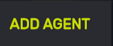

# TABLE OF CONTENTS

**[TABLE OF CONTENTS](#table-of-contents) 2**

**[GAME OVERVIEW](#game-overview) 4**

> [The Elite Championship](#the-elite-championship) 4
>
> [Own the Club](#own-the-club) 4
>
> [Manage the Club](#manage-the-club) 4
>
> [Player Agent](#player-agent) 4
>
> [Own the Players](#own-the-players) 4

**[KEY THINGS TO KNOW ABOUT
SOCCERVERSE](#key-things-to-know-about-soccerverse) 5**

**[GETTING STARTED](#getting-started) 6**

> [A Quick Note on Desktop vs
> Mobile](#a-quick-note-on-desktop-vs-mobile) 6
>
> [A Quick Note on the Beta and
> Support](#a-quick-note-on-the-beta-and-support) 6
>
> [Visit play.soccerverse.io](#visit-play.soccerverse.io) 6
>
> [Register a Xaya Name and Sign In](#register-a-xaya-name-and-sign-in)
> 6

**[PLAY THE GAME](#play-the-game) 10**

> [SMC](#smc) 10
>
> [Traders](#traders) 10
>
> [Notes for Traders](#notes-for-traders) 10
>
> [Club Shareholders](#club-shareholders) 10
>
> [Player Shareholders](#player-shareholders) 10
>
> [Club Managers](#club-managers) 11
>
> [Player Agents](#player-agents) 11
>
> [User Incentives to Maximising
> Profits](#user-incentives-to-maximising-profits) 11

**[KEY ACTIONS](#key-actions) 12**

> [**Submitting Actions (making
> moves)**](#submitting-actions-making-moves) **12**
>
> [Sign vs Confirm](#sign-vs-confirm) 13

**[MAIN MENU](#main-menu) 14**

> **[Search](#search) 15**

**[VIEW USER PROFILES/PORTFOLIOS](#view-user-profilesportfolios) 17**

> [Your Profile](#your-profile) 17

**[VIEWING FIXTURES AND MATCH
RESULTS](#viewing-fixtures-and-match-results) 19**

**[BUYING & SELLING SHARES](#buying-selling-shares) 19**

**[PROPOSE/VOTE FOR MANAGERS/AGENTS](#proposevote-for-managersagents)
23**

> [Proposal Process and Timeframes](#proposal-process-and-timeframes) 24
>
> [To propose a new manager or
> agent:](#to-propose-a-new-manager-or-agent) 24
>
> [Voting](#voting) 25

**[TRADING PLAYERS IN THE TRANSFER
MARKET](#trading-players-in-the-transfer-market) 28**

> [Minimums, Maximums & Fixed Numbers](#minimums-maximums-fixed-numbers)
> 28
>
> [Free Bench](#free-bench) 29
>
> [Agents Determine Transfer
> Availability](#agents-determine-transfer-availability) 29
>
> [Managers Buy/Sell In The Transfer
> Market](#managers-buysell-in-the-transfer-market) 29

**[END OF SEASON EVENTS](#end-of-season-events) 32**

> [Prizes](#prizes) 32
>
> [Player Contract Renewal](#player-contract-renewal) 32
>
> [Club Debt Payments](#club-debt-payments) 32
>
> [Prize Money Awarded](#prize-money-awarded) 32
>
> [Old Players Retire & New Players
> Join](#old-players-retire-new-players-join) 32
>
> [Player Ratings Changes](#player-ratings-changes) 32
>
> [Clubs Promoted/Relegated to Higher/Lower
> Divisions](#clubs-promotedrelegated-to-higherlower-divisions) 32
>
> [Club Debt](#club-debt) 33
>
> [Prize Money for Paying Debts](#prize-money-for-paying-debts) 33

**[USER ROLES](#user-roles) 34**

> [Manager](#manager) 34
>
> [Tactics](#tactics) 34
>
> [Line Up](#line-up) 35
>
> [Instructions](#instructions) 35
>
> [Formation](#formation) 36
>
> [Situations](#situations) 36
>
> [Agent](#agent) 37
>
> [Change Morale](#change-morale) 37
>
> [Change Contract Demands](#change-contract-demands) 38
>
> [Shareholder](#shareholder) 38

**S**occerverse - User Guide **\| Beta** IV

# **GAME OVERVIEW**

Introducing Soccerverse. A massively multiplayer, community-driven
football management game.

Become a manager, agent, club owner, share trader, scout or any
combination of these and more, in one huge persistent, open-ended game
world competing against other players.

Experience a thriving football economy that uses blockchain technology
to give you true realism, asset ownership and total control.

## The Elite Championship

One exclusive massive multiplayer game world -- "The Elite
Championship". With hundreds of clubs competing against each other in
leagues with weekly matches. Experience a classic real-time multiplayer
soccer management game like never before.

## Own the Club

Buy and sell shares in the clubs and receive dividends based on the team
performance.

Vote in the hiring and firing of the club's manager.

Get paid a weekly dividend from the club's profits.

## Manage the Club

Buy the right players, play the right tactics and compete against other
managers.

Like a real manager, you will need the backing of your club's
shareholders.

As a manager you will receive a wage from the club.

## Player Agent

Look after your players and do what's in their best interests for their
careers.\
You will need to have the support and trust of your player's
shareholders.\
Get paid a weekly wage from each of your players' salaries.

## Own the Players

Buy and sell shares in players using your football knowledge and find
the next superstar.\
Vote in the hiring and firing of the player's agent.\
Get paid a weekly dividend from the player's salary and bonuses if the
player is in the starting line up, scores or assists.

# KEY THINGS TO KNOW ABOUT SOCCERVERSE

-   It\'s a massively multiplayer, community-driven football management
    > simulator and trading game.

-   League matches are played Saturday and Wednesday, while cup and
    > shield games are played on Monday.

-   Owning and trading club and player shares is a key part of the game.

-   Club shareholders receive dividends based on the club\'s income.

-   Clubs receive more income if they are in a higher division and
    > perform well on the pitch.

-   Player shareholders receive dividends based on players' wage, which
    > in turn is based on their rating.

-   Player ratings can go up and down based on how they perform in real
    > life.

-   You can play as a manager or agent if shareholders appoint you. You
    > then receive a weekly wage.

-   Managers set team tactics, negotiate transfer deals, and negotiate
    > with agents.

-   Agents can negotiate new contracts with better wages for their
    > players or demand a transfer.

-   [[When a season ends]{.underline}](#section):

> \- Player ratings can change.
>
> \- New players are introduced or retired from the game to reflect real
> life.
>
> \- Clubs are promoted/relegated to higher/lower divisions.
>
> \- Finally, a new season starts and new fixtures are created.

# GETTING STARTED

Once you've set up your MetaMask wallet and got some MATIC and WCHI
you're ready to play. Follow the instructions at the following link if
you've not already done that.

[[https://downloads.soccerverse.io/Soccerverse_Beta4_Getting_Started.pdf]{.underline}](https://downloads.soccerverse.io/Soccerverse_Beta4_Getting_Started.pdf)

## A Quick Note on Desktop vs Mobile

Soccerverse on your desktop (or laptop) uses your web browser and the
MetaMask wallet browser extension. On your mobile device, Soccerverse
uses the MetaMask wallet app, which includes a built-in web browser.
While the MetaMask interface is slightly different on the 2 platforms,
there is no significant difference in gameplay.

## A Quick Note on the Beta and Support{width="1.0in" height="1.668500656167979in"}

Should you encounter any problems, your first troubleshooting step
should be to reload the page. On desktops, press CTRL + F5. On mobiles,
in the MetaMask web browser, tap the ellipsis button (3 dots) in the
lower-right corner then tap the Reload button. You can also try signing
out and then signing in again.

Should your issue persist, you can get help in the Soccerverse Discord
server here:

[[https://discord.gg/ze5xJgg7AM]{.underline}](https://discord.gg/ze5xJgg7AM)

## Visit play.soccerverse.io

Go to
[[https://play.soccerverse.io/]{.underline}](https://play.soccerverse.io/).
If you already have a Xaya name on Polygon, you can simply sign in (see
below). If not, you must first register a Xaya name for your account.

## Register a Xaya Name and Sign In

If you already have a Xaya name, follow steps #1 and #2 then skip to
step #7.

To register a Xaya name (i.e. user account) and sign in:

+-----------------------------------+-----------------------------------+
| **DESKTOP**                       | **MOBILE**                        |
+===================================+===================================+
| 1\. Click the Sign In button in   | 1\. Tap the Soccerverse hamburger |
| the upper right                   | menu button. Note that it is      |
|                                   | different from the MetaMask       |
|                                   | hamburger menu button at the top  |
|                                   | of the screen.                    |
+-----------------------------------+-----------------------------------+
| {width="0.96875in" | .jpg){width="2.276042213473316in" |
| height="0.46875in"}               | height="1.3288265529308836in"}    |
+-----------------------------------+-----------------------------------+
| 2\. Click the Sign In button tab  | 2\. Tap the Sign In menu item     |
| in the Sign In dropdown           |                                   |
+-----------------------------------+-----------------------------------+
| {width="1.577911198600175in" | jpg){width="2.4218755468066493in" |
| height="1.6739577865266841in"}    | height="1.5154844706911637in"}    |
+-----------------------------------+-----------------------------------+
| 3\. In the Sign In popup, click   | 3\. In the Sign In popup, tap the |
| the Register tab                  | Register tab                      |
+-----------------------------------+-----------------------------------+
| {width="2.7239588801399823in" | jpg){width="1.7552088801399826in" |
| height="1.4761570428696413in"}    | height="1.476687445319335in"}     |
+-----------------------------------+-----------------------------------+
| 4\. Enter a user name for         | 4\. Enter a user name for         |
| yourself (do not use your email   | yourself (do not use your email   |
| address or anything that should   | address or anything that should   |
| be private). Names are cAsE       | be private). Names are cAsE       |
| sENsITivE.                        | sENsITivE.                        |
+-----------------------------------+-----------------------------------+
| {width="2.619792213473316in" | .jpg){width="1.671875546806649in" |
| height="1.4118635170603675in"}    | height="1.4416163604549432in"}    |
+-----------------------------------+-----------------------------------+
| 5\. Click the REGISTER button     | 5\. Tap the REGISTER button then  |
| then confirm the transaction in   | confirm the transaction in        |
| MetaMask                          | MetaMask                          |
+-----------------------------------+-----------------------------------+
| {width="1.640625546806649in" | .jpg){width="1.671045494313211in" |
| height="2.8342530621172353in"}    | height="2.996874453193351in"}     |
+-----------------------------------+-----------------------------------+
| 6\. Your name will appear         | 6\. Ignore any errors that you    |
| momentarily. Click the Sign In    | may see. Your name will appear in |
| tab.                              | your MetaMask wallet momentarily. |
|                                   | Tap the Sign In tab.              |
+-----------------------------------+-----------------------------------+
|                                   | {width="2.1093755468066493in" |
|                                   | height="0.9599551618547681in"}    |
|                                   |                                   |
|                                   | {width="2.0950087489063867in" |
|                                   | height="0.8718744531933509in"}    |
+-----------------------------------+-----------------------------------+
| 6a. If you don't see your name in | 6a. If you don't see your name in |
| the list, wait a moment, then     | the list, wait a moment, then     |
| refresh the page with F5 or       | refresh the page through the      |
| CTRL+F5                           | MetaMask reload menu.             |
|                                   |                                   |
|                                   | To do this, tap the ellipsis (3   |
|                                   | dots - "\...") in the lower right |
|                                   | of the screen, then tap the       |
|                                   | reload menu                       |
+-----------------------------------+-----------------------------------+
|                                   | {width="1.1342115048118986in" |
|                                   | height="1.9239588801399825in"}    |
+-----------------------------------+-----------------------------------+
| 7\. Select a name in the names    | 7\. Select a name in the names    |
| dropdown menu                     | dropdown menu                     |
+-----------------------------------+-----------------------------------+
| {width="3.4791666666666665in" | 1.jpg){width="1.69040791776028in" |
| height="1.9027777777777777in"}    | height="1.8822911198600174in"}    |
+-----------------------------------+-----------------------------------+
| 8\. Click the sign in button      | 8\. Tap the sign in button        |
+-----------------------------------+-----------------------------------+
| {width="2.7968755468066493in" | jpg){width="1.6870319335083115in" |
| height="1.5072976815398076in"}    | height="1.4447911198600174in"}    |
+-----------------------------------+-----------------------------------+
| 9\. Confirm that you wish to sign | 9\. Confirm that you wish to sign |
| in by clicking the MetaMask Sign  | in by tapping the MetaMask Sign   |
| button                            | button                            |
+-----------------------------------+-----------------------------------+
| {width="1.9947922134733158in" | jpg){width="2.3250426509186353in" |
| height="3.147470472440945in"}     | height="3.028124453193351in"}     |
+-----------------------------------+-----------------------------------+
| 10\. You're signed in! Time to    |                                   |
| play the game!                    |                                   |
+-----------------------------------+-----------------------------------+

# PLAY THE GAME

## SMC 

The Soccerverse economy is fueled by the in-game currency SMC
(Soccerverse Coins, symbol: ₷). In a very real sense, you own your SMC.
Nobody can take it away from you, not even the game developers, thanks
to blockchain technology.

### Traders

Users can buy and sell club and player shares between each other. The
value of shares increases or decreases based on market demand.

#### Notes for Traders

Shareholders receive dividends for their shares based on the performance
of the clubs and players that they own shares in.

### **Club Shareholders**

-   Club shareholders get paid 0.1% of the matchday income

-   This 0.1% is split between all shareholders

-   The more shares you hold in the club, the larger the portion of the
    > 0.1% you receive

-   50% of a club's league/cup/shield prize money is split between all
    > shareholders, provided the club isn't in debt (see "[[Resolving
    > End-of-Season Debt]{.underline}](#_dwslbgbdtkq1)" for more
    > information)

**NOTE:** A club's performance can affect it's share value as well as
its revenues.

### **Player Shareholders**

Player shareholders have several ways to make money:

-   Dividends from regular player wages

    -   0.2% of player wages are split between shareholders

    -   Shareholders receive an additional 0.1% of the wages if the
        > player is in the starting lineup

-   Money from cup/shield prizes

    -   Players receive a bonus if the club wins a cup/shield equal to
        > 0.1% of the prize money

    -   This 0.1% is split between shareholders

-   Money from league prizes

    -   Players receive a 0.1% bonus of their club's league prize money

    -   This 0.1% is split between shareholders

-   Money from scoring goals and assists

    -   Shareholders receive 0.01% of the player's weekly wages if the
        > player scores a goal

    -   Shareholders receive 0.005% of the player's weekly wages if the
        > player assists with a goal

**NOTE:** Players wages can go up/down (and as a result, shareholder
dividends also) because the wage is directly linked to the player's
rating and how well their agent negotiates with the club manager.
Further, a player's rating can fluctuate at the end of a season based on
their real world performance, i.e. results from the real, physical world
that we live in have a degree of influence in the virtual, online
Soccerverse.

### Club Managers

-   Managers get paid 0.0004% of the club's weekly TV money (it\'s about
    > 0.0002% of the club's matchday income on average)

-   You can only be a manager for one club at a time

-   Managers are appointed (and fired) by club shareholders

### Player Agents

-   Agents get paid 0.002% of the player's weekly wage

-   You can be an agent for one or more players at the same time

-   Agents are appointed (and replaced) by player shareholders

## User Incentives to Maximising Profits

Club shareholders maximise their income if:

● The club is in a higher division and ends the season as high in the
league as possible

● Wins a cup or shield

● Does not go in debt

● Buys and sells the right players at the right time

● The club keeps its players happy on the right contracts and playing
enough to satisfy agents

Players shareholders maximise their income if:

● Their player is playing regularly

● At a club that ends higher in the league

● Their club wins a cup or shield

● The player's rating goes up (as the wage on a new contract will
eventually follow up)

Managers maximise their income if:

● They manage a club in a higher division

● They do a good job and keep the club's shareholders happy by
maximising shareholder dividends

Agents maximise their income if:

● Their player's rating goes up (as the wage on a new contract will
follow up)

● They do a good job and keep the player's shareholders happy by
maximising shareholder dividends

# KEY ACTIONS

The following are some key actions that you'll need to succeed in this
new gaming experience.

-   View user profiles/portfolios

-   Buy/sell club and player shares

-   Propose/vote for managers/agents

-   View fixtures and match reports

-   View clubs and players

-   Trade players (for club managers)

-   Negotiate with managers (for player agents)

-   Use the right strategies, i.e.Tactics (for club managers)

## Submitting Actions (making moves) 

Soccerverse is a true blockchain game with every part of it existing
entirely on the blockchain, including every action (or move) that every
user makes.

An action could be one or more of the following examples:

-   Changing your club's tactics

-   Placing a bid on a player in the Transfer Market

-   Buying or selling shares

When you perform an action within the game, your MetaMask wallet will
popup and ask you to confirm the move, i.e. submit the move to the
blockchain as a transaction.

  ------------------------------------------------------------------------------------------------------------
  **DESKTOP**                                            **MOBILE**
  ------------------------------------------------------ -----------------------------------------------------
  1\. MetaMask will pop up a window or panel for you to  1\. The MetaMask mobile wallet automatically displays
  sign. The contents are identical, but the presentation a confirmation dialog for you
  simply looks different.                                

  {width="1.8489588801399826in"   {width="1.8771500437445319in"
  height="2.4047145669291337in"}                         height="2.444792213473316in"}
  {width="1.4496839457567805in"   
  height="2.434375546806649in"}                          

  1a. If MetaMask doesn't create a popup for you, you'll N/A
  see a number badge on its browser extension icon and   
  you'll need to click that to display the popup shown   
  above.                                                 

  {width="0.3645833333333333in"     N/A
  height="0.3229166666666667in"}                         

  2\. Click the Sign or Confirm button                   2\. Tap the Sign or Confirm button

  3\. If successful, your move goes through              3\. If successful, your move goes through
  ------------------------------------------------------------------------------------------------------------

  -------------------------------------------------------------------------------------------------------
  {width="0.80625in"   assumed that you now know this, and so the signing part of
  height="0.80625in"}                          actions is left out of the instructions in the rest of
                                               this guide.**
  -------------------------------------------- ----------------------------------------------------------

  -------------------------------------------------------------------------------------------------------

## Sign vs Confirm

Whether the button says "sign" or "confirm", either way you're
cryptographically signing a transaction to PROVE that you are who you
say you are and that you are giving your positive permission for the
transaction. So, no real difference there.

However, if the button says "sign", then you're doing something like
user login authentication and there are no fees and there is no entry in
the blockchain. On the other hand, if the button says "confirm", then
you're doing something that will be recorded on the blockchain, e.g.
spending coins/tokens or making a game move, and you'll need to pay
transaction fees, which are typically very tiny and fractions of a
penny.

In short:

  -----------------------------------------------------------------------
                          **SIGN**                **CONFIRM**
  ----------------------- ----------------------- -----------------------
  **FREE**                ✔️                      ❌

  **HAS A TX FEE**        ❌                      ✔️
  -----------------------------------------------------------------------

# MAIN MENU

There are 7 items in the horizontal main menu at the top of the screen
(#1 to \# 7 below). The mobile version has an extended vertical main
menu accessible through the hamburger menu icon in the upper left of the
screen (this is separate from the MetaMask hamburger menu icon). The
extra items in the mobile hamburger menu are found on the desktop in the
upper right of the screen.

+-----------------------------------+-----------------------------------+
| **DESKTOP**                       | **MOBILE**                        |
+===================================+===================================+
| 0\. Language Selector (see below) | 0\. Language Selector             |
+-----------------------------------+-----------------------------------+
| {width="3.4791666666666665in" | .png){width="2.435416666666667in" |
| height="0.2777777777777778in"}    | height="0.3718755468066492in"}    |
+-----------------------------------+-----------------------------------+
| 1\. Home                          | 1\. Home                          |
+-----------------------------------+-----------------------------------+
| 2\. Matches                       | 2\. Matches                       |
+-----------------------------------+-----------------------------------+
| 3\. League Table                  | 3\. League Table                  |
+-----------------------------------+-----------------------------------+
| 4\. Transfer Market               | 4\. Transfer Market               |
+-----------------------------------+-----------------------------------+
| 5\. Game World                    | 5\. Game World                    |
+-----------------------------------+-----------------------------------+
| 6\. Exchange                      | 6\. Exchange                      |
+-----------------------------------+-----------------------------------+
| 7\. Vote                          | 7\. Vote                          |
+-----------------------------------+-----------------------------------+
| **DESKTOP RIGHT TOP MENUS**       | **MOBILE EXTENDED HAMBURGER       |
|                                   | MENU**                            |
+-----------------------------------+-----------------------------------+
| ---                               | 8\. Log Out                       |
+-----------------------------------+-----------------------------------+
|   --------                        |   --------                        |
| --------------------------------- | --------------------------------- |
| --------------------------------- | --------------------------------- |
| --------------------------------- | --------------------------------- |
|   Signed out                      |   Signed out                      |
|                         Signed in |                         Signed in |
|   --------                        |   --------                        |
| --------------------------------- | --------------------------------- |
| ------------ -------------------- | ------------ -------------------- |
| --------------------------------- | --------------------------------- |
|   {width="1.296875 | dia/image21.png){width="1.5572922 |
| 546806649in"    {width="1.234375546806649in" | png){width="1.5755872703412073in" |
|   height="0.33831474              |   height="3.1803838               |
| 19072616in"}                      | 582677164in"}                     |
|    height="0.3375240594925634in"} |     height="3.221874453193351in"} |
|                                   |                                   |
|   {width="1.3725634 | --------------------------------- |
| 295713036in"   {width="1.1728324584426946in" | --------------------------------- |
|   height="1.44062445              |                                   |
| 31933508in"}                      |                                   |
|    height="1.5697922134733158in"} |                                   |
|   --------                        |                                   |
| --------------------------------- |                                   |
| --------------------------------- |                                   |
| --------------------------------- |                                   |
+-----------------------------------+-----------------------------------+
| 9\. Sign In / Profile             | 9\. Sign In / Profile             |
+-----------------------------------+-----------------------------------+
| 10\. Settings                     | 10\. Settings                     |
+-----------------------------------+-----------------------------------+
| 11\. Help & Support               | 11\. Help & Support               |
+-----------------------------------+-----------------------------------+
| 12\. Switch Dark/Light Mode       | 12\. Switch Dark/Light Mode       |
+-----------------------------------+-----------------------------------+
| 13\. Log Out                      | ---                               |
+-----------------------------------+-----------------------------------+

To access all of the horizontal main menu on mobile devices, swipe or
flick left or right on the menu.

Most of the menus are self-explanatory. Refer to other portions of the
guide for explanations and "how to" instructions.

## Search

The fastest and easiest way to find a club, player, or another user is
to use the search bar. The search icon is in the upper right on both
mobile and desktop.

  -----------------------------------------------------------------------------------------------------------
  **DESKTOP**                                           **MOBILE**
  ----------------------------------------------------- -----------------------------------------------------
  {width="3.4791666666666665in"   {width="0.7178652668416448in"
  height="0.5138888888888888in"}                        height="0.5072922134733159in"}

  1\. Click the search icon to display the search bar   1\. Tap the search icon to display the search bar

  {width="3.4791666666666665in"   {width="1.9353007436570429in"
  height="0.6111111111111112in"}                        height="0.7572922134733159in"}

  2\. Click "CLOSE X" to close the search bar           2\. Tap the "X" to close the search bar
  -----------------------------------------------------------------------------------------------------------

Searches must be at least 3 characters but are case insensitive, i.e.
searching for "lut" and "LUT" both return the same results.

However, if you wish to search by ID, i.e. the numeric ID of the club,
player, or user, then your search can be as short as 1 digit (0-9), but
must be only digits and no alphabetic or other characters.

If there are any matches, results are returned in order:

1.  Clubs first

2.  Players second

3.  Users last

Further, all results have a club/player/user badge on the right side to
tell you what the result is.

  ------------------------------------------------------------------------------------------------------------
  **DESKTOP**                                            **MOBILE**
  ------------------------------------------------------ -----------------------------------------------------
  {width="3.4791666666666665in"   {width="2.2343755468066493in"
  height="0.8194444444444444in"}                         height="1.2509820647419072in"}

  {width="3.4791666666666665in"   {width="2.2343755468066493in"
  height="0.9027777777777778in"}                         height="1.257671697287839in"}
  ------------------------------------------------------------------------------------------------------------

Simply click on the line of the result you want, i.e. the result name,
type badge, or empty space on the line, to go to that club's overview,
player's overview, or user's profile.

# VIEW USER PROFILES/PORTFOLIOS

Your profile area shows information about your career, your SMC bank
balance as well as any shares that you own.

Soccerverse is a social game and you can also see the same information
about other users by looking at their profile area.

There are several places where you can find other users to click on
their name and display their profiles.

-   Gameworld \> Best Managers

-   Use the search bar to find a user

-   Club overview (for that club's manager)

-   Player overview (for that player's agent)

-   In the in-game chat box (if they are currently online)

Simply click a user's name to display their profile.

User profiles have the following information:

-   Overview: Various information, including financial summaries

-   Portfolio: What shares are owned

-   Accounts: What has been spent and received (SMC)

-   Career: Career as a club manager

-   Agents: What players are managed as an agent

-   Share orders: Open buy/sell orders for club/player shares

{width="3.6986996937882766in"
height="2.8614588801399825in"}

A User Profile

## Your Profile

How you can view your own profile depends on whether you are a club
manager or not.

Everyone can use the PROFILE button/menu as shown below:

  ------------------------------------------------------------------------------------------------------------
  **DESKTOP**                                            **MOBILE**
  ------------------------------------------------------ -----------------------------------------------------
  1\. Click your name in the top right                   1\. Tap the Soccerverse hamburger menu

  {width="2.369792213473316in"     {width="1.921875546806649in"
  height="0.7368963254593176in"}                         height="1.1232874015748031in"}

  2\. In the dropdown menu, click the PROFILE button     2\. In the Soccerverse menu, tap the PROFILE menu
                                                         item

  {width="1.5462412510936132in"   {width="1.2447922134733158in"
  height="2.038542213473316in"}                          height="2.5343066491688537in"}

  3\. You're immediately taken to your profile           3\. You're immediately taken to your profile
  ------------------------------------------------------------------------------------------------------------

If you aren't a club manager, you can also click the HOME button in the
main menu.

If you are a club manager, after you click the HOME button in the main
menu, you are taken to your club page. Since you're the manager, simply
click on your club's manager's name, i.e. your name.

{width="3.254997812773403in"
height="2.1739588801399825in"}

The club manager's "home" screen is his club overview

# VIEWING FIXTURES AND MATCH RESULTS

Clicking on the League menu item will display the leagues.

Clicking on the Matches menu item will display past and future fixtures.

Clicking on the score of past fixtures will bring up the match
commentary and other information regarding the match.

# BUYING & SELLING SHARES

Shares pay dividends, so the more you have, the more SMC (Soccerverse
Coins) you get. They can also go up or down in price in the market, so
you can potentially profit from trading (buying and selling) in the
markets.

Initially, clubs and players start out with a total of 10 million
(10,000,000) shares each.

The markets for club and player shares are under the respective
club/player's shares tab in the Order Book tab.

{width="4.920928477690289in"
height="2.8489588801399823in"}
{width="1.3840146544181977in"
height="2.8260411198600175in"}

Club order book

{width="4.869792213473316in"
height="2.8188210848643918in"}
{width="1.357007874015748in"
height="2.7635411198600175in"}

Player order book

You can also browse all clubs or all players at once by clicking/tapping
EXCHANGE in the main menu.

  ------------------------------------------------------------------------------------------------------------
  **DESKTOP**                                            **MOBILE**
  ------------------------------------------------------ -----------------------------------------------------
  1\. The main menu is at the top of the screen          1\. You can tap the Soccerverse main menu hamburger
                                                         button or you can left/right swipe the main menu to
                                                         the left of the Soccerverse game icon

  {width="3.4791666666666665in"   {width="1.5799311023622047in"
  height="0.2638888888888889in"}                         height="3.215625546806649in"}
                                                         {width="1.7717279090113736in"
                                                         height="0.9760422134733159in"}

  2\. On the Exchange screen, click the CLUB SHARES or   2\. On the Exchange screen, click the CLUB SHARES or
  PLAYER SHARES tab                                      PLAYER SHARES tab

  {width="2.6302088801399823in"    {width="2.8802088801399823in"
  height="1.2284809711286089in"}                         height="0.9658180227471566in"}

  3\. Once you've decided on a club or player for which  3\. Once you've decided on a club or player for which
  you'd like to see their order book, click their View   you'd like to see their order book, tap their View
  button on the right                                    button on the right

  {width="2.8593755468066493in"    {width="1.686233595800525in"
  height="2.191616360454943in"}                          height="2.090625546806649in"}
  ------------------------------------------------------------------------------------------------------------

Buying and selling shares is as simple as entering:

-   The price you want to buy or sell at

-   The quantity of shares that you want to buy/sell

-   Then clicking the Buy or Sell button and confirming

When **BUYING,** if you bid at or over the lowest price in the order
book, you will get 1 or more shares. However, your order may not be
entirely filled if there aren't enough shares for sale at that price. In
this case, the portion of your unfilled order will remain in the order
book until it is filled or until you cancel it. If you bid lower than
the lowest sell order, your order will remain in the order book until it
is filled (someone sells at that price) or until you cancel it.

Selling shares works similar to buying, just in reverse.

{width="5.709891732283465in"
height="2.9493613298337706in"}

The full view when placing share orders for a player

{width="4.277600612423447in"
height="1.928426290463692in"}

Close up detail

{width="3.4911417322834644in"
height="1.6833770778652668in"}

Confirming purchase of player shares

{width="2.7515583989501313in"
height="1.4731419510061243in"}

List of shareholders in player

{width="4.588542213473316in"
height="1.7946587926509185in"}

After the purchase, the user has "5,000,001" shares available to sell

# PROPOSE/VOTE FOR MANAGERS/AGENTS

Shareholders with 100 shares in a club (\>=0.001%) or 1,000,000 shares
in a player (\>=10%) can propose a new manager for a club or a new agent
for a player. Once a proposal has been made, other shareholders have 24
hours to propose other candidates, unless the shareholder making the
proposal has \>50% shares, in which case the voting period begins
instantly.

After the 24-hour proposal period expires, voting begins and lasts for 3
days or until a candidate receives \>50% of the votes. All shareholders
can vote for managers and agents irrespective of how many shares they
have. Owning more shares gives you a more powerful vote. At the end of a
voting period, the candidate with the most votes wins.

Proposing or voting for a manager/agent is done in the club/player
overview under Vote.

{width="3.4621216097987753in" height="2.0in"}
{width="0.9856113298337708in" height="2.0in"}

Propose or vote for a new manager for a club

{width="3.45126312335958in" height="2.0in"}
{width="0.9856113298337708in" height="2.0in"}

Propose or vote for a new agent for a player

## Proposal Process and Timeframes

The proposal process consists of several steps:

1.  Initial proposal: This starts a 24 hour countdown for other users to
    > submit different proposals

2.  Additional proposals: Other users can submit different proposals up
    > to 24 hours after the initial proposal

3.  Voting period: All shareholders may vote during the 3-day voting
    > period

4.  Vote end & acceptance/denial: At the end of the vote, the winning
    > candidate for a club may accept or decline the position. Winning
    > an agent vote automatically makes the user an agent

{width="7.267716535433071in" height="1.75in"}

If a user owns \>50% of a club's or player's shares, the proposal period
is skipped and the user may then vote with their majority of shares to
install their choice of manager/agent.

## To propose a new manager or agent:

**NOTE:** Xaya user names are case sensitive and must be exact, e.g.
"Bob", "BOB", and "bob" are all different. For difficult names, you
should copy & paste them.

+-----------------------------------+-----------------------------------+
| **DESKTOP**                       | **MOBILE**                        |
+===================================+===================================+
| 1\. On the club or player Votes   | 1\. On the club or player Votes   |
| screen, click ADD MANAGER or ADD  | screen, tap ADD MANAGER or ADD    |
| AGENT                             | AGENT                             |
+-----------------------------------+-----------------------------------+
| {width="0.9733333333333334in" |                                   |
| h                                 |                                   |
| eight="0.4in"}{width="1.1771423884514436in" |                                   |
| height="0.4in"}                   |                                   |
+-----------------------------------+-----------------------------------+
| 2\. In the proposal dialog, enter | 2\. In the proposal dialog, enter |
| the name of the user that you     | the name of the user that you     |
| wish to propose EXACTLY           | wish to propose EXACTLY.          |
|                                   |                                   |
|                                   | WARNING! Mobile users should be   |
|                                   | careful about auto-correct. Also, |
|                                   | DO NOT leave a trailing space.    |
+-----------------------------------+-----------------------------------+
| ![]                               | {width="1.5in" | media/image107.jpg){width="1.5in" |
| height="0.5215518372703412in"}    | height="0.8021391076115486in"}    |
| ![]                               | {width="1.5in" | media/image104.jpg){width="1.5in" |
| height="0.5129308836395451in"}    | height="0.8287292213473316in"}    |
+-----------------------------------+-----------------------------------+
| 3\. Verify that the name you      | 3\. Verify that the name you      |
| entered is correct, then click    | entered is correct, then click    |
| the PROPOSE button                | the PROPOSE button                |
+-----------------------------------+-----------------------------------+
| ![]                               | ![]                               |
| (media/image25.png){width="1.5in" | (media/image57.jpg){width="1.5in" |
| height="0.5431036745406824in"}    | height="0.825in"}                 |
| ![]                               | ![]                               |
| (media/image84.png){width="1.5in" | (media/image95.jpg){width="1.5in" |
| height="0.5431036745406824in"}    | height="0.825in"}                 |
+-----------------------------------+-----------------------------------+
| 4\. Confirm your choice in        | 4\. Confirm your choice in        |
| MetaMask. You'll see 2 toast      | MetaMask. You'll see 2 toast      |
| notifications informing you that: | notifications informing you that: |
|                                   |                                   |
| 1\) your proposal has been        | 1\) your proposal has been        |
| initiated, and                    | initiated, and                    |
|                                   |                                   |
| 2\) that your proposal has been   | 2\) that your proposal has been   |
| successful                        | successful                        |
+-----------------------------------+-----------------------------------+
| {width="3.3379593175853017in" | jpg){width="3.4791666666666665in" |
| height="0.47in"}                  | height="0.4722222222222222in"}    |
|                                   |                                   |
| {width="3.2711996937882764in" | jpg){width="3.4791666666666665in" |
| height="0.47in"}                  | height="0.4722222222222222in"}    |
+-----------------------------------+-----------------------------------+
| 5\. Check the Votes tab in the    | 5\. Check the Votes tab in the    |
| club or player's page. You may    | club or player's page. You may    |
| need to wait a few seconds and/or | need to wait a few seconds and/or |
| refresh the page.                 | refresh the page.                 |
+-----------------------------------+-----------------------------------+
| {width="2.6927088801399823in" | jpg){width="1.4909547244094488in" |
| height="1.7494542869641294in"}    | height="1.8927088801399825in"}    |
|                                   | {width="1.453794838145232in" |
| png){width="3.4791666666666665in" | height="1.3406255468066492in"}    |
| height="0.7777777777777778in"}    |                                   |
+-----------------------------------+-----------------------------------+

## Voting

All shareholders are eligible to vote; there is no minimum requirement
like there is for submitting proposals.

+-----------------------------------+-----------------------------------+
| **DESKTOP**                       | **MOBILE**                        |
+===================================+===================================+
| 1\. Navigate to the Vote screen   | 1\. Navigate to the Vote screen   |
| using the main menu VOTE item     | using the main menu VOTE item     |
+-----------------------------------+-----------------------------------+
| {width="3.4791666666666665in" | .jpg){width="1.483817804024497in" |
| height="0.5972222222222222in"}    | height="2.465625546806649in"}     |
|                                   | {width="1.6928324584426946in" |
|                                   | height="1.6218755468066492in"}    |
+-----------------------------------+-----------------------------------+
| 2\. Click the CLUB VOTES or       | 2\. Tap the CLUB VOTES or PLAYER  |
| PLAYER VOTES tab                  | VOTES tab                         |
+-----------------------------------+-----------------------------------+
| {width="1.9635422134733158in" | jpg){width="2.1718755468066493in" |
| height="1.040559930008749in"}     | height="0.9818952318460192in"}    |
+-----------------------------------+-----------------------------------+
| 3\. Scroll to find a club or      | 3\. Scroll to find a club or      |
| player that you wish to make a    | player that you wish to make a    |
| proposal for or to vote for a     | proposal for or to vote for a     |
| candidate                         | candidate                         |
+-----------------------------------+-----------------------------------+
| {width="3.4791666666666665in" | .jpg){width="1.638921697287839in" |
| height="1.1944444444444444in"}    | height="1.7468755468066492in"}    |
|                                   | {width="1.638921697287839in" |
| png){width="3.4791666666666665in" | height="1.7468755468066492in"}    |
| height="1.1944444444444444in"}    |                                   |
+-----------------------------------+-----------------------------------+
| 4\. Click the VIEW button to      | 4\. Tap the right chevron (\>) to |
| navigate to the club or player's  | navigate to the club or player's  |
| voting screen                     | voting screen                     |
+-----------------------------------+-----------------------------------+
| {width="1.6458333333333333in" | .jpg){width="2.244792213473316in" |
| height="0.8645833333333334in"}    | height="0.826674321959755in"}     |
+-----------------------------------+-----------------------------------+
| ---                               | 4a. On the Player VOTES screen,   |
|                                   | scroll down the screen until you  |
|                                   | see the voting section, or tap    |
|                                   | the up arrow button to collapse   |
|                                   | the basic player information      |
+-----------------------------------+-----------------------------------+
| ---                               | {width="1.9427088801399826in" |
|                                   | height="2.2161964129483813in"}    |
+-----------------------------------+-----------------------------------+
| 5\. Make your decision then click | 5\. Make your decision then click |
| the VOTE button, then sign the    | the VOTE button, then sign the    |
| transaction in MetaMask           | transaction in MetaMask           |
+-----------------------------------+-----------------------------------+
| {width="2.5781255468066493in" | jpg){width="2.0021773840769903in" |
| height="1.536068460192476in"}     | height="2.5177088801399825in"}    |
+-----------------------------------+-----------------------------------+
| 6\. You can see the screen        | 6\. You can see the screen        |
| updated with each of your shares  | updated with each of your shares  |
| counting for 1 vote               | counting for 1 vote               |
+-----------------------------------+-----------------------------------+
| {width="2.4218755468066493in" | .jpg){width="1.734375546806649in" |
| height="1.486479658792651in"}     | height="1.3345341207349082in"}    |
+-----------------------------------+-----------------------------------+

# TRADING PLAYERS IN THE TRANSFER MARKET

The transfer market is an **auction** where players are traded between
clubs. Agents determine if a player can be traded while managers
buy/sell players on behalf of their club.

There are 3 tabs in the Transfer Market:

1.  Transfer List: This is where players are listed for auction

2.  Transfer History: Records of all past transfers

3.  Free Bench: Bidding on a player here begins the 7-day auction in the
    > Transfer List

## Minimums, Maximums & Fixed Numbers

There are limits for different facets of the transfer market.

  -------------------------------------------------------------------------
  **ITEM**                        **MINIMUM**   **MAXIMUM**   **FIXED**
  ------------------------------- ------------- ------------- -------------
  Club size                       21            32            ---

  Transfers in from another club  0             3             ---
  (per season)                                                

  Transfers out to another club   0             3             ---
  (per season)                                                

  Transfers in from the Free      0             No limit      ---
  Bench                                                       

  Contract renewals               0             32            ---

  Transfer listing time           ---           ---           7 days

  Player contract lengths (in     1             6             ---
  seasons)                                                    

  Transfer buy bid increase       1%            No limit      ---

  Forced player sales             0             32            ---

  Forced free bench player buys   0             21            ---

  "FREE" Free Bench players       0             21            ---
  -------------------------------------------------------------------------

Clubs must maintain between 21 and 32 players.

Managers may only trade a maximum of 6 players with other clubs: 3 in
and 3 out. However, they may buy any number of players off of the Free
Bench up to the maximum club size of 32.

Aside from trading players in the transfer market, the only way for a
manager to "fire" a player is to not renew their contract. It is
important for managers to ensure that they stay at or above the 21
player minimum, otherwise they will receive low-ranked players from the
Free Bench at the end of the season.

When a manager lists a player for auction in the transfer market, the
auction lasts for 7 days, after which it expires.

If a club is in debt at the end of a season, it may be forced to sell
valuable players and possibly acquire low rated players from the Free
Bench if the squad size is below the minimum amount. See the section on
"[[Resolving End-of-Season Debt]{.underline}](#_dwslbgbdtkq1)" for more
information.

## Free Bench

New players and players that don't have a contract with a club, i.e.
they are unemployed, are in the "Free Bench". These players enter the
regular Transfer List 7-day auction after a manager bids on them in the
Free Bench.

## Agents Determine Transfer Availability

Whether or not a player can be transferred depends on the player's
agent. By default, players are available for transfer. However, an agent
can change this so that the player cannot be transferred. For an agent
to change the transfer availability of a player, the agent must:

1.  Visit their player's screen

2.  Click the CONTRACT tab

3.  Beside Available for transfer, check either Yes or No

4.  Click the Submit button\
    > {width="3.0436209536307963in"
    > height="1.5281244531933509in"}

**NOTE:** If an agent's player is listed as available for transfer, and
a club manager then lists the player in the transfer market, the agent
can't reverse the listing by changing the player's availability to No
after the fact. At that point, it's too late.

## Managers Buy/Sell In The Transfer Market

Club managers can buy and sell players between teams in the transfer
market, provided that the player's agent has made the player available
for transfer (the default is yes). If a player has no agent, then
consent is implied. Managers can also bid on players in the Free Bench,
which begins the 7-day auction of that player in the Transfer List where
other managers can also bid on that player.

To sell a player:

1.  Go to your club Squad tab

2.  Click a player

3.  \[OPTIONAL\] Click the CONTRACT tab

4.  \[OPTIONAL\] In the "As an agent" info panel, check whether or not
    > the player's agent has allowed or disallowed transferring the
    > player. If the Available for transfer No checkbox is checked, then
    > you cannot list the player for transfer and must talk to the
    > player's agent. If Yes is checked, you can list the player in the
    > transfer market.

5.  If Yes is checked for Available for transfer, then the Sell Player
    > button will be visible on the left, bottom of the player screen.
    > Click the Sell Player button\
    > {width="1.5112062554680665in"
    > height="2.8197911198600174in"}

6.  Enter a minimum selling price\
    > {width="2.526042213473316in"
    > height="1.3324179790026247in"}

7.  Click the Sell Player button

8.  If the minimum bid is met or surpassed, then at the end of the 7-day
    > auction period, the player is transferred from your club to the
    > buying club

To bid on a player:

1.  Click Transfer Market in the top menu

2.  This will show a list of players available for sale, however you can
    > also click the "Free Bench" tab menu to view players available
    > there too

3.  Click a player's name

4.  On the player's screen at the bottom of the basic info panel, click
    > the Buy Player button

    a.  If there is no Buy Player button, then [[the player isn't
        > available]{.underline}](#agents-determine-transfer-availability)
        > or you are not a manager of a club.\
        > {width="1.3846347331583553in"
        > height="2.528124453193351in"}

5.  Enter a bid at or above the minimum bid

6.  Click the Submit Transfer Bid button\
    > {width="2.5052088801399823in"
    > height="1.3044356955380578in"}

7.  At the end of the 7-day auction period, the highest bid wins and the
    > player is transferred to the buying club

Once a bid is placed, it cannot be cancelled. This prevents fake bids
from driving up the price.

The Buy Player button is visible to all club managers. Rather than go
through the Transfer Market top menu, you can simply check if a player
is currently listed for transfer by visiting the player's screen.

If you aren't a club manager, you can either check the Transfer Market,
or directly visit a player's screen and check whether or not the
Transfer Status in the basic player info panel is Listed or Not Listed.
You will not see any buy or sell buttons.

\-\-\-\-\-\-\-\-\-\-\-\-\-\-\-\-\-\-\-\-\-\-\-\-\-\-\-\-\-\-\-\-\-\-\-\-\-\-\-\-\-\-\-\-\-\-\-\-\-\-\-\-\-\-\-\-\-\-\-\-\-\-\-\-\-\-\-\-\-\-\-\-\-\-\-\-\-\-\-\-\-\-\-\-\-\-\-\-\-\-\-\-\-\-\-\-\-\-\-\-\-\-\-\-\-\-\-\-\-\-\-\-\-\-\-\-\-\-\-\-\-\-\-\-\-\-\-\-\-\-\-\-\-\-\-\-\-\--

#  

# END OF SEASON EVENTS

There are a few events at the end of every season:

1.  League, cup and shield winners & prizes announced

2.  Player contract renewal or non-renewal

3.  Club debt payments

4.  Prize money awarded

5.  Old players retire & new players join

6.  Player ratings changes

7.  Clubs promoted/relegated to higher/lower divisions

8.  Club Debt

## Prizes

Prizes for winning in the leagues, cup and shield are awarded. They
include trophies and cash prizes.

## Player Contract Renewal

Player contracts are either renewed or not. Players whose contracts
aren't renewed move to the Free Bench at the end of the season if their
contracts expire.

## Club Debt Payments

All club debts are paid off. See "[[Resolving End-of-Season
Debt]{.underline}](#_dwslbgbdtkq1)" for more information.

## Prize Money Awarded

Provided that the prize money wasn't used to pay off club debt, the
club, its shareholders, and its player shareholders split the prize
money 89.8% / 10% / 0.2%, respectively.

## Old Players Retire & New Players Join

At the end of each season, some old players retire while new players
join. New players start in the Free Bench.

## Player Ratings Changes

At the end of each season, player ratings may change up or down,
depending on their real world performance.

## Clubs Promoted/Relegated to Higher/Lower Divisions

Depending upon a club's performance, it can advance to a higher
division, or be relegated to a lower division. Higher divisions are more
profitable for shareholders and managers.

## Club Debt

At the end of the season it is possible that some clubs are in debt if
the manager did not properly take care of the club's finances.

The autonomous debt resolution process minimises damage to the club. The
steps proceed in order until all debt is paid off.

1.  League, cup, and shield prize money goes to the club's debt first
    > and then to the club and shareholders if any prize money remains.

2.  The club's top player is sold on the transfer market to pay off debt
    > and reduce the outgoing expenses (player's wage).

3.  If the club falls below the minimum of 21 players, it receives free
    > low-ranked players from the Free Bench.

### Prize Money for Paying Debts

If a club wins any prize money from its league or a cup or shield,
debtors are first in line for that money.

If there is any prize money left after paying off all debts, then the
remainder goes to the club, its shareholders, and its player
shareholders split the prize money 89.8% / 10% / 0.2%, respectively.

Since this represents a financial loss for shareholders, they may wish
to find someone better to replace their club's manager. See the section
on [[voting]{.underline}](#proposevote-for-managersagents) for more
information.

\-\-\-\-\-\-\-\-\-\-\-\-\-\-\-\-\-\-\-\-\-\-\-\-\-\-\-\-\-\-\-\-\-\-\-\-\-\-\-\-\-\-\-\-\-\-\-\-\-\-\-\-\-\-\-\-\-\-\-\-\-\-\-\-\-\-\-\-\-\-\-\-\-\-\-\-\-\-\-\-\-\-\-\-\-\-\-\-\-\-\-\-\-\-\-\-\-\-\-\-\-\-\-\-\-\-\-\-\-\-\-\-\-\-\-\-\-\-\-\-\-\-\-\-\-\-\-\-\-\-\-\-\-\-\-\-\-\--

#  

# USER ROLES

There are 3 primary roles that users can play in Soccerverse:

1.  Manager

2.  Agent

3.  Shareholder

Users may play more than 1 role and may even play all 3 roles.

The following describes the core of each role.

## Manager

Club managers have the most difficult role. They manage and control
their clubs completely.

However, there are only 300 clubs, so there can only be 300 managers.
Users must convince club shareholders to propose and vote for them to
become a club's manager. This is THE ELITE position in the game.

Once a user becomes a manager, their Home screen changes from their
personal profile to their club's main screen. They also gain full access
to all club management functions, including access to the club's
tactics, which is arguably the most important part of the game.

### Tactics

Tactics is where managers set their strategies for matches. After making
any changes (including situations), you must click/tap the Submit Team
Sheet button or your changes will be lost.

{width="1.7916666666666667in" height="0.5625in"}

  ----------------------------------------------------------------------------------------------------
  {width="0.80625in"   the next match. If there are less than 12 hours before
  height="0.80625in"}                          the next match, you cannot change your tactics.**
  -------------------------------------------- -------------------------------------------------------

  ----------------------------------------------------------------------------------------------------

**NOTE ON DATE & TIME:** The date format is \<day of the week\> \<day
number\> \<month\> \<2-digit year\>, e.g. Tues 6 Jun 06 in simple ISO
date format is 2006-06-06. Time is given in UTC+0 time, so you must
adjust for your timezone. Club managers should consult their Tactics
page to see the counter for when they must submit their team sheets by.

{width="4.802083333333333in" height="0.5625in"}

Counter for team sheet submission deadline

There are 4 sections in Tactics:

1.  Line Up

2.  Instructions

3.  Formation

4.  Situations

#### Line Up

Line Up is where managers decide who is on the pitch to start, who the
substitutes are, and who the extra players that won't be participating
in the match are. It shows:

-   Which players are on the pitch and their positions (11)

-   Which players are available for substitutions (7)

-   Which players aren't participating in the match (the rest of the
    > club's players, between 3 and 14)

To change the line up, drag and drop a player onto another player.
They'll swap positions. You can submit the line up by clicking the
Submit Team Sheet button.

{width="5.0in" height="2.427272528433946in"}

Line Up

#### Instructions

This is where the particulars of the team's strategy is determined. If
you need to have it explained to you, then you're not qualified to be a
manager.

{width="5.0in" height="2.4545450568678917in"}

Instructions

#### Formation

Formations are foundational for setting strategies. There are many to
choose from.

{width="5.0in" height="2.527272528433946in"}

Choose a formation for your team

#### Situations

Situations let you change strategies and substitute players depending on
various conditions at the 45, 60, and 75 minute marks of the match.

{width="5.0in" height="1.3272725284339457in"}

Create situations

You can create situations based on various conditions.

{width="1.5in"
height="2.25in"}{width="1.5in" height="1.545in"}

Situations based on conditions

## Agent

It's the agent's job to negotiate with the club manager for the benefit
of the shareholders. For example, if a manager is not fielding the
player in the starting line-up then the players shareholders will
receive less dividends. Likewise, if the players rating has increased
then the player may want the manager to renew his contract with a
recalculated salary.

However, if an agent doesn't get his way, he can change the player's
morale to "unhappy". This reduces the player's rating by 20 points and
thus the manager will have less options and degraded performance when he
wishes to use the player.

### Change Morale

To change the morale for a player:

1.  Visit the player's screen

2.  Make certain that you are on the Selection tab

3.  Click the smiley/neutral/unhappy face morale button\
    > {width="3.557292213473316in"
    > height="0.8765813648293963in"}

4.  In the Change Morale popup, click happy, neutral, or unhappy\
    > {width="3.2656255468066493in"
    > height="1.1441601049868766in"}

5.  The player's morale changes\
    > {width="0.8697922134733158in"
    > height="0.7511832895888014in"}

### Change Contract Demands

Agents set the terms for their players' contracts. This is done on the
player's Contract screen.

{width="3.5537314085739284in"
height="1.9031244531933509in"}

Player contract options

Agents can decide whether or not their player can be listed by the
club's manager in the transfer market or not.

Agents can also decide whether or not the player is willing to renew
their contract with the club. Contract lengths are between 1 and 6
seasons.

Simply make any changes in the Contract panel then click the Submit
button.

## Shareholder

Shareholders buy and sell shares in clubs and players and earn dividends
based on club/player performance. See the section on [[buying and
selling shares]{.underline}](#viewing-fixtures-and-match-results) for
more information about that.

If they hold enough shares, i.e. 100+ for clubs and 1,000,000+ for
players, they can propose a new club manager or player agent. If they
hold 50% + 1 shares, they can propose and vote as they wish with nobody
to stop them.

While agents and managers are "hands on" to ensure the success of
players and clubs, it's the responsibility of shareholders to hire a
competent agent or manager.

Exactly how shareholders organise themselves is outside of the game, per
se, although they can use the in-game chat.

Each club has its own chat channel which can be accessed in the club
Overview screen.

**###END###**
