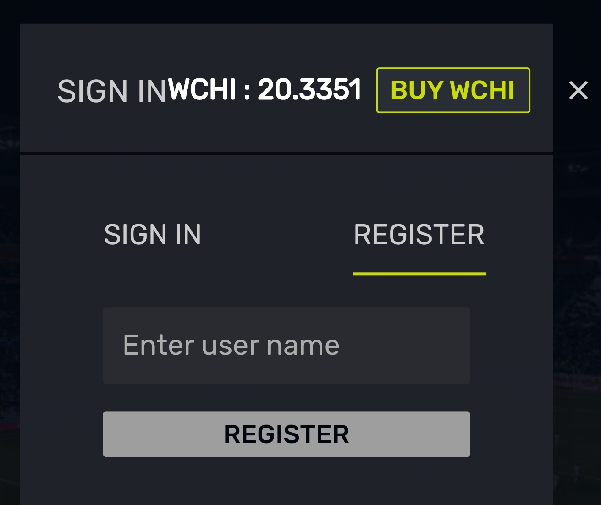
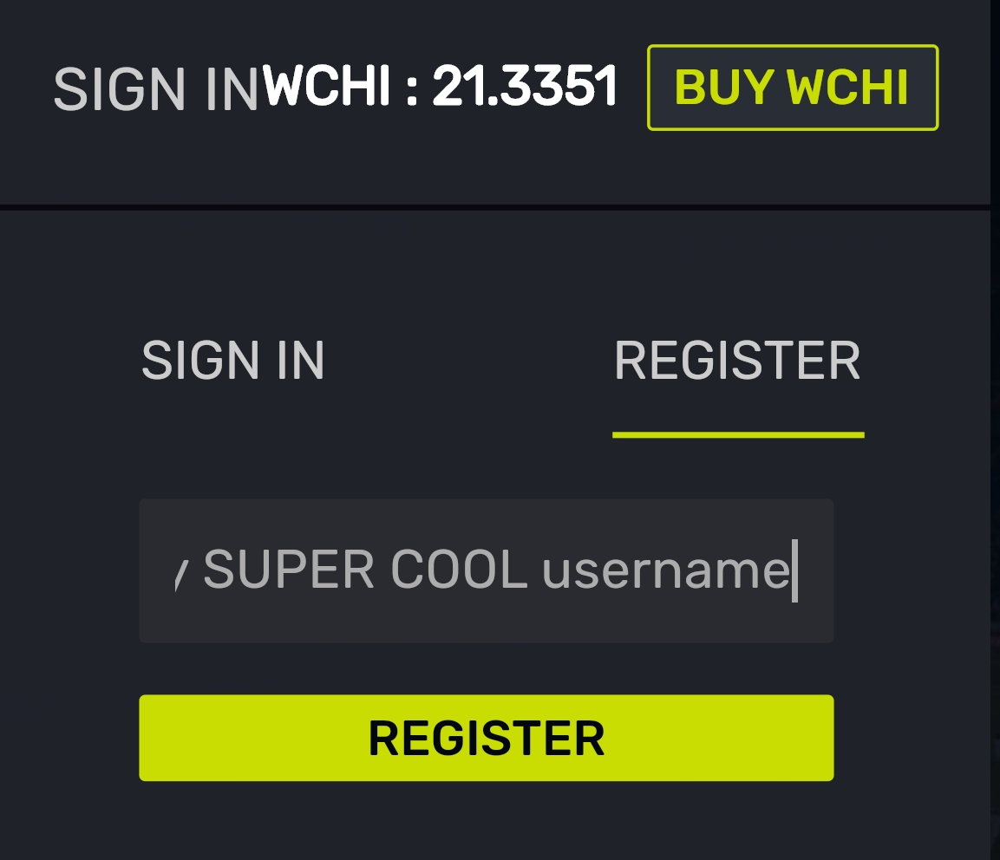
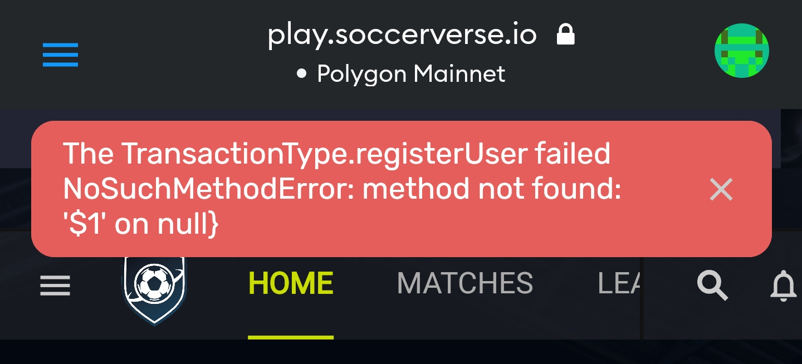
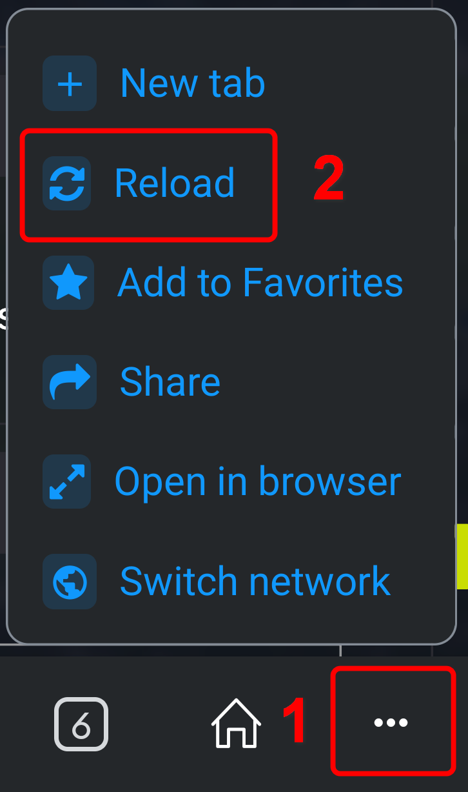
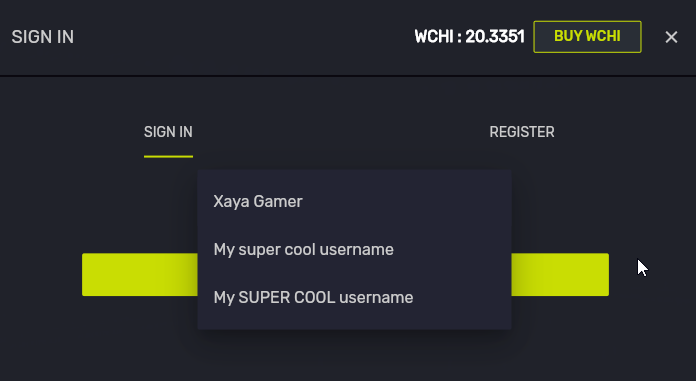
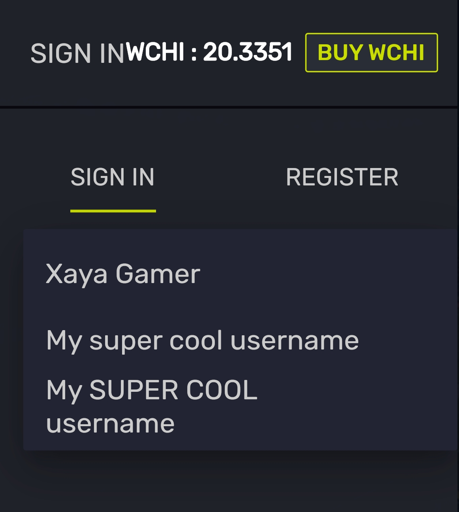
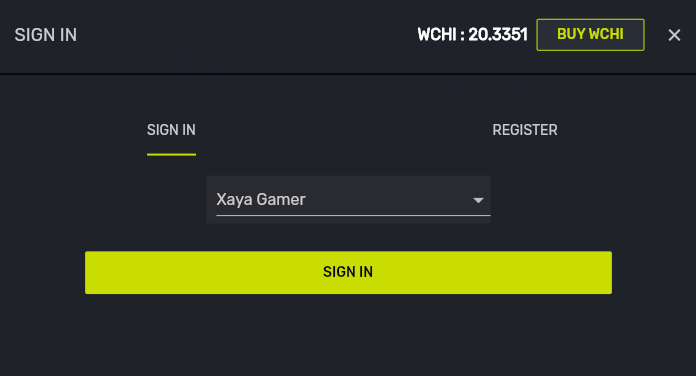
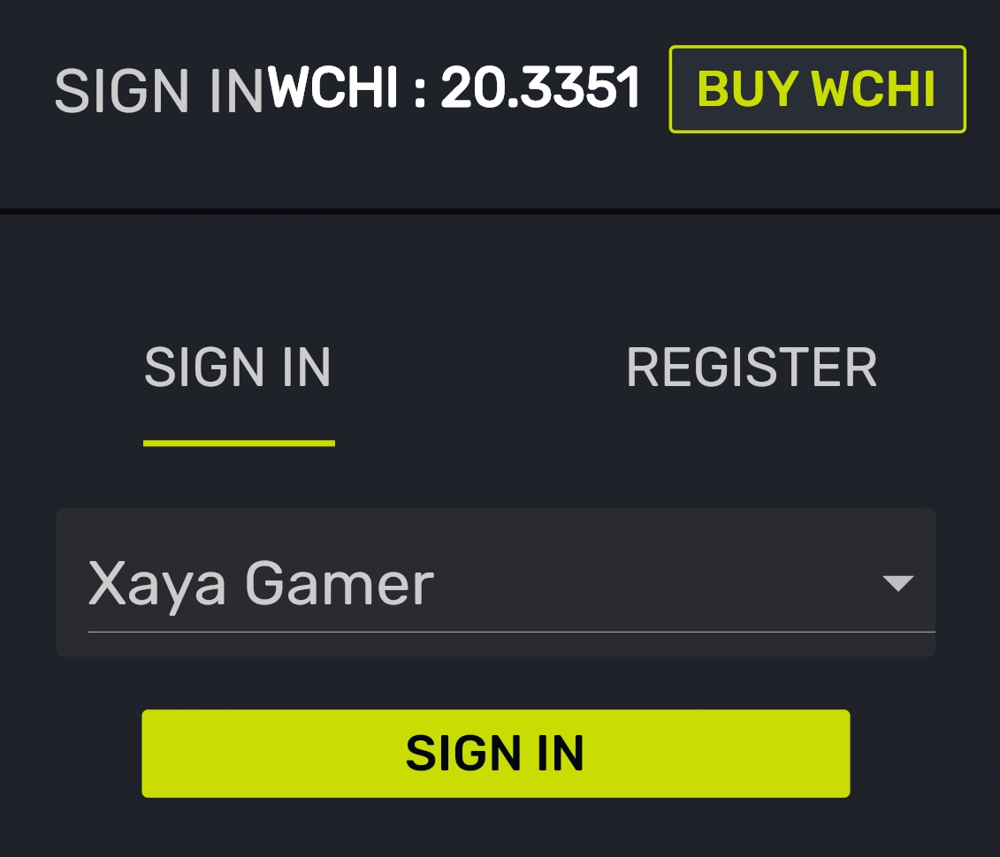

# [GETTING STARTED]{.c33} {#h.51xf9sjkpo4t .c54 .c17}

[Once you've set up your MetaMask wallet and got some MATIC and WCHI
you're ready to play. Follow the instructions at the following link if
you've not already done that.]{.c7}

[]{.c11 .c7}

[[https://downloads.soccerverse.io/Soccerverse_Beta4_Getting_Started.pdf](https://www.google.com/url?q=https://downloads.soccerverse.io/Soccerverse_Beta4_Getting_Started.pdf&sa=D&source=editors&ust=1662412550182258&usg=AOvVaw22Yk4e01pvWueMpfZtVEm6){.c3}]{.c10}[ ]{.c11
.c7}

## [A Quick Note on Desktop vs Mobile]{.c27} {#h.77adltt2t47i .c26 .c17}

[Soccerverse on your desktop (or laptop) uses your web browser and the
MetaMask wallet browser extension. On your mobile device, Soccerverse
uses the MetaMask wallet app, which includes a built-in web browser.
While the MetaMask interface is slightly different on the 2 platforms,
there is no significant difference in gameplay. ]{.c11 .c7}

## [A Quick Note on the Beta and Support]{.c27}[{style="width: 96.00px; height: 160.18px; margin-left: 0.00px; margin-top: 0.00px; transform: rotate(0.00rad) translateZ(0px); -webkit-transform: rotate(0.00rad) translateZ(0px);"}]{style="overflow: hidden; display: inline-block; margin: 0.00px 0.00px; border: 0.00px solid #000000; transform: rotate(0.00rad) translateZ(0px); -webkit-transform: rotate(0.00rad) translateZ(0px); width: 96.00px; height: 160.18px;"} {#h.l5vn8xcyosj6 .c26 .c17}

[Should you encounter any problems, your first troubleshooting step
should be to reload the page. On desktops, press CTRL + F5. On mobiles,
in the MetaMask web browser, tap the ellipsis button (3 dots) in the
lower-right corner then tap the Reload button. You can also try signing
out and then signing in again. ]{.c11 .c7}

[]{.c11 .c7}

[Should your issue persist, you can get help in the Soccerverse Discord
server here:]{.c11 .c7}

[]{.c11 .c7}

[[https://discord.gg/ze5xJgg7AM](https://www.google.com/url?q=https://discord.gg/ze5xJgg7AM&sa=D&source=editors&ust=1662412550184554&usg=AOvVaw21FM_ss1jbofp_5_q78s78){.c3}]{.c10}

## Visit[ ]{.c51}play.s[occer]{.c51}verse.io {#h.tjsidrfr7wa2 .c26 .c17}

[Go to]{.c7}[ ]{.c65
.c80}[[https://play.soccerverse.io/](https://www.google.com/url?q=https://play.soccerverse.io/&sa=D&source=editors&ust=1662412550185899&usg=AOvVaw2Bopxq39v5wAlfbl0SKWHE){.c3}]{.c10}[.
If you already have a Xaya name on Polygon, you can simply sign in (see
below). If not, you must first register a Xaya name for your account.
]{.c11 .c7}

## [Register a Xaya Name and Sign In]{.c27} {#h.by7uo8wl0ac2 .c26 .c17}

[If you already have a Xaya name, follow steps #1 and #2 then skip to
step #7. ]{.c11 .c7}

[]{.c11 .c7}

[To register a Xaya name (i.e. user account) and sign in:]{.c11 .c7}

[]{.c11 .c7}

[]{#t.ea1907d809d2754b29a421eecc992cfb27d28fbc} []{#t.0}

[DESKTOP]{.c25}

[MOBILE]{.c25}

[1. Click the Sign In button in the upper right]{.c11 .c7}

[1. Tap the Soccerverse hamburger menu button. Note that it is different
from the MetaMask hamburger menu button at the top of the screen.]{.c11
.c7}

[{style="width: 93.00px; height: 45.00px; margin-left: 0.00px; margin-top: 0.00px; transform: rotate(0.00rad) translateZ(0px); -webkit-transform: rotate(0.00rad) translateZ(0px);"}]{style="overflow: hidden; display: inline-block; margin: 0.00px 0.00px; border: 0.00px solid #000000; transform: rotate(0.00rad) translateZ(0px); -webkit-transform: rotate(0.00rad) translateZ(0px); width: 93.00px; height: 45.00px;"}

[{style="width: 218.50px; height: 127.57px; margin-left: 0.00px; margin-top: 0.00px; transform: rotate(0.00rad) translateZ(0px); -webkit-transform: rotate(0.00rad) translateZ(0px);"}]{style="overflow: hidden; display: inline-block; margin: 0.00px 0.00px; border: 0.00px solid #000000; transform: rotate(0.00rad) translateZ(0px); -webkit-transform: rotate(0.00rad) translateZ(0px); width: 218.50px; height: 127.57px;"}

[2. Click the Sign In button tab in the Sign In dropdown]{.c11 .c7}

[2. Tap the Sign In menu item]{.c11 .c7}

[{style="width: 151.48px; height: 160.70px; margin-left: 0.00px; margin-top: 0.00px; transform: rotate(0.00rad) translateZ(0px); -webkit-transform: rotate(0.00rad) translateZ(0px);"}]{style="overflow: hidden; display: inline-block; margin: 0.00px 0.00px; border: 0.00px solid #000000; transform: rotate(0.00rad) translateZ(0px); -webkit-transform: rotate(0.00rad) translateZ(0px); width: 151.48px; height: 160.70px;"}

[{style="width: 232.50px; height: 145.49px; margin-left: 0.00px; margin-top: 0.00px; transform: rotate(0.00rad) translateZ(0px); -webkit-transform: rotate(0.00rad) translateZ(0px);"}]{style="overflow: hidden; display: inline-block; margin: 0.00px 0.00px; border: 0.00px solid #000000; transform: rotate(0.00rad) translateZ(0px); -webkit-transform: rotate(0.00rad) translateZ(0px); width: 232.50px; height: 145.49px;"}

[3. In the Sign In popup, click the Register tab]{.c11 .c7}

[3. In the Sign In popup, tap the Register tab]{.c11 .c7}

[{style="width: 261.50px; height: 141.71px; margin-left: 0.00px; margin-top: 0.00px; transform: rotate(0.00rad) translateZ(0px); -webkit-transform: rotate(0.00rad) translateZ(0px);"}]{style="overflow: hidden; display: inline-block; margin: 0.00px 0.00px; border: 0.00px solid #000000; transform: rotate(0.00rad) translateZ(0px); -webkit-transform: rotate(0.00rad) translateZ(0px); width: 261.50px; height: 141.71px;"}

[{style="width: 168.50px; height: 141.76px; margin-left: 0.00px; margin-top: 0.00px; transform: rotate(0.00rad) translateZ(0px); -webkit-transform: rotate(0.00rad) translateZ(0px);"}]{style="overflow: hidden; display: inline-block; margin: 0.00px 0.00px; border: 0.00px solid #000000; transform: rotate(0.00rad) translateZ(0px); -webkit-transform: rotate(0.00rad) translateZ(0px); width: 168.50px; height: 141.76px;"}

[4. Enter a user name for yourself (do not use your email address or
anything that should be private). Names are cAsE sENsITivE.]{.c11 .c7}

[4. Enter a user name for yourself (do not use your email address or
anything that should be private). Names are cAsE sENsITivE.]{.c11 .c7}

[{style="width: 251.50px; height: 135.54px; margin-left: 0.00px; margin-top: 0.00px; transform: rotate(0.00rad) translateZ(0px); -webkit-transform: rotate(0.00rad) translateZ(0px);"}]{style="overflow: hidden; display: inline-block; margin: 0.00px 0.00px; border: 0.00px solid #000000; transform: rotate(0.00rad) translateZ(0px); -webkit-transform: rotate(0.00rad) translateZ(0px); width: 251.50px; height: 135.54px;"}

[{style="width: 160.50px; height: 138.40px; margin-left: 0.00px; margin-top: 0.00px; transform: rotate(0.00rad) translateZ(0px); -webkit-transform: rotate(0.00rad) translateZ(0px);"}]{style="overflow: hidden; display: inline-block; margin: 0.00px 0.00px; border: 0.00px solid #000000; transform: rotate(0.00rad) translateZ(0px); -webkit-transform: rotate(0.00rad) translateZ(0px); width: 160.50px; height: 138.40px;"}

[5. Click the REGISTER button then confirm the transaction in
MetaMask]{.c7}

[5. Tap the REGISTER button then confirm the transaction in
MetaMask]{.c11 .c7}

[{style="width: 157.50px; height: 272.09px; margin-left: 0.00px; margin-top: 0.00px; transform: rotate(0.00rad) translateZ(0px); -webkit-transform: rotate(0.00rad) translateZ(0px);"}]{style="overflow: hidden; display: inline-block; margin: 0.00px 0.00px; border: 0.00px solid #000000; transform: rotate(0.00rad) translateZ(0px); -webkit-transform: rotate(0.00rad) translateZ(0px); width: 157.50px; height: 272.09px;"}

[{style="width: 160.42px; height: 287.70px; margin-left: 0.00px; margin-top: 0.00px; transform: rotate(0.00rad) translateZ(0px); -webkit-transform: rotate(0.00rad) translateZ(0px);"}]{style="overflow: hidden; display: inline-block; margin: 0.00px 0.00px; border: 0.00px solid #000000; transform: rotate(0.00rad) translateZ(0px); -webkit-transform: rotate(0.00rad) translateZ(0px); width: 160.42px; height: 287.70px;"}

[6. Your name will appear momentarily. Click the Sign In tab.]{.c11 .c7}

[6. Ignore any errors that you may see. Your name will appear in your
MetaMask wallet momentarily. Tap the Sign In tab.]{.c11 .c7}

[]{.c11 .c7}

[{style="width: 202.50px; height: 92.16px; margin-left: 0.00px; margin-top: 0.00px; transform: rotate(0.00rad) translateZ(0px); -webkit-transform: rotate(0.00rad) translateZ(0px);"}]{style="overflow: hidden; display: inline-block; margin: 0.00px 0.00px; border: 0.00px solid #000000; transform: rotate(0.00rad) translateZ(0px); -webkit-transform: rotate(0.00rad) translateZ(0px); width: 202.50px; height: 92.16px;"}

[{style="width: 201.12px; height: 83.70px; margin-left: 0.00px; margin-top: 0.00px; transform: rotate(0.00rad) translateZ(0px); -webkit-transform: rotate(0.00rad) translateZ(0px);"}]{style="overflow: hidden; display: inline-block; margin: 0.00px 0.00px; border: 0.00px solid #000000; transform: rotate(0.00rad) translateZ(0px); -webkit-transform: rotate(0.00rad) translateZ(0px); width: 201.12px; height: 83.70px;"}

[6a. If you don't see your name in the list, wait a moment, then refresh
the page with F5 or CTRL+F5]{.c11 .c7}

[6a. If you don't see your name in the list, wait a moment, then refresh
the page through the MetaMask reload menu. ]{.c11 .c7}

[]{.c11 .c7}

[To do this, tap the ellipsis (3 dots - "\...") in the lower right of
the screen, then tap the reload menu]{.c11 .c7}

[]{.c11 .c7}

[{style="width: 108.88px; height: 184.70px; margin-left: 0.00px; margin-top: 0.00px; transform: rotate(0.00rad) translateZ(0px); -webkit-transform: rotate(0.00rad) translateZ(0px);"}]{style="overflow: hidden; display: inline-block; margin: 0.00px 0.00px; border: 0.00px solid #000000; transform: rotate(0.00rad) translateZ(0px); -webkit-transform: rotate(0.00rad) translateZ(0px); width: 108.88px; height: 184.70px;"}

[7. Select a name in the names dropdown menu]{.c11 .c7}

[7. Select a name in the names dropdown menu]{.c11 .c7}

[{style="width: 334.00px; height: 182.67px; margin-left: 0.00px; margin-top: 0.00px; transform: rotate(0.00rad) translateZ(0px); -webkit-transform: rotate(0.00rad) translateZ(0px);"}]{style="overflow: hidden; display: inline-block; margin: 0.00px 0.00px; border: 0.00px solid #000000; transform: rotate(0.00rad) translateZ(0px); -webkit-transform: rotate(0.00rad) translateZ(0px); width: 334.00px; height: 182.67px;"}

[{style="width: 162.28px; height: 180.70px; margin-left: 0.00px; margin-top: 0.00px; transform: rotate(0.00rad) translateZ(0px); -webkit-transform: rotate(0.00rad) translateZ(0px);"}]{style="overflow: hidden; display: inline-block; margin: 0.00px 0.00px; border: 0.00px solid #000000; transform: rotate(0.00rad) translateZ(0px); -webkit-transform: rotate(0.00rad) translateZ(0px); width: 162.28px; height: 180.70px;"}

[8. Click the sign in button]{.c11 .c7}

[8. Tap the sign in button]{.c11 .c7}

[{style="width: 268.50px; height: 144.70px; margin-left: 0.00px; margin-top: 0.00px; transform: rotate(0.00rad) translateZ(0px); -webkit-transform: rotate(0.00rad) translateZ(0px);"}]{style="overflow: hidden; display: inline-block; margin: 0.00px 0.00px; border: 0.00px solid #000000; transform: rotate(0.00rad) translateZ(0px); -webkit-transform: rotate(0.00rad) translateZ(0px); width: 268.50px; height: 144.70px;"}

[{style="width: 161.96px; height: 138.70px; margin-left: 0.00px; margin-top: 0.00px; transform: rotate(0.00rad) translateZ(0px); -webkit-transform: rotate(0.00rad) translateZ(0px);"}]{style="overflow: hidden; display: inline-block; margin: 0.00px 0.00px; border: 0.00px solid #000000; transform: rotate(0.00rad) translateZ(0px); -webkit-transform: rotate(0.00rad) translateZ(0px); width: 161.96px; height: 138.70px;"}

[9. Confirm that you wish to sign in by clicking the MetaMask Sign
button]{.c11 .c7}

[9. Confirm that you wish to sign in by tapping the MetaMask Sign
button]{.c11 .c7}

[{style="width: 191.50px; height: 302.16px; margin-left: 0.00px; margin-top: 0.00px; transform: rotate(0.00rad) translateZ(0px); -webkit-transform: rotate(0.00rad) translateZ(0px);"}]{style="overflow: hidden; display: inline-block; margin: 0.00px 0.00px; border: 0.00px solid #000000; transform: rotate(0.00rad) translateZ(0px); -webkit-transform: rotate(0.00rad) translateZ(0px); width: 191.50px; height: 302.16px;"}

[{style="width: 223.20px; height: 290.70px; margin-left: 0.00px; margin-top: 0.00px; transform: rotate(0.00rad) translateZ(0px); -webkit-transform: rotate(0.00rad) translateZ(0px);"}]{style="overflow: hidden; display: inline-block; margin: 0.00px 0.00px; border: 0.00px solid #000000; transform: rotate(0.00rad) translateZ(0px); -webkit-transform: rotate(0.00rad) translateZ(0px); width: 223.20px; height: 290.70px;"}

[10. You're signed in! Time to play the game!]{.c11 .c7}

[]{.c11 .c7}

[]{.c0}

[]{.c0}

[]{.c0}
