<div>

[]{.c64 .c65}

</div>

[]{.c3}

# TABLE OF CONTENTS {#h.26jebzh9mfe3 .c42}

[[TABLE OF
CONTENTS](#h.hv5ridfokgec){.c8}]{.c6}[        ]{.c6}[[2](#h.hv5ridfokgec){.c8}]{.c6}

[[GAME
OVERVIEW](#h.fphamietg73){.c8}]{.c6}[        ]{.c6}[[4](#h.fphamietg73){.c8}]{.c6}

[[The Elite
Championship](#h.qla2l6p3yczk){.c8}]{.c3}[        ]{.c3}[[4](#h.qla2l6p3yczk){.c8}]{.c3}

[[Own the
Club](#h.m4jdq3vx1ssu){.c8}]{.c3}[        ]{.c3}[[4](#h.m4jdq3vx1ssu){.c8}]{.c3}

[[Manage the
Club](#h.s7ydq1bzaw94){.c8}]{.c3}[        ]{.c3}[[4](#h.s7ydq1bzaw94){.c8}]{.c3}

[[Player
Agent](#h.z0iix2laly0v){.c8}]{.c3}[        ]{.c3}[[4](#h.z0iix2laly0v){.c8}]{.c3}

[[Own the
Players](#h.gsox8hfnffp7){.c8}]{.c3}[        ]{.c3}[[4](#h.gsox8hfnffp7){.c8}]{.c3}

[[KEY THINGS TO KNOW ABOUT
SOCCERVERSE](#h.k23klfe43xot){.c8}]{.c6}[        ]{.c6}[[5](#h.k23klfe43xot){.c8}]{.c6}

[[GETTING
STARTED](#h.51xf9sjkpo4t){.c8}]{.c6}[        ]{.c6}[[6](#h.51xf9sjkpo4t){.c8}]{.c6}

[[A Quick Note on Desktop vs
Mobile](#h.77adltt2t47i){.c8}]{.c3}[        ]{.c3}[[6](#h.77adltt2t47i){.c8}]{.c3}

[[A Quick Note on the Beta and
Support](#h.l5vn8xcyosj6){.c8}]{.c3}[        ]{.c3}[[6](#h.l5vn8xcyosj6){.c8}]{.c3}

[[Visit
play.soccerverse.io](#h.tjsidrfr7wa2){.c8}]{.c3}[        ]{.c3}[[6](#h.tjsidrfr7wa2){.c8}]{.c3}

[[Register a Xaya Name and Sign
In](#h.by7uo8wl0ac2){.c8}]{.c3}[        ]{.c3}[[6](#h.by7uo8wl0ac2){.c8}]{.c3}

[[PLAY THE
GAME](#h.x8ugu16eq9om){.c8}]{.c6}[        ]{.c6}[[10](#h.x8ugu16eq9om){.c8}]{.c6}

[[SMC](#h.vfjkw333ny8y){.c8}
]{.c3}[        ]{.c3}[[10](#h.vfjkw333ny8y){.c8}]{.c3}

[[Traders](#h.6az88vhxvj1v){.c8}]{.c3}[        ]{.c3}[[10](#h.6az88vhxvj1v){.c8}]{.c3}

[[Notes for
Traders](#h.8yax9cqqxbr){.c8}]{.c3}[        ]{.c3}[[10](#h.8yax9cqqxbr){.c8}]{.c3}

[[Club
Shareholders](#h.24gzyhz7w53){.c8}]{.c3}[        ]{.c3}[[10](#h.24gzyhz7w53){.c8}]{.c3}

[[Player
Shareholders](#h.54fdat4wuaso){.c8}]{.c3}[        ]{.c3}[[10](#h.54fdat4wuaso){.c8}]{.c3}

[[Club
Managers](#h.kuej5napbcjv){.c8}]{.c3}[        ]{.c3}[[11](#h.kuej5napbcjv){.c8}]{.c3}

[[Player
Agents](#h.69npvzi85pl7){.c8}]{.c3}[        ]{.c3}[[11](#h.69npvzi85pl7){.c8}]{.c3}

[[User Incentives to Maximising
Profits](#h.yd1oznh4hiaq){.c8}]{.c3}[        ]{.c3}[[11](#h.yd1oznh4hiaq){.c8}]{.c3}

[[KEY
ACTIONS](#h.b3d4hlkh23rp){.c8}]{.c6}[        ]{.c6}[[12](#h.b3d4hlkh23rp){.c8}]{.c6}

[[Submitting Actions (making moves)](#h.nta9axv352ia){.c8}
]{.c6}[        ]{.c6}[[12](#h.nta9axv352ia){.c8}]{.c6}

[[Sign vs
Confirm](#h.bsb1pxyc7hdk){.c8}]{.c3}[        ]{.c3}[[13](#h.bsb1pxyc7hdk){.c8}]{.c3}

[[MAIN
MENU](#h.q44dzrjpnskt){.c8}]{.c6}[        ]{.c6}[[14](#h.q44dzrjpnskt){.c8}]{.c6}

[[Search](#h.xtptjx99um9k){.c8}]{.c6}[        ]{.c6}[[15](#h.xtptjx99um9k){.c8}]{.c6}

[[VIEW USER
PROFILES/PORTFOLIOS](#h.101rz7svtyx){.c8}]{.c6}[        ]{.c6}[[17](#h.101rz7svtyx){.c8}]{.c6}

[[Your
Profile](#h.r4hk99qrb4m4){.c8}]{.c3}[        ]{.c3}[[17](#h.r4hk99qrb4m4){.c8}]{.c3}

[[VIEWING FIXTURES AND MATCH
RESULTS](#h.po03fx23ajwx){.c8}]{.c6}[        ]{.c6}[[19](#h.po03fx23ajwx){.c8}]{.c6}

[[BUYING & SELLING
SHARES](#h.tmjvov3ksi2q){.c8}]{.c6}[        ]{.c6}[[19](#h.tmjvov3ksi2q){.c8}]{.c6}

[[PROPOSE/VOTE FOR
MANAGERS/AGENTS](#h.lrilimrzzjrk){.c8}]{.c6}[        ]{.c6}[[23](#h.lrilimrzzjrk){.c8}]{.c6}

[[Proposal Process and
Timeframes](#h.9az770jpy2ub){.c8}]{.c3}[        ]{.c3}[[24](#h.9az770jpy2ub){.c8}]{.c3}

[[To propose a new manager or
agent:](#h.db4lhd23ux6i){.c8}]{.c3}[        ]{.c3}[[24](#h.db4lhd23ux6i){.c8}]{.c3}

[[Voting](#h.tg8sc7wmbebl){.c8}]{.c3}[        ]{.c3}[[25](#h.tg8sc7wmbebl){.c8}]{.c3}

[[TRADING PLAYERS IN THE TRANSFER
MARKET](#h.eszjtkr0tal7){.c8}]{.c6}[        ]{.c6}[[28](#h.eszjtkr0tal7){.c8}]{.c6}

[[Minimums, Maximums & Fixed
Numbers](#h.ugwb1yoxo14e){.c8}]{.c3}[        ]{.c3}[[28](#h.ugwb1yoxo14e){.c8}]{.c3}

[[Free
Bench](#h.c3iplctxje0j){.c8}]{.c3}[        ]{.c3}[[29](#h.c3iplctxje0j){.c8}]{.c3}

[[Agents Determine Transfer
Availability](#h.78qjv5jjpzt7){.c8}]{.c3}[        ]{.c3}[[29](#h.78qjv5jjpzt7){.c8}]{.c3}

[[Managers Buy/Sell In The Transfer
Market](#h.4z7bd37agzn){.c8}]{.c3}[        ]{.c3}[[29](#h.4z7bd37agzn){.c8}]{.c3}

[[END OF SEASON
EVENTS](#h.r7edzioo14rd){.c8}]{.c6}[        ]{.c6}[[32](#h.r7edzioo14rd){.c8}]{.c6}

[[Prizes](#h.l3i367aily3p){.c8}]{.c3}[        ]{.c3}[[32](#h.l3i367aily3p){.c8}]{.c3}

[[Player Contract
Renewal](#h.xe5a8zs6kpn2){.c8}]{.c3}[        ]{.c3}[[32](#h.xe5a8zs6kpn2){.c8}]{.c3}

[[Club Debt
Payments](#h.9i4ogyf4o9uf){.c8}]{.c3}[        ]{.c3}[[32](#h.9i4ogyf4o9uf){.c8}]{.c3}

[[Prize Money
Awarded](#h.8bhmarvsv1co){.c8}]{.c3}[        ]{.c3}[[32](#h.8bhmarvsv1co){.c8}]{.c3}

[[Old Players Retire & New Players
Join](#h.obhfa43ouxpc){.c8}]{.c3}[        ]{.c3}[[32](#h.obhfa43ouxpc){.c8}]{.c3}

[[Player Ratings
Changes](#h.kdx4z9dwlh6f){.c8}]{.c3}[        ]{.c3}[[32](#h.kdx4z9dwlh6f){.c8}]{.c3}

[[Clubs Promoted/Relegated to Higher/Lower
Divisions](#h.7acugysofqog){.c8}]{.c3}[        ]{.c3}[[32](#h.7acugysofqog){.c8}]{.c3}

[[Club Debt](#h.oqqmt5frlo36){.c8}]{.c64 .c40}[        ]{.c64
.c40}[[33](#h.oqqmt5frlo36){.c8}]{.c40 .c64}

[[Prize Money for Paying Debts](#h.8cicqlc8u85v){.c8}]{.c64
.c40}[        ]{.c64 .c40}[[33](#h.8cicqlc8u85v){.c8}]{.c64 .c40}

[[USER
ROLES](#h.7n4f6qylfy7j){.c8}]{.c6}[        ]{.c6}[[34](#h.7n4f6qylfy7j){.c8}]{.c6}

[[Manager](#h.z1gjtvfhyp5){.c8}]{.c3}[        ]{.c3}[[34](#h.z1gjtvfhyp5){.c8}]{.c3}

[[Tactics](#h.p95qxz9wx7d6){.c8}]{.c3}[        ]{.c3}[[34](#h.p95qxz9wx7d6){.c8}]{.c3}

[[Line
Up](#h.dcxhwhnelcnk){.c8}]{.c3}[        ]{.c3}[[35](#h.dcxhwhnelcnk){.c8}]{.c3}

[[Instructions](#h.rlrpv0ul1baw){.c8}]{.c3}[        ]{.c3}[[35](#h.rlrpv0ul1baw){.c8}]{.c3}

[[Formation](#h.75vq035snkwf){.c8}]{.c3}[        ]{.c3}[[36](#h.75vq035snkwf){.c8}]{.c3}

[[Situations](#h.h1fw3g74rogb){.c8}]{.c3}[        ]{.c3}[[36](#h.h1fw3g74rogb){.c8}]{.c3}

[[Agent](#h.eb9a5dn6xs7x){.c8}]{.c3}[        ]{.c3}[[37](#h.eb9a5dn6xs7x){.c8}]{.c3}

[[Change
Morale](#h.soxm7j6zxcds){.c8}]{.c3}[        ]{.c3}[[37](#h.soxm7j6zxcds){.c8}]{.c3}

[[Change Contract
Demands](#h.3hvttccbxzq2){.c8}]{.c3}[        ]{.c3}[[38](#h.3hvttccbxzq2){.c8}]{.c3}

[[Shareholder](#h.h6fdapjh2ux7){.c8}]{.c3}[        ]{.c3}[[38](#h.h6fdapjh2ux7){.c8}]{.c3}

------------------------------------------------------------------------

[]{.c18 .c51}

[S]{.c59 .c76 .c18}[occerverse]{.c18 .c76}[ - User Guide]{.c18 .c56}[   
                             ]{.c18 .c87}[ ]{.c59 .c18 .c60}[\|]{.c59
.c40 .c60}[  ]{.c59 .c18 .c60}[Beta ]{.c59 .c40 .c60}[IV]{.c60}

# [GAME OVERVIEW]{.c58 .c40} {#h.fphamietg73 .c42}

[Introducing Soccerverse.  A massively multiplayer, community-driven
football management game.]{.c1}

[]{.c1}

[Become a manager, agent, club owner, share trader, scout or any
combination of these and more,  in one huge persistent, open-ended game
world competing against other players.]{.c1}

[]{.c1}

[Experience a thriving football economy that uses blockchain technology
to give you true realism, asset ownership and total control.]{.c1}

## [The Elite Championship]{.c40} {#h.qla2l6p3yczk .c20}

[One exclusive massive multiplayer game world -- "The Elite
Championship". With hundreds of clubs competing against each other in
leagues with weekly matches.  Experience a classic real-time multiplayer
soccer management game like never before.]{.c1}

## [Own the Club]{.c15} {#h.m4jdq3vx1ssu .c20}

[Buy and sell shares in the clubs and receive dividends based on the
team performance.]{.c1}

[Vote in the hiring and firing of the club's manager.]{.c1}

[Get paid a weekly dividend from the club's profits.]{.c1}

## [Manage the Club]{.c40} {#h.s7ydq1bzaw94 .c20}

[Buy the right players, play the right tactics and compete against other
managers.]{.c1}

[Like a real manager, you will need the backing of your club's
shareholders.]{.c1}

[As a manager you will receive a wage from the club.]{.c1}

## [Player Agent]{.c40} {#h.z0iix2laly0v .c20}

[Look after your players and do what's in their best interests for their
careers.\
You will need to have the support and trust of your player's
shareholders.\
Get paid a weekly wage from each of your players' salaries.]{.c1}

## [Own the Players]{.c15} {#h.gsox8hfnffp7 .c20}

[Buy and sell shares in players using your football knowledge and find
the next superstar.\
Vote in the hiring and firing of the player's agent.\
Get paid a weekly dividend from the player's salary and bonuses if the
player is in the starting line up, scores or assists.]{.c1}

[]{.c1}

[]{.c1}

[]{.c3}

# [KEY THINGS TO KNOW ABOUT SOCCERVERSE]{.c58 .c40} {#h.k23klfe43xot .c49 .c71}

[]{.c3}

-   [It\'s a massively multiplayer, community-driven football management
    simulator and trading game.]{.c3}

[]{.c3}

-   [League matches are played Saturday and Wednesday, while cup and
    shield games are played on Monday.]{.c3}

[]{.c3}

-   [Owning and trading club and player shares is a key part of the
    game.]{.c3}

[]{.c3}

-   [Club shareholders receive dividends based on the club\'s
    income.]{.c3}

[]{.c3}

-   [Clubs receive more income if they are in a higher division and
    perform well on the pitch.]{.c3}

[]{.c3}

-   [Player shareholders receive dividends based on players' wage, which
    in turn is based on their rating.]{.c3}

[]{.c3}

-   [Player ratings can go up and down based on how they perform in real
    life.]{.c3}

[]{.c3}

-   [You can play as a manager or agent if shareholders appoint you. You
    then receive a weekly wage.]{.c3}

[]{.c3}

-   [Managers set team tactics, negotiate transfer deals, and negotiate
    with agents.]{.c3}

[]{.c3}

-   [Agents can negotiate new contracts with better wages for their
    players or demand a transfer. ]{.c3}

[]{.c3}

-   [[When a season ends](#h.ncc9awmc5dbo){.c8}]{.c4}[:]{.c3}

[- Player ratings can change.]{.c3}

[- New players are introduced or retired from the game to reflect real
life.]{.c3}

[- Clubs are promoted/relegated to higher/lower divisions.]{.c3}

[- Finally, a new season starts and new fixtures are created.]{.c3}

[]{.c3}

------------------------------------------------------------------------

[]{.c3}

# [GETTING STARTED]{.c58 .c40} {#h.51xf9sjkpo4t .c42}

[Once you've set up your MetaMask wallet and got some MATIC and WCHI
you're ready to play. Follow the instructions at the following link if
you've not already done that.]{.c22 .c18}

[]{.c1}

[[https://downloads.soccerverse.io/Soccerverse_Beta4_Getting_Started.pdf](https://www.google.com/url?q=https://downloads.soccerverse.io/Soccerverse_Beta4_Getting_Started.pdf&sa=D&source=editors&ust=1662591527128762&usg=AOvVaw2Sd1jmEyL6hq4rhFF7mvli){.c8}]{.c4
.c22}[ ]{.c1}

## [A Quick Note on Desktop vs Mobile]{.c15} {#h.77adltt2t47i .c20}

[Soccerverse on your desktop (or laptop) uses your web browser and the
MetaMask wallet browser extension. On your mobile device, Soccerverse
uses the MetaMask wallet app, which includes a built-in web browser.
While the MetaMask interface is slightly different on the 2 platforms,
there is no significant difference in gameplay. ]{.c1}

## [A Quick Note on the Beta and Support]{.c15}[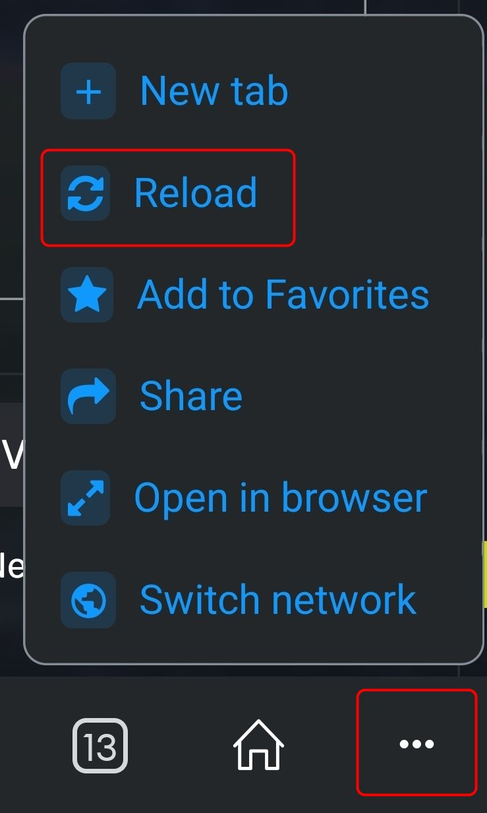{style="width: 96.00px; height: 160.18px; margin-left: 0.00px; margin-top: 0.00px; transform: rotate(0.00rad) translateZ(0px); -webkit-transform: rotate(0.00rad) translateZ(0px);"}]{style="overflow: hidden; display: inline-block; margin: 0.00px 0.00px; border: 0.00px solid #000000; transform: rotate(0.00rad) translateZ(0px); -webkit-transform: rotate(0.00rad) translateZ(0px); width: 96.00px; height: 160.18px;"} {#h.l5vn8xcyosj6 .c20}

[Should you encounter any problems, your first troubleshooting step
should be to reload the page. On desktops, press CTRL + F5. On mobiles,
in the MetaMask web browser, tap the ellipsis button (3 dots) in the
lower-right corner then tap the Reload button. You can also try signing
out and then signing in again. ]{.c1}

[]{.c1}

[Should your issue persist, you can get help in the Soccerverse Discord
server here:]{.c1}

[]{.c1}

[[https://discord.gg/ze5xJgg7AM](https://www.google.com/url?q=https://discord.gg/ze5xJgg7AM&sa=D&source=editors&ust=1662591527130037&usg=AOvVaw20NXyFmV-uLF_Lhb2xfSba){.c8}]{.c4
.c22}

## Visit[ ]{.c40}play.s[occer]{.c40}verse.io {#h.tjsidrfr7wa2 .c20}

[Go to]{.c22 .c18}[ ]{.c22
.c85}[[https://play.soccerverse.io/](https://www.google.com/url?q=https://play.soccerverse.io/&sa=D&source=editors&ust=1662591527130576&usg=AOvVaw0Xt5aVvsJwsIlP0imcwIcS){.c8}]{.c4
.c22}[. If you already have a Xaya name on Polygon, you can simply sign
in (see below). If not, you must first register a Xaya name for your
account. ]{.c1}

## [Register a Xaya Name and Sign In]{.c15} {#h.by7uo8wl0ac2 .c20}

[If you already have a Xaya name, follow steps #1 and #2 then skip to
step #7. ]{.c1}

[]{.c1}

[To register a Xaya name (i.e. user account) and sign in:]{.c1}

[]{.c1}

[]{#t.ea1907d809d2754b29a421eecc992cfb27d28fbc}[]{#t.0}

[DESKTOP]{.c47 .c40}

[MOBILE]{.c47 .c40}

[1. Click the Sign In button in the upper right]{.c1}

[1. Tap the Soccerverse hamburger menu button. Note that it is different
from the MetaMask hamburger menu button at the top of the screen.]{.c1}

[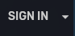{style="width: 93.00px; height: 45.00px; margin-left: 0.00px; margin-top: 0.00px; transform: rotate(0.00rad) translateZ(0px); -webkit-transform: rotate(0.00rad) translateZ(0px);"}]{style="overflow: hidden; display: inline-block; margin: 0.00px 0.00px; border: 0.00px solid #000000; transform: rotate(0.00rad) translateZ(0px); -webkit-transform: rotate(0.00rad) translateZ(0px); width: 93.00px; height: 45.00px;"}

[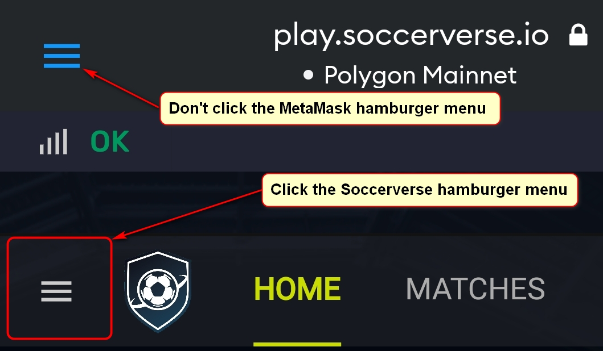{style="width: 218.50px; height: 127.57px; margin-left: 0.00px; margin-top: 0.00px; transform: rotate(0.00rad) translateZ(0px); -webkit-transform: rotate(0.00rad) translateZ(0px);"}]{style="overflow: hidden; display: inline-block; margin: 0.00px 0.00px; border: 0.00px solid #000000; transform: rotate(0.00rad) translateZ(0px); -webkit-transform: rotate(0.00rad) translateZ(0px); width: 218.50px; height: 127.57px;"}

[2. Click the Sign In button tab in the Sign In dropdown]{.c1}

[2. Tap the Sign In menu item]{.c1}

[{style="width: 151.48px; height: 160.70px; margin-left: 0.00px; margin-top: 0.00px; transform: rotate(0.00rad) translateZ(0px); -webkit-transform: rotate(0.00rad) translateZ(0px);"}]{style="overflow: hidden; display: inline-block; margin: 0.00px 0.00px; border: 0.00px solid #000000; transform: rotate(0.00rad) translateZ(0px); -webkit-transform: rotate(0.00rad) translateZ(0px); width: 151.48px; height: 160.70px;"}

[{style="width: 232.50px; height: 145.49px; margin-left: 0.00px; margin-top: 0.00px; transform: rotate(0.00rad) translateZ(0px); -webkit-transform: rotate(0.00rad) translateZ(0px);"}]{style="overflow: hidden; display: inline-block; margin: 0.00px 0.00px; border: 0.00px solid #000000; transform: rotate(0.00rad) translateZ(0px); -webkit-transform: rotate(0.00rad) translateZ(0px); width: 232.50px; height: 145.49px;"}

[3. In the Sign In popup, click the Register tab]{.c1}

[3. In the Sign In popup, tap the Register tab]{.c1}

[{style="width: 261.50px; height: 141.71px; margin-left: 0.00px; margin-top: 0.00px; transform: rotate(0.00rad) translateZ(0px); -webkit-transform: rotate(0.00rad) translateZ(0px);"}]{style="overflow: hidden; display: inline-block; margin: 0.00px 0.00px; border: 0.00px solid #000000; transform: rotate(0.00rad) translateZ(0px); -webkit-transform: rotate(0.00rad) translateZ(0px); width: 261.50px; height: 141.71px;"}

[{style="width: 168.50px; height: 141.76px; margin-left: 0.00px; margin-top: 0.00px; transform: rotate(0.00rad) translateZ(0px); -webkit-transform: rotate(0.00rad) translateZ(0px);"}]{style="overflow: hidden; display: inline-block; margin: 0.00px 0.00px; border: 0.00px solid #000000; transform: rotate(0.00rad) translateZ(0px); -webkit-transform: rotate(0.00rad) translateZ(0px); width: 168.50px; height: 141.76px;"}

[4. Enter a user name for yourself (do not use your email address or
anything that should be private). Names are cAsE sENsITivE.]{.c1}

[4. Enter a user name for yourself (do not use your email address or
anything that should be private). Names are cAsE sENsITivE.]{.c1}

[{style="width: 251.50px; height: 135.54px; margin-left: 0.00px; margin-top: 0.00px; transform: rotate(0.00rad) translateZ(0px); -webkit-transform: rotate(0.00rad) translateZ(0px);"}]{style="overflow: hidden; display: inline-block; margin: 0.00px 0.00px; border: 0.00px solid #000000; transform: rotate(0.00rad) translateZ(0px); -webkit-transform: rotate(0.00rad) translateZ(0px); width: 251.50px; height: 135.54px;"}

[{style="width: 160.50px; height: 138.40px; margin-left: 0.00px; margin-top: 0.00px; transform: rotate(0.00rad) translateZ(0px); -webkit-transform: rotate(0.00rad) translateZ(0px);"}]{style="overflow: hidden; display: inline-block; margin: 0.00px 0.00px; border: 0.00px solid #000000; transform: rotate(0.00rad) translateZ(0px); -webkit-transform: rotate(0.00rad) translateZ(0px); width: 160.50px; height: 138.40px;"}

[5. Click the REGISTER button then confirm the transaction in
MetaMask]{.c22 .c18}

[5. Tap the REGISTER button then confirm the transaction in
MetaMask]{.c1}

[{style="width: 157.50px; height: 272.09px; margin-left: 0.00px; margin-top: 0.00px; transform: rotate(0.00rad) translateZ(0px); -webkit-transform: rotate(0.00rad) translateZ(0px);"}]{style="overflow: hidden; display: inline-block; margin: 0.00px 0.00px; border: 0.00px solid #000000; transform: rotate(0.00rad) translateZ(0px); -webkit-transform: rotate(0.00rad) translateZ(0px); width: 157.50px; height: 272.09px;"}

[{style="width: 160.42px; height: 287.70px; margin-left: 0.00px; margin-top: 0.00px; transform: rotate(0.00rad) translateZ(0px); -webkit-transform: rotate(0.00rad) translateZ(0px);"}]{style="overflow: hidden; display: inline-block; margin: 0.00px 0.00px; border: 0.00px solid #000000; transform: rotate(0.00rad) translateZ(0px); -webkit-transform: rotate(0.00rad) translateZ(0px); width: 160.42px; height: 287.70px;"}

[6. Your name will appear momentarily. Click the Sign In tab.]{.c1}

[6. Ignore any errors that you may see. Your name will appear in your
MetaMask wallet momentarily. Tap the Sign In tab.]{.c1}

[]{.c1}

[{style="width: 202.50px; height: 92.16px; margin-left: 0.00px; margin-top: 0.00px; transform: rotate(0.00rad) translateZ(0px); -webkit-transform: rotate(0.00rad) translateZ(0px);"}]{style="overflow: hidden; display: inline-block; margin: 0.00px 0.00px; border: 0.00px solid #000000; transform: rotate(0.00rad) translateZ(0px); -webkit-transform: rotate(0.00rad) translateZ(0px); width: 202.50px; height: 92.16px;"}

[{style="width: 201.12px; height: 83.70px; margin-left: 0.00px; margin-top: 0.00px; transform: rotate(0.00rad) translateZ(0px); -webkit-transform: rotate(0.00rad) translateZ(0px);"}]{style="overflow: hidden; display: inline-block; margin: 0.00px 0.00px; border: 0.00px solid #000000; transform: rotate(0.00rad) translateZ(0px); -webkit-transform: rotate(0.00rad) translateZ(0px); width: 201.12px; height: 83.70px;"}

[6a. If you don't see your name in the list, wait a moment, then refresh
the page with F5 or CTRL+F5]{.c1}

[6a. If you don't see your name in the list, wait a moment, then refresh
the page through the MetaMask reload menu. ]{.c1}

[]{.c1}

[To do this, tap the ellipsis (3 dots - "\...") in the lower right of
the screen, then tap the reload menu]{.c1}

[]{.c1}

[{style="width: 108.88px; height: 184.70px; margin-left: 0.00px; margin-top: 0.00px; transform: rotate(0.00rad) translateZ(0px); -webkit-transform: rotate(0.00rad) translateZ(0px);"}]{style="overflow: hidden; display: inline-block; margin: 0.00px 0.00px; border: 0.00px solid #000000; transform: rotate(0.00rad) translateZ(0px); -webkit-transform: rotate(0.00rad) translateZ(0px); width: 108.88px; height: 184.70px;"}

[7. Select a name in the names dropdown menu]{.c1}

[7. Select a name in the names dropdown menu]{.c1}

[{style="width: 334.00px; height: 182.67px; margin-left: 0.00px; margin-top: 0.00px; transform: rotate(0.00rad) translateZ(0px); -webkit-transform: rotate(0.00rad) translateZ(0px);"}]{style="overflow: hidden; display: inline-block; margin: 0.00px 0.00px; border: 0.00px solid #000000; transform: rotate(0.00rad) translateZ(0px); -webkit-transform: rotate(0.00rad) translateZ(0px); width: 334.00px; height: 182.67px;"}

[{style="width: 162.28px; height: 180.70px; margin-left: 0.00px; margin-top: 0.00px; transform: rotate(0.00rad) translateZ(0px); -webkit-transform: rotate(0.00rad) translateZ(0px);"}]{style="overflow: hidden; display: inline-block; margin: 0.00px 0.00px; border: 0.00px solid #000000; transform: rotate(0.00rad) translateZ(0px); -webkit-transform: rotate(0.00rad) translateZ(0px); width: 162.28px; height: 180.70px;"}

[8. Click the sign in button]{.c1}

[8. Tap the sign in button]{.c1}

[{style="width: 268.50px; height: 144.70px; margin-left: 0.00px; margin-top: 0.00px; transform: rotate(0.00rad) translateZ(0px); -webkit-transform: rotate(0.00rad) translateZ(0px);"}]{style="overflow: hidden; display: inline-block; margin: 0.00px 0.00px; border: 0.00px solid #000000; transform: rotate(0.00rad) translateZ(0px); -webkit-transform: rotate(0.00rad) translateZ(0px); width: 268.50px; height: 144.70px;"}

[{style="width: 161.96px; height: 138.70px; margin-left: 0.00px; margin-top: 0.00px; transform: rotate(0.00rad) translateZ(0px); -webkit-transform: rotate(0.00rad) translateZ(0px);"}]{style="overflow: hidden; display: inline-block; margin: 0.00px 0.00px; border: 0.00px solid #000000; transform: rotate(0.00rad) translateZ(0px); -webkit-transform: rotate(0.00rad) translateZ(0px); width: 161.96px; height: 138.70px;"}

[9. Confirm that you wish to sign in by clicking the MetaMask Sign
button]{.c1}

[9. Confirm that you wish to sign in by tapping the MetaMask Sign
button]{.c1}

[{style="width: 191.50px; height: 302.16px; margin-left: 0.00px; margin-top: 0.00px; transform: rotate(0.00rad) translateZ(0px); -webkit-transform: rotate(0.00rad) translateZ(0px);"}]{style="overflow: hidden; display: inline-block; margin: 0.00px 0.00px; border: 0.00px solid #000000; transform: rotate(0.00rad) translateZ(0px); -webkit-transform: rotate(0.00rad) translateZ(0px); width: 191.50px; height: 302.16px;"}

[{style="width: 223.20px; height: 290.70px; margin-left: 0.00px; margin-top: 0.00px; transform: rotate(0.00rad) translateZ(0px); -webkit-transform: rotate(0.00rad) translateZ(0px);"}]{style="overflow: hidden; display: inline-block; margin: 0.00px 0.00px; border: 0.00px solid #000000; transform: rotate(0.00rad) translateZ(0px); -webkit-transform: rotate(0.00rad) translateZ(0px); width: 223.20px; height: 290.70px;"}

[10. You're signed in! Time to play the game!]{.c1}

[]{.c1}

[]{.c3}

[]{.c3}

[]{.c3}

# [PLAY THE GAME]{.c58 .c40} {#h.x8ugu16eq9om .c42}

## [SMC ]{.c15} {#h.vfjkw333ny8y .c20}

[The Soccerverse economy is fueled by the in-game currency SMC
(Soccerverse Coins, symbol: ]{.c22 .c18}[₷]{.c18 .c78}[). In a very real
sense, you own your SMC. Nobody can take it away from you, not even the
game developers, thanks to blockchain technology. ]{.c1}

### [Traders]{.c15} {#h.6az88vhxvj1v .c27}

[Users can buy and sell club and player shares between each other. The
value of shares increases or decreases based on market demand. ]{.c22
.c18}

#### Notes for Traders {#h.8yax9cqqxbr .c70 .c49}

[Shareholders receive dividends for their shares based on the
performance of  the clubs and players that they own shares in. ]{.c3}

### [Club Shareholders]{.c15} {#h.24gzyhz7w53 .c27}

-   [Club shareholders get paid 0.1% of the matchday income]{.c1}
-   [This 0.1% is split between all shareholders]{.c1}
-   [The more shares you hold in the club, the larger the portion of the
    0.1% you receive]{.c1}
-   [50% of a club's league/cup/shield prize money is split between all
    shareholders, ]{.c22 .c18}[provided the club isn't in debt]{.c22
    .c18}[ (see "]{.c22 .c18}[[Resolving End-of-Season
    Debt](#h.dwslbgbdtkq1){.c8}]{.c4 .c22}[" for more information)]{.c1}

[]{.c1}

[NOTE:]{.c18 .c59}[ A club's performance can affect it's share value as
well as its revenues. ]{.c1}

### [Player Shareholders]{.c15} {#h.54fdat4wuaso .c27}

[Player shareholders have several ways to make money:]{.c1}

[]{.c1}

-   [Dividends from regular player wages]{.c1}

```{=html}
<!-- -->
```
-   [0.2% of player wages are split between shareholders]{.c1}
-   [Shareholders receive an additional 0.1% of the wages if the player
    is in the starting lineup]{.c1}

```{=html}
<!-- -->
```
-   [Money from cup/shield prizes]{.c1}

```{=html}
<!-- -->
```
-   [Players receive a bonus if the club wins a cup/shield equal to 0.1%
    of the prize money]{.c1}
-   [This 0.1% is split between shareholders]{.c1}

```{=html}
<!-- -->
```
-   [Money from league prizes]{.c1}

```{=html}
<!-- -->
```
-   [Players receive a 0.1% bonus of their club's league prize
    money]{.c1}
-   [This 0.1% is split between shareholders]{.c1}

```{=html}
<!-- -->
```
-   [Money from scoring goals and assists]{.c1}

```{=html}
<!-- -->
```
-   [Shareholders receive 0.01% of the player's weekly wages if the
    player scores a goal]{.c1}
-   [Shareholders receive 0.005% of the player's weekly wages if the
    player assists with a goal]{.c1}

[]{.c1}

[NOTE:]{.c59 .c18}[ Players wages can go up/down (and as a result,
shareholder dividends also) because the wage is directly linked to the
player's rating and how well their agent negotiates with the club
manager.]{.c22 .c18}[ Further, a player's rating can fluctuate at the
end of a season based on their real world performance, i.e. results from
the real, physical world that we live in have a degree of influence in
the virtual, online Soccerverse.]{.c1}

### [Club Managers]{.c15} {#h.kuej5napbcjv .c27}

-   [Managers get paid 0.0004% of the club's weekly TV money (it\'s
    about 0.0002% of the club's matchday income on average)]{.c1}
-   [You can only be a manager for one club at a time]{.c1}
-   [Managers are appointed (and fired) by club shareholders]{.c1}

### [Player Agents]{.c15} {#h.69npvzi85pl7 .c27}

-   [Agents get paid 0.002% of the player's weekly wage]{.c1}
-   [You can be an agent for one or more players at the same time]{.c1}
-   [Agents are appointed (and replaced) by player shareholders]{.c22
    .c18}

## User [Incentives to Maximising Profits]{.c15} {#h.yd1oznh4hiaq .c20}

[Club shareholders maximise their income if:]{.c3}

[● The club is in a higher division and ends the season as high in the
league as possible]{.c3}

[● Wins a cup or shield]{.c3}

[● Does not go in debt]{.c3}

[● Buys and sells the right players at the right time]{.c3}

[● The club keeps its players happy on the right contracts and playing
enough to satisfy agents]{.c3}

[]{.c3}

[Players shareholders maximise their income if:]{.c3}

[● Their player is playing regularly]{.c3}

[● At a club that ends higher in the league]{.c3}

[● Their club wins a cup or shield]{.c3}

[● The player's rating goes up (as the wage on a new contract will
eventually follow up)]{.c3}

[]{.c3}

[Managers maximise their income if:]{.c3}

[● They manage a club in a higher division]{.c3}

[● They do a good job and keep the club's shareholders happy by
maximising shareholder dividends ]{.c18}

[]{.c3}

[Agents maximise their income if:]{.c3}

[● Their player's rating goes up (as the wage on a new contract will
follow up)]{.c3}

[● They do a good job and keep the player's shareholders happy by
maximising shareholder ]{.c18}[dividends]{.c3}

[]{.c3}

------------------------------------------------------------------------

[]{.c3}

# [KEY ACTIONS]{.c58 .c40} {#h.b3d4hlkh23rp .c42}

[The following are some key actions that you'll need to succeed in this
new gaming experience.]{.c17}

[]{.c17}

-   [View user profiles/portfolios]{.c17}
-   [Buy/sell club and player shares]{.c17}
-   [Propose/vote for managers/agents]{.c17}
-   [View fixtures and match reports]{.c17}
-   [View clubs and players]{.c17}
-   [Trade players (for club managers)]{.c17}
-   [Negotiate with managers (for player agents)]{.c17}
-   [Use the right strategies, i.e.]{.c22 .c73}[Tactics]{.c22
    .c73}[ (for club managers)]{.c22 .c73}

## Submitting Actions [(making moves) ]{.c15} {#h.nta9axv352ia .c20}

[Soccerverse is a true blockchain game with every part of it existing
entirely on the blockchain, including every action (or move) that every
user makes. ]{.c17}

[]{.c17}

[An action could be one or more of the following examples:]{.c17}

[]{.c17}

-   [Changing your club's tactics]{.c17}
-   [Placing a bid on a player in the Transfer Market]{.c17}
-   [Buying or selling shares]{.c17}

[]{.c17}

[When you perform an action within the game, your MetaMask wallet will
popup and ask you to confirm the move, i.e. submit the move to the
blockchain as a transaction.]{.c22 .c73}

[]{.c1}

[]{#t.a3cbfffee7542e41f19f7b957937f91bc7357598}[]{#t.1}

[DESKTOP]{.c47 .c40}

[MOBILE]{.c47 .c40}

[1. MetaMask will pop up a window or panel for you to sign. The contents
are identical, but the presentation simply looks different. ]{.c1}

[1. The MetaMask mobile wallet automatically displays a confirmation
dialog for you]{.c1}

[{style="width: 177.50px; height: 230.85px; margin-left: 0.00px; margin-top: 0.00px; transform: rotate(0.00rad) translateZ(0px); -webkit-transform: rotate(0.00rad) translateZ(0px);"}]{style="overflow: hidden; display: inline-block; margin: 0.00px 0.00px; border: 0.00px solid #000000; transform: rotate(0.00rad) translateZ(0px); -webkit-transform: rotate(0.00rad) translateZ(0px); width: 177.50px; height: 230.85px;"}[ ]{.c22
.c18}[{style="width: 139.17px; height: 233.70px; margin-left: 0.00px; margin-top: 0.00px; transform: rotate(0.00rad) translateZ(0px); -webkit-transform: rotate(0.00rad) translateZ(0px);"}]{style="overflow: hidden; display: inline-block; margin: 0.00px 0.00px; border: 0.00px solid #000000; transform: rotate(0.00rad) translateZ(0px); -webkit-transform: rotate(0.00rad) translateZ(0px); width: 139.17px; height: 233.70px;"}

[{style="width: 180.21px; height: 234.70px; margin-left: 0.00px; margin-top: 0.00px; transform: rotate(0.00rad) translateZ(0px); -webkit-transform: rotate(0.00rad) translateZ(0px);"}]{style="overflow: hidden; display: inline-block; margin: 0.00px 0.00px; border: 0.00px solid #000000; transform: rotate(0.00rad) translateZ(0px); -webkit-transform: rotate(0.00rad) translateZ(0px); width: 180.21px; height: 234.70px;"}

[1a. If MetaMask doesn't create a popup for you, you'll see a number
badge on its browser extension icon and you'll need to click that to
display the popup shown above.]{.c1}

[]{.c1}

[N/A]{.c1}

[{style="width: 35.00px; height: 31.00px; margin-left: 0.00px; margin-top: 0.00px; transform: rotate(0.00rad) translateZ(0px); -webkit-transform: rotate(0.00rad) translateZ(0px);"}]{style="overflow: hidden; display: inline-block; margin: 0.00px 0.00px; border: 0.00px solid #000000; transform: rotate(0.00rad) translateZ(0px); -webkit-transform: rotate(0.00rad) translateZ(0px); width: 35.00px; height: 31.00px;"}

[N/A]{.c1}

[2. Click the Sign or Confirm button ]{.c1}

[2. Tap the Sign or Confirm button]{.c1}

[3. If successful, your move goes through ]{.c1}

[3. If successful, your move goes through ]{.c1}

[]{.c3}

[]{#t.30788d743875eac29b42f8388d838e3d83682c48}[]{#t.2}

  ---------------------------------------------------------------------------------------------------------------------------------------------------------------------------------------------------------------------------------------------------------------------------------------------------------------------------------------------------------------------------------------------------------------------------------------------------------------------------------- -----------------------------------------------------------------------------------------------------------------------------------------------------------------------------------------------------------
  [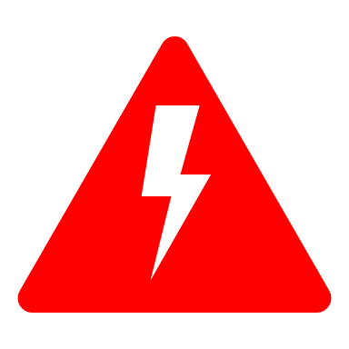{style="width: 77.40px; height: 77.40px; margin-left: 0.00px; margin-top: 0.00px; transform: rotate(0.00rad) translateZ(0px); -webkit-transform: rotate(0.00rad) translateZ(0px);"}]{style="overflow: hidden; display: inline-block; margin: 0.00px 0.00px; border: 0.00px solid #000000; transform: rotate(0.00rad) translateZ(0px); -webkit-transform: rotate(0.00rad) translateZ(0px); width: 77.40px; height: 77.40px;"}   [Since signing is required for all actions, it is largely assumed that you now know this, and so the signing part of actions is left out of the instructions in the rest of this guide. ]{.c80 .c18 .c75}
  ---------------------------------------------------------------------------------------------------------------------------------------------------------------------------------------------------------------------------------------------------------------------------------------------------------------------------------------------------------------------------------------------------------------------------------------------------------------------------------- -----------------------------------------------------------------------------------------------------------------------------------------------------------------------------------------------------------

## Sign vs Confirm {#h.bsb1pxyc7hdk .c20}

[Whether the button says "sign" or "confirm", either way you're
cryptographically signing a transaction to PROVE that you are who you
say you are and that you are giving your positive permission for the
transaction. So, no real difference there.]{.c3}

[]{.c3}

[However, if the button says "sign", then you're doing something like
user login authentication and there are no fees and there is no entry in
the blockchain. On the other hand, if the button says "confirm", then
you're doing something that will be recorded on the blockchain, e.g.
spending coins/tokens or making a game move, and you'll need to pay
transaction fees, which are typically very tiny and fractions of a
penny. ]{.c3}

[]{.c3}

[In short:]{.c3}

[]{.c3}

[]{#t.141d01c688c241a71152f0f29b1f8018366656aa}[]{#t.3}

[]{.c47 .c40}

[SIGN]{.c47 .c40}

[CONFIRM]{.c47 .c40}

[FREE]{.c40 .c50}

[✔️]{.c66 .c22 .c18}

[❌]{.c22 .c18 .c66}

[HAS A TX FEE]{.c50 .c40}

[❌]{.c66 .c22 .c18}

[✔️]{.c66 .c22 .c18}

------------------------------------------------------------------------

[]{.c3}

# [MAIN MENU]{.c58 .c40} {#h.q44dzrjpnskt .c42}

[There are 7 items in the horizontal main menu at the top of the screen
(#1 to \# 7 below). The mobile version has an extended vertical main
menu accessible through the hamburger menu icon in the upper left of the
screen (this is separate from the MetaMask hamburger menu icon). The
extra items in the mobile hamburger menu are found on the desktop in the
upper right of the screen. ]{.c3}

[]{.c1}

[]{#t.66dc50c8fa51ded622c7526f45f7a191575ee350}[]{#t.4}

[DESKTOP]{.c47 .c40}

[MOBILE]{.c47 .c40}

[0. Language Selector (see below)]{.c1}

[0. Language Selector]{.c1}

[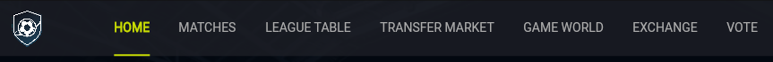{style="width: 334.00px; height: 26.67px; margin-left: 0.00px; margin-top: 0.00px; transform: rotate(0.00rad) translateZ(0px); -webkit-transform: rotate(0.00rad) translateZ(0px);"}]{style="overflow: hidden; display: inline-block; margin: 0.00px 0.00px; border: 0.00px solid #000000; transform: rotate(0.00rad) translateZ(0px); -webkit-transform: rotate(0.00rad) translateZ(0px); width: 334.00px; height: 26.67px;"}

[{style="width: 233.80px; height: 35.70px; margin-left: 0.00px; margin-top: 0.00px; transform: rotate(0.00rad) translateZ(0px); -webkit-transform: rotate(0.00rad) translateZ(0px);"}]{style="overflow: hidden; display: inline-block; margin: 0.00px 0.00px; border: 0.00px solid #000000; transform: rotate(0.00rad) translateZ(0px); -webkit-transform: rotate(0.00rad) translateZ(0px); width: 233.80px; height: 35.70px;"}

[1. Home]{.c1}

[1. Home]{.c1}

[2. Matches]{.c1}

[2. Matches]{.c1}

[3. League Table]{.c1}

[3. League Table]{.c1}

[4. Transfer Market]{.c1}

[4. Transfer Market]{.c1}

[5. Game World]{.c1}

[5. Game World]{.c1}

[6. Exchange]{.c1}

[6. Exchange]{.c1}

[7. Vote]{.c1}

[7. Vote]{.c1}

[DESKTOP RIGHT TOP MENUS]{.c74 .c59 .c40}

[MOBILE EXTENDED HAMBURGER MENU]{.c59 .c40 .c74}

[---]{.c1}

[8. Log Out]{.c1}

[]{.c1}

[]{#t.560f425e74c447d6400783f2b4eaefa77e7fbf2b}[]{#t.5}

  ---------------------------------------------------------------------------------------------------------------------------------------------------------------------------------------------------------------------------------------------------------------------------------------------------------------------------------------------------------------------------------------------------------------------------------------------------------- ----------------------------------------------------------------------------------------------------------------------------------------------------------------------------------------------------------------------------------------------------------------------------------------------------------------------------------------------------------------------------------------------------------------------------------------------------------
  [Signed out]{.c1}                                                                                                                                                                                                                                                                                                                                                                                                                                          [Signed in]{.c1}
  [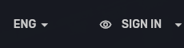{style="width: 124.50px; height: 32.48px; margin-left: 0.00px; margin-top: 0.00px; transform: rotate(0.00rad) translateZ(0px); -webkit-transform: rotate(0.00rad) translateZ(0px);"}]{style="overflow: hidden; display: inline-block; margin: 0.00px 0.00px; border: 0.00px solid #000000; transform: rotate(0.00rad) translateZ(0px); -webkit-transform: rotate(0.00rad) translateZ(0px); width: 124.50px; height: 32.48px;"}     [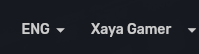{style="width: 118.50px; height: 32.40px; margin-left: 0.00px; margin-top: 0.00px; transform: rotate(0.00rad) translateZ(0px); -webkit-transform: rotate(0.00rad) translateZ(0px);"}]{style="overflow: hidden; display: inline-block; margin: 0.00px 0.00px; border: 0.00px solid #000000; transform: rotate(0.00rad) translateZ(0px); -webkit-transform: rotate(0.00rad) translateZ(0px); width: 118.50px; height: 32.40px;"}
  [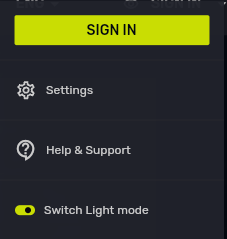{style="width: 131.77px; height: 138.30px; margin-left: 0.00px; margin-top: 0.00px; transform: rotate(0.00rad) translateZ(0px); -webkit-transform: rotate(0.00rad) translateZ(0px);"}]{style="overflow: hidden; display: inline-block; margin: 0.00px 0.00px; border: 0.00px solid #000000; transform: rotate(0.00rad) translateZ(0px); -webkit-transform: rotate(0.00rad) translateZ(0px); width: 131.77px; height: 138.30px;"}   [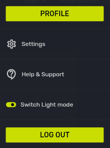{style="width: 112.59px; height: 150.70px; margin-left: 0.00px; margin-top: 0.00px; transform: rotate(0.00rad) translateZ(0px); -webkit-transform: rotate(0.00rad) translateZ(0px);"}]{style="overflow: hidden; display: inline-block; margin: 0.00px 0.00px; border: 0.00px solid #000000; transform: rotate(0.00rad) translateZ(0px); -webkit-transform: rotate(0.00rad) translateZ(0px); width: 112.59px; height: 150.70px;"}
  ---------------------------------------------------------------------------------------------------------------------------------------------------------------------------------------------------------------------------------------------------------------------------------------------------------------------------------------------------------------------------------------------------------------------------------------------------------- ----------------------------------------------------------------------------------------------------------------------------------------------------------------------------------------------------------------------------------------------------------------------------------------------------------------------------------------------------------------------------------------------------------------------------------------------------------

[]{.c1}

[]{.c1}

[]{#t.da03c8e150311ccb909a4fbfe0459cdd6efc7e4e}[]{#t.6}

  ---------------------------------------------------------------------------------------------------------------------------------------------------------------------------------------------------------------------------------------------------------------------------------------------------------------------------------------------------------------------------------------------------------------------------------------------------------- ----------------------------------------------------------------------------------------------------------------------------------------------------------------------------------------------------------------------------------------------------------------------------------------------------------------------------------------------------------------------------------------------------------------------------------------------------------
  [Signed out]{.c1}                                                                                                                                                                                                                                                                                                                                                                                                                                          [Signed in]{.c1}
  [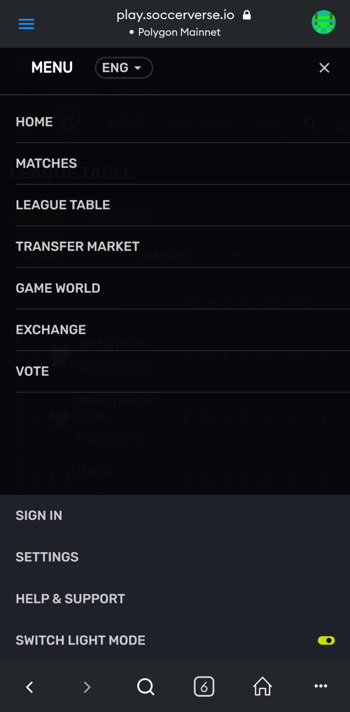{style="width: 149.50px; height: 305.32px; margin-left: 0.00px; margin-top: 0.00px; transform: rotate(0.00rad) translateZ(0px); -webkit-transform: rotate(0.00rad) translateZ(0px);"}]{style="overflow: hidden; display: inline-block; margin: 0.00px 0.00px; border: 0.00px solid #000000; transform: rotate(0.00rad) translateZ(0px); -webkit-transform: rotate(0.00rad) translateZ(0px); width: 149.50px; height: 305.32px;"}   [{style="width: 151.26px; height: 309.30px; margin-left: 0.00px; margin-top: 0.00px; transform: rotate(0.00rad) translateZ(0px); -webkit-transform: rotate(0.00rad) translateZ(0px);"}]{style="overflow: hidden; display: inline-block; margin: 0.00px 0.00px; border: 0.00px solid #000000; transform: rotate(0.00rad) translateZ(0px); -webkit-transform: rotate(0.00rad) translateZ(0px); width: 151.26px; height: 309.30px;"}
  ---------------------------------------------------------------------------------------------------------------------------------------------------------------------------------------------------------------------------------------------------------------------------------------------------------------------------------------------------------------------------------------------------------------------------------------------------------- ----------------------------------------------------------------------------------------------------------------------------------------------------------------------------------------------------------------------------------------------------------------------------------------------------------------------------------------------------------------------------------------------------------------------------------------------------------

[]{.c1}

[9. Sign In / Profile]{.c1}

[9. Sign In / Profile]{.c1}

[10. Settings]{.c1}

[10. Settings]{.c1}

[11. Help & Support]{.c1}

[11. Help & Support]{.c1}

[12. Switch Dark/Light Mode]{.c1}

[12. Switch Dark/Light Mode]{.c1}

[13. Log Out]{.c1}

[---]{.c1}

[]{.c3}

[To access all of the horizontal main menu on mobile devices, swipe or
flick left or right on the menu.]{.c3}

[]{.c3}

[Most of the menus are self-explanatory. Refer to other portions of the
guide for explanations and "how to" instructions. ]{.c3}

## [Search]{.c15} {#h.xtptjx99um9k .c20}

[The fastest and easiest way to find a club, player, or another user is
to use the search bar. The search icon is in the upper right on both
mobile and desktop. ]{.c3}

[]{.c17}

[]{#t.58807da4062d6f87d636584340b7dbc191be43ed}[]{#t.7}

[DESKTOP]{.c47 .c40}

[MOBILE]{.c47 .c40}

[{style="width: 334.00px; height: 49.33px; margin-left: 0.00px; margin-top: 0.00px; transform: rotate(0.00rad) translateZ(0px); -webkit-transform: rotate(0.00rad) translateZ(0px);"}]{style="overflow: hidden; display: inline-block; margin: 0.00px 0.00px; border: 0.00px solid #000000; transform: rotate(0.00rad) translateZ(0px); -webkit-transform: rotate(0.00rad) translateZ(0px); width: 334.00px; height: 49.33px;"}

[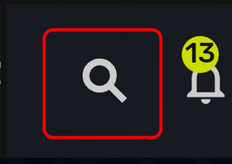{style="width: 68.92px; height: 48.70px; margin-left: 0.00px; margin-top: 0.00px; transform: rotate(0.00rad) translateZ(0px); -webkit-transform: rotate(0.00rad) translateZ(0px);"}]{style="overflow: hidden; display: inline-block; margin: 0.00px 0.00px; border: 0.00px solid #000000; transform: rotate(0.00rad) translateZ(0px); -webkit-transform: rotate(0.00rad) translateZ(0px); width: 68.92px; height: 48.70px;"}

[1. Click the search icon to display the search bar]{.c1}

[1. Tap the search icon to display the search bar]{.c1}

[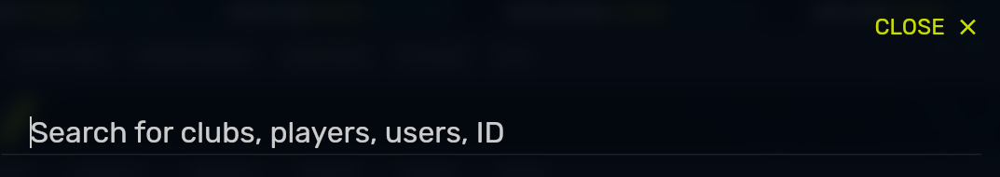{style="width: 334.00px; height: 58.67px; margin-left: 0.00px; margin-top: 0.00px; transform: rotate(0.00rad) translateZ(0px); -webkit-transform: rotate(0.00rad) translateZ(0px);"}]{style="overflow: hidden; display: inline-block; margin: 0.00px 0.00px; border: 0.00px solid #000000; transform: rotate(0.00rad) translateZ(0px); -webkit-transform: rotate(0.00rad) translateZ(0px); width: 334.00px; height: 58.67px;"}

[{style="width: 185.79px; height: 72.70px; margin-left: 0.00px; margin-top: 0.00px; transform: rotate(0.00rad) translateZ(0px); -webkit-transform: rotate(0.00rad) translateZ(0px);"}]{style="overflow: hidden; display: inline-block; margin: 0.00px 0.00px; border: 0.00px solid #000000; transform: rotate(0.00rad) translateZ(0px); -webkit-transform: rotate(0.00rad) translateZ(0px); width: 185.79px; height: 72.70px;"}

[2. Click "CLOSE X" to close the search bar]{.c1}

[2. Tap the "X" to close the search bar]{.c1}

[]{.c3}

[Searches must be at least 3 characters but are case insensitive, i.e.
searching for "lut" and "LUT" both return the same results. ]{.c3}

[]{.c3}

[However, if you wish to search by ID, i.e. the numeric ID of the club,
player, or user, then your search can be as short as 1 digit (0-9), but
must be only digits and no alphabetic or other characters. ]{.c3}

[]{.c3}

[If there are any matches, results are returned in order:]{.c3}

[]{.c3}

1.  [Clubs first]{.c3}
2.  [Players second]{.c3}
3.  [Users last]{.c18}

[]{.c3}

[Further, all results have a club/player/user badge on the right side to
tell you what the result is. ]{.c3}

[]{.c17}

[]{#t.0f05fcb9bc1ce11c899b6a4bf615f5158456b0e4}[]{#t.8}

[DESKTOP]{.c47 .c40}

[MOBILE]{.c47 .c40}

[{style="width: 334.00px; height: 78.67px; margin-left: 0.00px; margin-top: 0.00px; transform: rotate(0.00rad) translateZ(0px); -webkit-transform: rotate(0.00rad) translateZ(0px);"}]{style="overflow: hidden; display: inline-block; margin: 0.00px 0.00px; border: 0.00px solid #000000; transform: rotate(0.00rad) translateZ(0px); -webkit-transform: rotate(0.00rad) translateZ(0px); width: 334.00px; height: 78.67px;"}

[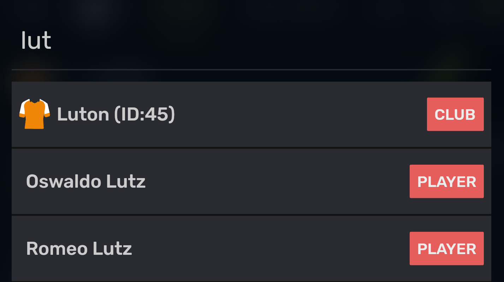{style="width: 214.50px; height: 120.09px; margin-left: 0.00px; margin-top: 0.00px; transform: rotate(0.00rad) translateZ(0px); -webkit-transform: rotate(0.00rad) translateZ(0px);"}]{style="overflow: hidden; display: inline-block; margin: 0.00px 0.00px; border: 0.00px solid #000000; transform: rotate(0.00rad) translateZ(0px); -webkit-transform: rotate(0.00rad) translateZ(0px); width: 214.50px; height: 120.09px;"}

[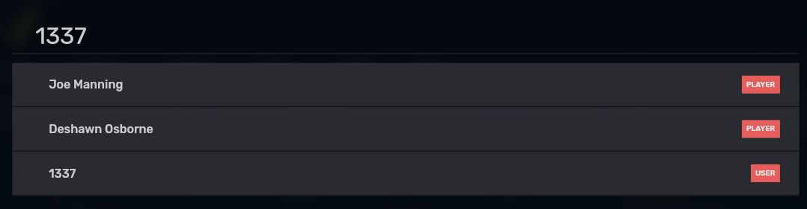{style="width: 334.00px; height: 86.67px; margin-left: 0.00px; margin-top: 0.00px; transform: rotate(0.00rad) translateZ(0px); -webkit-transform: rotate(0.00rad) translateZ(0px);"}]{style="overflow: hidden; display: inline-block; margin: 0.00px 0.00px; border: 0.00px solid #000000; transform: rotate(0.00rad) translateZ(0px); -webkit-transform: rotate(0.00rad) translateZ(0px); width: 334.00px; height: 86.67px;"}

[{style="width: 214.50px; height: 120.74px; margin-left: 0.00px; margin-top: 0.00px; transform: rotate(0.00rad) translateZ(0px); -webkit-transform: rotate(0.00rad) translateZ(0px);"}]{style="overflow: hidden; display: inline-block; margin: 0.00px 0.00px; border: 0.00px solid #000000; transform: rotate(0.00rad) translateZ(0px); -webkit-transform: rotate(0.00rad) translateZ(0px); width: 214.50px; height: 120.74px;"}

[]{.c3}

[Simply click on the line of the result you want, i.e. the result name,
type badge, or empty space on the line, to go to that club's overview,
player's overview, or user's profile.]{.c18}

# VIEW USER PROFILES/PORTFOLIOS {#h.101rz7svtyx .c42}

[Your profile area shows information about your career, your SMC bank
balance as well as any shares that you own.]{.c17}

[]{.c17}

[Soccerverse is a social game and you can also see the same information
about other users by looking at their profile area. ]{.c17}

[]{.c17}

[There are several places where you can find other users to click on
their name and display their profiles.]{.c17}

[]{.c17}

-   [Gameworld \> Best Managers]{.c17}
-   [Use the search bar to find a user]{.c17}
-   [Club overview (for that club's manager)]{.c17}
-   [Player overview (for that player's agent)]{.c17}
-   [In the in-game chat box (if they are currently online)]{.c17}

[]{.c17}

[Simply click a user's name to display their profile.]{.c17}

[]{.c17}

[User profiles have the following information:]{.c17}

[]{.c17}

-   [Overview: Various information, including financial summaries]{.c17}
-   [Portfolio: What shares are owned]{.c17}
-   [Accounts: What has been spent and received (SMC)]{.c17}
-   [Career: Career as a club manager]{.c17}
-   [Agents: What players are managed as an agent ]{.c17}
-   [Share orders: Open buy/sell orders for club/player shares]{.c17}

[]{.c17}

[{style="width: 355.08px; height: 274.70px; margin-left: 0.00px; margin-top: 0.00px; transform: rotate(0.00rad) translateZ(0px); -webkit-transform: rotate(0.00rad) translateZ(0px);"}]{style="overflow: hidden; display: inline-block; margin: 0.00px 0.00px; border: 0.00px solid #000000; transform: rotate(0.00rad) translateZ(0px); -webkit-transform: rotate(0.00rad) translateZ(0px); width: 355.08px; height: 274.70px;"}

[A User Profile]{.c17}

## Your Profile {#h.r4hk99qrb4m4 .c20}

[How you can view your own profile depends on whether you are a club
manager or not.]{.c17}

[]{.c17}

[Everyone can use the PROFILE button/menu as shown below:]{.c17}

[]{.c17}

[]{#t.dc0b762d055d0fa1f1063407d87cb746e3b607d4}[]{#t.9}

[DESKTOP]{.c47 .c40}

[MOBILE]{.c47 .c40}

[1. Click your name in the top right]{.c1}

[1. Tap the Soccerverse hamburger menu]{.c1}

[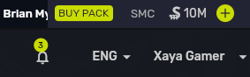{style="width: 227.50px; height: 70.74px; margin-left: 0.00px; margin-top: 0.00px; transform: rotate(0.00rad) translateZ(0px); -webkit-transform: rotate(0.00rad) translateZ(0px);"}]{style="overflow: hidden; display: inline-block; margin: 0.00px 0.00px; border: 0.00px solid #000000; transform: rotate(0.00rad) translateZ(0px); -webkit-transform: rotate(0.00rad) translateZ(0px); width: 227.50px; height: 70.74px;"}

[{style="width: 184.50px; height: 107.84px; margin-left: 0.00px; margin-top: 0.00px; transform: rotate(0.00rad) translateZ(0px); -webkit-transform: rotate(0.00rad) translateZ(0px);"}]{style="overflow: hidden; display: inline-block; margin: 0.00px 0.00px; border: 0.00px solid #000000; transform: rotate(0.00rad) translateZ(0px); -webkit-transform: rotate(0.00rad) translateZ(0px); width: 184.50px; height: 107.84px;"}

[2. In the dropdown menu, click the PROFILE button]{.c1}

[2. In the Soccerverse menu, tap the PROFILE menu item]{.c1}

[{style="width: 148.44px; height: 195.70px; margin-left: 0.00px; margin-top: 0.00px; transform: rotate(0.00rad) translateZ(0px); -webkit-transform: rotate(0.00rad) translateZ(0px);"}]{style="overflow: hidden; display: inline-block; margin: 0.00px 0.00px; border: 0.00px solid #000000; transform: rotate(0.00rad) translateZ(0px); -webkit-transform: rotate(0.00rad) translateZ(0px); width: 148.44px; height: 195.70px;"}

[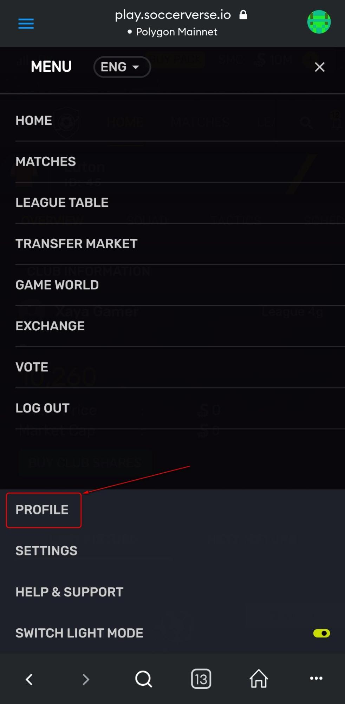{style="width: 119.50px; height: 243.29px; margin-left: 0.00px; margin-top: 0.00px; transform: rotate(0.00rad) translateZ(0px); -webkit-transform: rotate(0.00rad) translateZ(0px);"}]{style="overflow: hidden; display: inline-block; margin: 0.00px 0.00px; border: 0.00px solid #000000; transform: rotate(0.00rad) translateZ(0px); -webkit-transform: rotate(0.00rad) translateZ(0px); width: 119.50px; height: 243.29px;"}

[3. You're immediately taken to your profile]{.c1}

[3. You're immediately taken to your profile]{.c1}

[]{.c17}

[If you aren't a club manager, you can also click the HOME button in the
main menu.]{.c17}

[]{.c17}

[If you are a club manager, after you click the HOME button in the main
menu, you are taken to your club page. Since you're the manager, simply
click on your club's manager's name, i.e. your name. ]{.c17}

[]{.c17}

[{style="width: 312.48px; height: 208.70px; margin-left: 0.00px; margin-top: 0.00px; transform: rotate(0.00rad) translateZ(0px); -webkit-transform: rotate(0.00rad) translateZ(0px);"}]{style="overflow: hidden; display: inline-block; margin: 0.00px 0.00px; border: 0.00px solid #000000; transform: rotate(0.00rad) translateZ(0px); -webkit-transform: rotate(0.00rad) translateZ(0px); width: 312.48px; height: 208.70px;"}

[The club manager's "home" screen is his club overview]{.c17}

------------------------------------------------------------------------

[]{.c17}

# [VIEWING FIXTURES AND MATCH RESULTS]{.c58 .c40} {#h.po03fx23ajwx .c42}

[Clicking on the League menu item will display the leagues.]{.c1}

[Clicking on the Matches menu item will display past and future
fixtures.]{.c1}

[Clicking on the score of past fixtures will bring up the match
commentary and other information regarding the match.]{.c22 .c18}

# [BUYING & SELLING SHARES]{.c58 .c40} {#h.tmjvov3ksi2q .c42}

[Shares pay dividends, so the more you have, the more ]{.c22
.c18}[SMC]{.c22 .c18}[ (Soccerverse Coins) you get. They can also go up
or down in price in the market, so you can potentially profit from
trading (buying and selling) in the markets.]{.c1}

[]{.c1}

[Initially, clubs and players start out with a total of 10 million
(10,000,000) shares each. ]{.c1}

[]{.c1}

[The markets for club and player shares are under the respective
club/player's shares tab in the Order Book tab. ]{.c1}

[]{.c1}

[{style="width: 486.22px; height: 273.50px; margin-left: -6.91px; margin-top: 0.00px; transform: rotate(0.00rad) translateZ(0px); -webkit-transform: rotate(0.00rad) translateZ(0px);"}]{style="overflow: hidden; display: inline-block; margin: 0.00px 0.00px; border: 0.00px solid #000000; transform: rotate(0.00rad) translateZ(0px); -webkit-transform: rotate(0.00rad) translateZ(0px); width: 472.41px; height: 273.50px;"}[ 
]{.c22
.c18}[{style="width: 132.87px; height: 271.30px; margin-left: 0.00px; margin-top: 0.00px; transform: rotate(0.00rad) translateZ(0px); -webkit-transform: rotate(0.00rad) translateZ(0px);"}]{style="overflow: hidden; display: inline-block; margin: 0.00px 0.00px; border: 0.00px solid #000000; transform: rotate(0.00rad) translateZ(0px); -webkit-transform: rotate(0.00rad) translateZ(0px); width: 132.87px; height: 271.30px;"}

[Club order book]{.c1}

[]{.c1}

[{style="width: 481.08px; height: 270.61px; margin-left: -6.79px; margin-top: 0.00px; transform: rotate(0.00rad) translateZ(0px); -webkit-transform: rotate(0.00rad) translateZ(0px);"}]{style="overflow: hidden; display: inline-block; margin: 0.00px 0.00px; border: 0.00px solid #000000; transform: rotate(0.00rad) translateZ(0px); -webkit-transform: rotate(0.00rad) translateZ(0px); width: 467.50px; height: 270.61px;"}[ 
]{.c22
.c18}[{style="width: 130.27px; height: 265.30px; margin-left: 0.00px; margin-top: 0.00px; transform: rotate(0.00rad) translateZ(0px); -webkit-transform: rotate(0.00rad) translateZ(0px);"}]{style="overflow: hidden; display: inline-block; margin: 0.00px 0.00px; border: 0.00px solid #000000; transform: rotate(0.00rad) translateZ(0px); -webkit-transform: rotate(0.00rad) translateZ(0px); width: 130.27px; height: 265.30px;"}

[Player order book]{.c1}

[]{.c1}

[You can also browse all clubs or all players at once by
clicking/tapping EXCHANGE in the main menu. ]{.c1}

[]{.c1}

[]{#t.7c43ee8cbcab1c8f4430b882423244fe043be346}[]{#t.10}

[DESKTOP]{.c47 .c40}

[MOBILE]{.c47 .c40}

[1. The main menu is at the top of the screen]{.c1}

[1. You can tap the Soccerverse main menu hamburger button or you can
left/right swipe the main menu to the left of the Soccerverse game
icon]{.c1}

[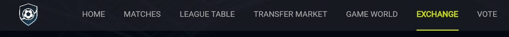{style="width: 334.00px; height: 25.33px; margin-left: 0.00px; margin-top: 0.00px; transform: rotate(0.00rad) translateZ(0px); -webkit-transform: rotate(0.00rad) translateZ(0px);"}]{style="overflow: hidden; display: inline-block; margin: 0.00px 0.00px; border: 0.00px solid #000000; transform: rotate(0.00rad) translateZ(0px); -webkit-transform: rotate(0.00rad) translateZ(0px); width: 334.00px; height: 25.33px;"}

[{style="width: 151.67px; height: 308.70px; margin-left: 0.00px; margin-top: 0.00px; transform: rotate(0.00rad) translateZ(0px); -webkit-transform: rotate(0.00rad) translateZ(0px);"}]{style="overflow: hidden; display: inline-block; margin: 0.00px 0.00px; border: 0.00px solid #000000; transform: rotate(0.00rad) translateZ(0px); -webkit-transform: rotate(0.00rad) translateZ(0px); width: 151.67px; height: 308.70px;"}[ ]{.c22
.c18}[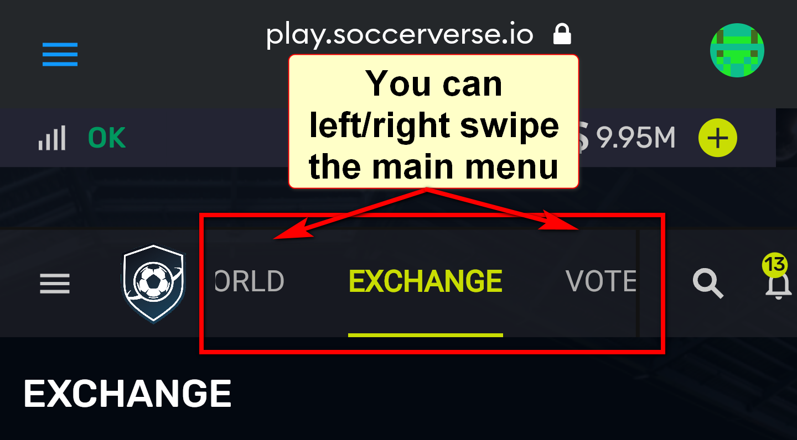{style="width: 170.09px; height: 93.70px; margin-left: 0.00px; margin-top: 0.00px; transform: rotate(0.00rad) translateZ(0px); -webkit-transform: rotate(0.00rad) translateZ(0px);"}]{style="overflow: hidden; display: inline-block; margin: 0.00px 0.00px; border: 0.00px solid #000000; transform: rotate(0.00rad) translateZ(0px); -webkit-transform: rotate(0.00rad) translateZ(0px); width: 170.09px; height: 93.70px;"}

[2. On the Exchange screen, click the CLUB SHARES or PLAYER SHARES
tab]{.c1}

[2. On the Exchange screen, click the CLUB SHARES or PLAYER SHARES
tab]{.c1}

[{style="width: 252.50px; height: 117.93px; margin-left: 0.00px; margin-top: 0.00px; transform: rotate(0.00rad) translateZ(0px); -webkit-transform: rotate(0.00rad) translateZ(0px);"}]{style="overflow: hidden; display: inline-block; margin: 0.00px 0.00px; border: 0.00px solid #000000; transform: rotate(0.00rad) translateZ(0px); -webkit-transform: rotate(0.00rad) translateZ(0px); width: 252.50px; height: 117.93px;"}

[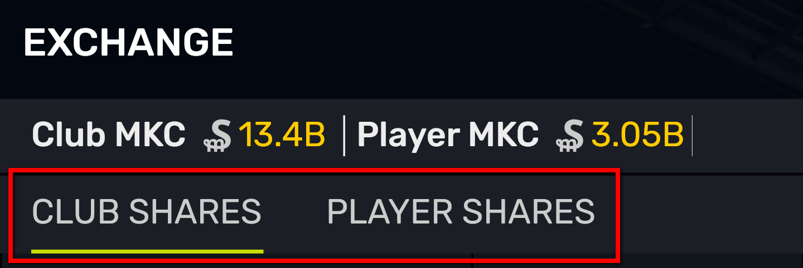{style="width: 276.50px; height: 92.72px; margin-left: 0.00px; margin-top: 0.00px; transform: rotate(0.00rad) translateZ(0px); -webkit-transform: rotate(0.00rad) translateZ(0px);"}]{style="overflow: hidden; display: inline-block; margin: 0.00px 0.00px; border: 0.00px solid #000000; transform: rotate(0.00rad) translateZ(0px); -webkit-transform: rotate(0.00rad) translateZ(0px); width: 276.50px; height: 92.72px;"}

[3. Once you've decided on a club or player for which you'd like to see
their order book, click their View button on the right]{.c1}

[3. Once you've decided on a club or player for which you'd like to see
their order book, tap their View button on the right]{.c1}

[{style="width: 274.50px; height: 210.40px; margin-left: 0.00px; margin-top: 0.00px; transform: rotate(0.00rad) translateZ(0px); -webkit-transform: rotate(0.00rad) translateZ(0px);"}]{style="overflow: hidden; display: inline-block; margin: 0.00px 0.00px; border: 0.00px solid #000000; transform: rotate(0.00rad) translateZ(0px); -webkit-transform: rotate(0.00rad) translateZ(0px); width: 274.50px; height: 210.40px;"}

[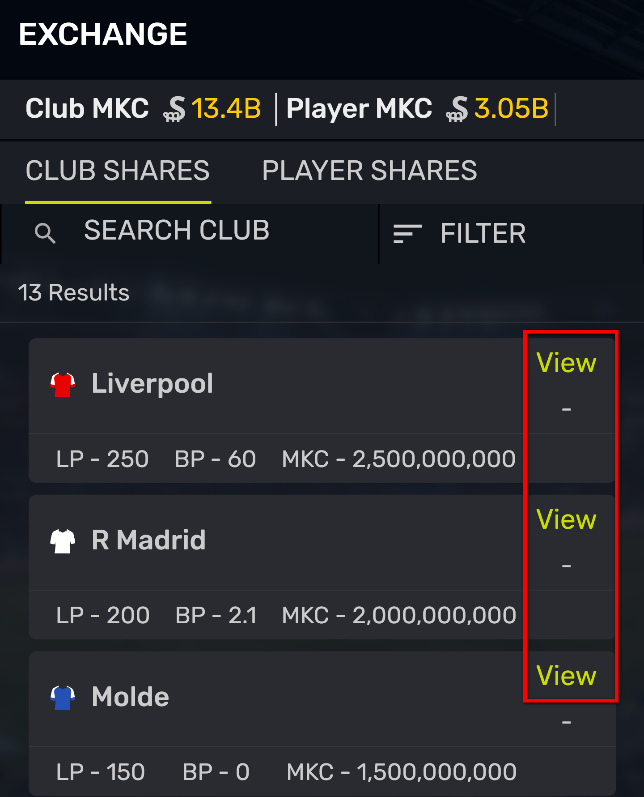{style="width: 161.88px; height: 200.70px; margin-left: 0.00px; margin-top: 0.00px; transform: rotate(0.00rad) translateZ(0px); -webkit-transform: rotate(0.00rad) translateZ(0px);"}]{style="overflow: hidden; display: inline-block; margin: 0.00px 0.00px; border: 0.00px solid #000000; transform: rotate(0.00rad) translateZ(0px); -webkit-transform: rotate(0.00rad) translateZ(0px); width: 161.88px; height: 200.70px;"}

[]{.c1}

[Buying and selling shares is as simple as entering:]{.c1}

[]{.c1}

-   [The price you want to buy or sell at]{.c1}
-   [The quantity of shares that you want to buy/sell]{.c1}
-   [Then clicking the Buy or Sell button and confirming]{.c1}

[]{.c1}

[When ]{.c22 .c18}[BUYING,]{.c59 .c18}[ if you bid at or over the lowest
price in the order book, you will get 1 or more shares. However, your
order may not be entirely filled if there aren't enough shares for sale
at that price. In this case, the portion of your unfilled order will
remain in the order book until it is filled or until you cancel it. If
you bid lower than the lowest sell order, your order will remain in the
order book until it is filled (someone sells at that price) or until you
cancel it.]{.c1}

[]{.c1}

[Selling shares works similar to buying, just in reverse.]{.c1}

[]{.c1}

[]{.c1}

[{style="width: 548.15px; height: 283.14px; margin-left: 0.00px; margin-top: 0.00px; transform: rotate(0.00rad) translateZ(0px); -webkit-transform: rotate(0.00rad) translateZ(0px);"}]{style="overflow: hidden; display: inline-block; margin: 0.00px 0.00px; border: 0.00px solid #000000; transform: rotate(0.00rad) translateZ(0px); -webkit-transform: rotate(0.00rad) translateZ(0px); width: 548.15px; height: 283.14px;"}

[The full view when placing share orders for a player]{.c1}

[]{.c3}

[{style="width: 410.65px; height: 185.13px; margin-left: 0.00px; margin-top: 0.00px; transform: rotate(0.00rad) translateZ(0px); -webkit-transform: rotate(0.00rad) translateZ(0px);"}]{style="overflow: hidden; display: inline-block; margin: 0.00px 0.00px; border: 0.00px solid #000000; transform: rotate(0.00rad) translateZ(0px); -webkit-transform: rotate(0.00rad) translateZ(0px); width: 410.65px; height: 185.13px;"}

[Close up detail]{.c3}

[]{.c3}

[{style="width: 335.15px; height: 161.60px; margin-left: 0.00px; margin-top: 0.00px; transform: rotate(0.00rad) translateZ(0px); -webkit-transform: rotate(0.00rad) translateZ(0px);"}]{style="overflow: hidden; display: inline-block; margin: 0.00px 0.00px; border: 0.00px solid #000000; transform: rotate(0.00rad) translateZ(0px); -webkit-transform: rotate(0.00rad) translateZ(0px); width: 335.15px; height: 161.60px;"}

[Confirming purchase of player shares]{.c3}

[]{.c3}

[{style="width: 264.15px; height: 141.42px; margin-left: 0.00px; margin-top: 0.00px; transform: rotate(0.00rad) translateZ(0px); -webkit-transform: rotate(0.00rad) translateZ(0px);"}]{style="overflow: hidden; display: inline-block; margin: 0.00px 0.00px; border: 0.00px solid #000000; transform: rotate(0.00rad) translateZ(0px); -webkit-transform: rotate(0.00rad) translateZ(0px); width: 264.15px; height: 141.42px;"}

[List of shareholders in player]{.c3}

[]{.c3}

[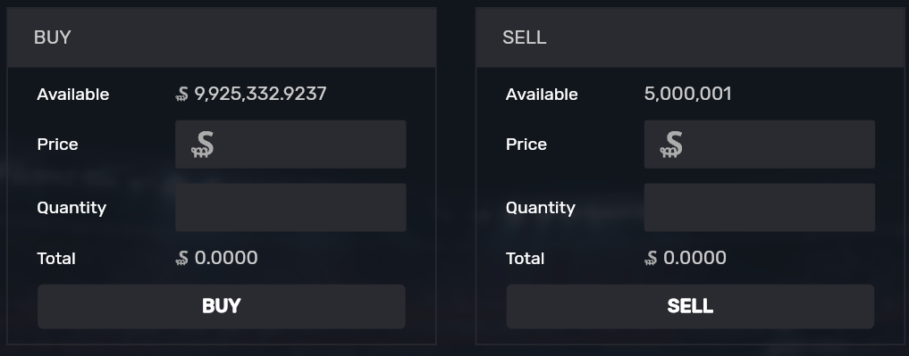{style="width: 440.50px; height: 172.29px; margin-left: 0.00px; margin-top: 0.00px; transform: rotate(0.00rad) translateZ(0px); -webkit-transform: rotate(0.00rad) translateZ(0px);"}]{style="overflow: hidden; display: inline-block; margin: 0.00px 0.00px; border: 0.00px solid #000000; transform: rotate(0.00rad) translateZ(0px); -webkit-transform: rotate(0.00rad) translateZ(0px); width: 440.50px; height: 172.29px;"}

[After the purchase, the user has "5,000,001" shares available to
sell]{.c3}

# [PROPOSE/VOTE FOR MANAGERS/AGENTS]{.c58 .c40} {#h.lrilimrzzjrk .c42}

[Shareholders with ]{.c22 .c18}[100 shares in a club (\>=0.001%)  or
1,000,000]{.c22 .c18}[ shares in a player (\>=10%) can propose a new
manager for a club or a new agent for a player. Once a proposal has been
made, other shareholders have 24 hours to propose other candidates,
unless the shareholder making the proposal has \>50% shares, in which
case the voting period begins instantly. ]{.c1}

[]{.c1}

[After the 24-hour proposal period expires, voting begins and lasts for
3 days or until a candidate receives \>50% of the votes. All
shareholders can vote for managers and agents irrespective of how many
shares they have. Owning more shares gives you a more powerful vote. At
the end of a voting period, the candidate with the most votes
wins.]{.c22 .c18}

[]{.c1}

[Proposing or voting for a manager/agent is done in the club/player
overview under Vote. ]{.c1}

[]{.c1}

[{style="width: 341.83px; height: 192.00px; margin-left: -4.73px; margin-top: 0.00px; transform: rotate(0.00rad) translateZ(0px); -webkit-transform: rotate(0.00rad) translateZ(0px);"}]{style="overflow: hidden; display: inline-block; margin: 0.00px 0.00px; border: 0.00px solid #000000; transform: rotate(0.00rad) translateZ(0px); -webkit-transform: rotate(0.00rad) translateZ(0px); width: 332.36px; height: 192.00px;"}[ 
]{.c22
.c18}[{style="width: 94.62px; height: 192.00px; margin-left: 0.00px; margin-top: 0.00px; transform: rotate(0.00rad) translateZ(0px); -webkit-transform: rotate(0.00rad) translateZ(0px);"}]{style="overflow: hidden; display: inline-block; margin: 0.00px 0.00px; border: 0.00px solid #000000; transform: rotate(0.00rad) translateZ(0px); -webkit-transform: rotate(0.00rad) translateZ(0px); width: 94.62px; height: 192.00px;"}

[Propose or vote for a new manager for a club]{.c1}

[]{.c1}

[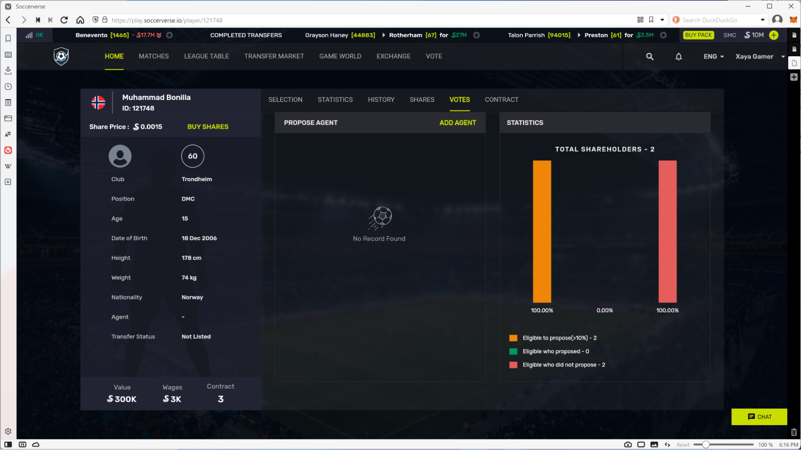{style="width: 340.76px; height: 192.00px; margin-left: -4.72px; margin-top: 0.00px; transform: rotate(0.00rad) translateZ(0px); -webkit-transform: rotate(0.00rad) translateZ(0px);"}]{style="overflow: hidden; display: inline-block; margin: 0.00px 0.00px; border: 0.00px solid #000000; transform: rotate(0.00rad) translateZ(0px); -webkit-transform: rotate(0.00rad) translateZ(0px); width: 331.32px; height: 192.00px;"}[ 
]{.c22
.c18}[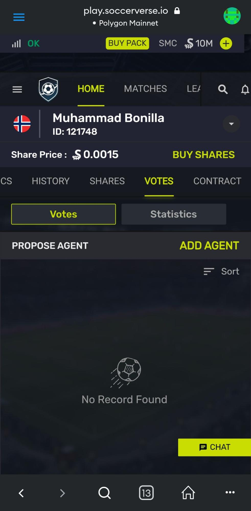{style="width: 94.62px; height: 192.00px; margin-left: 0.00px; margin-top: 0.00px; transform: rotate(0.00rad) translateZ(0px); -webkit-transform: rotate(0.00rad) translateZ(0px);"}]{style="overflow: hidden; display: inline-block; margin: 0.00px 0.00px; border: 0.00px solid #000000; transform: rotate(0.00rad) translateZ(0px); -webkit-transform: rotate(0.00rad) translateZ(0px); width: 94.62px; height: 192.00px;"}

[Propose or vote for a new agent for a player]{.c1}

## [Proposal Process and Timeframes]{.c15} {#h.9az770jpy2ub .c20}

[The proposal process consists of several steps:]{.c3}

[]{.c3}

1.  [Initial proposal: This starts a 24 hour countdown for other users
    to submit different proposals]{.c3}
2.  [Additional proposals: Other users can submit different proposals up
    to 24 hours after the initial proposal]{.c3}
3.  [Voting period: All shareholders may vote during the 3-day voting
    period]{.c3}
4.  [Vote end & acceptance/denial: At the end of the vote, the winning
    candidate for a club may accept or decline the position. Winning an
    agent vote automatically makes the user an agent]{.c3}

[]{.c3}

[{style="width: 697.70px; height: 168.00px; margin-left: 0.00px; margin-top: 0.00px; transform: rotate(0.00rad) translateZ(0px); -webkit-transform: rotate(0.00rad) translateZ(0px);"}]{style="overflow: hidden; display: inline-block; margin: 0.00px 0.00px; border: 0.00px solid #000000; transform: rotate(0.00rad) translateZ(0px); -webkit-transform: rotate(0.00rad) translateZ(0px); width: 697.70px; height: 168.00px;"}

[If a user owns \>50% of a club's or player's shares, the proposal
period is skipped and the user may then vote with their majority of
shares to install their choice of manager/agent. ]{.c18}

## [To propose a new manager or agent:]{.c15} {#h.db4lhd23ux6i .c20}

[NOTE:]{.c18 .c75}[ Xaya user names are case sensitive and must be
exact, ]{.c18}[e.g. "Bob", "BOB", and "bob" are all different]{.c22
.c18}[. For difficult names, you should copy & paste them. ]{.c3}

[]{.c1}

[]{#t.a606521961382e762024915fe6dd7255b964ce5e}[]{#t.11}

[DESKTOP]{.c47 .c40}

[MOBILE]{.c40 .c47}

[1. On the club or player Votes screen, click ADD MANAGER or ADD
AGENT]{.c1}

[1. On the club or player Votes screen, tap ADD MANAGER or ADD
AGENT]{.c1}

[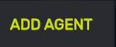{style="width: 93.44px; height: 38.40px; margin-left: 0.00px; margin-top: 0.00px; transform: rotate(0.00rad) translateZ(0px); -webkit-transform: rotate(0.00rad) translateZ(0px);"}]{style="overflow: hidden; display: inline-block; margin: 0.00px 0.00px; border: 0.00px solid #000000; transform: rotate(0.00rad) translateZ(0px); -webkit-transform: rotate(0.00rad) translateZ(0px); width: 93.44px; height: 38.40px;"}[{style="width: 113.01px; height: 38.40px; margin-left: 0.00px; margin-top: 0.00px; transform: rotate(0.00rad) translateZ(0px); -webkit-transform: rotate(0.00rad) translateZ(0px);"}]{style="overflow: hidden; display: inline-block; margin: 0.00px 0.00px; border: 0.00px solid #000000; transform: rotate(0.00rad) translateZ(0px); -webkit-transform: rotate(0.00rad) translateZ(0px); width: 113.01px; height: 38.40px;"}

[2. In the proposal dialog, enter the name of the user that you wish to
propose EXACTLY]{.c1}

[2. In the proposal dialog, enter the name of the user that you wish to
propose EXACTLY.]{.c1}

[]{.c1}

[WARNING! Mobile users should be careful about auto-correct. Also, DO
NOT leave a trailing space.]{.c1}

[{style="width: 144.00px; height: 50.07px; margin-left: 0.00px; margin-top: 0.00px; transform: rotate(0.00rad) translateZ(0px); -webkit-transform: rotate(0.00rad) translateZ(0px);"}]{style="overflow: hidden; display: inline-block; margin: 0.00px 0.00px; border: 0.00px solid #000000; transform: rotate(0.00rad) translateZ(0px); -webkit-transform: rotate(0.00rad) translateZ(0px); width: 144.00px; height: 50.07px;"}[ 
]{.c22
.c18}[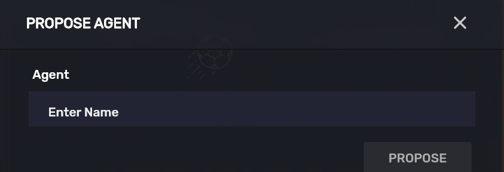{style="width: 144.00px; height: 49.24px; margin-left: 0.00px; margin-top: 0.00px; transform: rotate(0.00rad) translateZ(0px); -webkit-transform: rotate(0.00rad) translateZ(0px);"}]{style="overflow: hidden; display: inline-block; margin: 0.00px 0.00px; border: 0.00px solid #000000; transform: rotate(0.00rad) translateZ(0px); -webkit-transform: rotate(0.00rad) translateZ(0px); width: 144.00px; height: 49.24px;"}

[{style="width: 144.00px; height: 77.01px; margin-left: 0.00px; margin-top: 0.00px; transform: rotate(0.00rad) translateZ(0px); -webkit-transform: rotate(0.00rad) translateZ(0px);"}]{style="overflow: hidden; display: inline-block; margin: 0.00px 0.00px; border: 0.00px solid #000000; transform: rotate(0.00rad) translateZ(0px); -webkit-transform: rotate(0.00rad) translateZ(0px); width: 144.00px; height: 77.01px;"}[ 
]{.c22
.c18}[{style="width: 144.00px; height: 79.56px; margin-left: 0.00px; margin-top: 0.00px; transform: rotate(0.00rad) translateZ(0px); -webkit-transform: rotate(0.00rad) translateZ(0px);"}]{style="overflow: hidden; display: inline-block; margin: 0.00px 0.00px; border: 0.00px solid #000000; transform: rotate(0.00rad) translateZ(0px); -webkit-transform: rotate(0.00rad) translateZ(0px); width: 144.00px; height: 79.56px;"}[ 
]{.c1}

[3. Verify that the name you entered is correct, then click the PROPOSE
button]{.c1}

[3. Verify that the name you entered is correct, then click the PROPOSE
button]{.c1}

[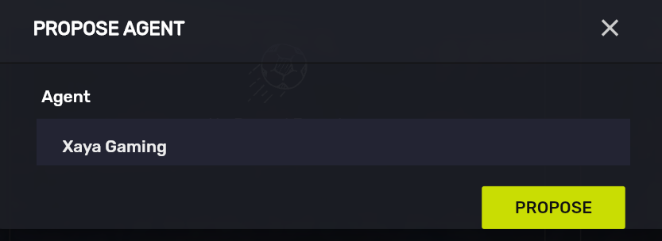{style="width: 144.00px; height: 52.14px; margin-left: 0.00px; margin-top: 0.00px; transform: rotate(0.00rad) translateZ(0px); -webkit-transform: rotate(0.00rad) translateZ(0px);"}]{style="overflow: hidden; display: inline-block; margin: 0.00px 0.00px; border: 0.00px solid #000000; transform: rotate(0.00rad) translateZ(0px); -webkit-transform: rotate(0.00rad) translateZ(0px); width: 144.00px; height: 52.14px;"}[ 
]{.c22
.c18}[{style="width: 144.00px; height: 52.14px; margin-left: 0.00px; margin-top: 0.00px; transform: rotate(0.00rad) translateZ(0px); -webkit-transform: rotate(0.00rad) translateZ(0px);"}]{style="overflow: hidden; display: inline-block; margin: 0.00px 0.00px; border: 0.00px solid #000000; transform: rotate(0.00rad) translateZ(0px); -webkit-transform: rotate(0.00rad) translateZ(0px); width: 144.00px; height: 52.14px;"}[ ]{.c1}

[{style="width: 144.00px; height: 79.20px; margin-left: 0.00px; margin-top: 0.00px; transform: rotate(0.00rad) translateZ(0px); -webkit-transform: rotate(0.00rad) translateZ(0px);"}]{style="overflow: hidden; display: inline-block; margin: 0.00px 0.00px; border: 0.00px solid #000000; transform: rotate(0.00rad) translateZ(0px); -webkit-transform: rotate(0.00rad) translateZ(0px); width: 144.00px; height: 79.20px;"}[ 
]{.c22
.c18}[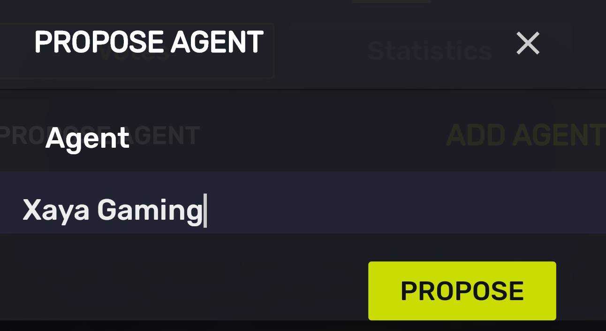{style="width: 144.00px; height: 79.20px; margin-left: 0.00px; margin-top: 0.00px; transform: rotate(0.00rad) translateZ(0px); -webkit-transform: rotate(0.00rad) translateZ(0px);"}]{style="overflow: hidden; display: inline-block; margin: 0.00px 0.00px; border: 0.00px solid #000000; transform: rotate(0.00rad) translateZ(0px); -webkit-transform: rotate(0.00rad) translateZ(0px); width: 144.00px; height: 79.20px;"}

[4. Confirm your choice in MetaMask. You'll see 2 toast notifications
informing you that:]{.c1}

[1) your proposal has been initiated, and ]{.c1}

[2) that your proposal has been successful]{.c1}

[4. Confirm your choice in MetaMask. You'll see 2 toast notifications
informing you that:]{.c1}

[1) your proposal has been initiated, and ]{.c1}

[2) that your proposal has been successful]{.c1}

[{style="width: 320.44px; height: 45.12px; margin-left: 0.00px; margin-top: 0.00px; transform: rotate(0.00rad) translateZ(0px); -webkit-transform: rotate(0.00rad) translateZ(0px);"}]{style="overflow: hidden; display: inline-block; margin: 0.00px 0.00px; border: 0.00px solid #000000; transform: rotate(0.00rad) translateZ(0px); -webkit-transform: rotate(0.00rad) translateZ(0px); width: 320.44px; height: 45.12px;"}

[ ]{.c22
.c18}[{style="width: 314.04px; height: 45.12px; margin-left: 0.00px; margin-top: 0.00px; transform: rotate(0.00rad) translateZ(0px); -webkit-transform: rotate(0.00rad) translateZ(0px);"}]{style="overflow: hidden; display: inline-block; margin: 0.00px 0.00px; border: 0.00px solid #000000; transform: rotate(0.00rad) translateZ(0px); -webkit-transform: rotate(0.00rad) translateZ(0px); width: 314.04px; height: 45.12px;"}

[{style="width: 334.00px; height: 45.33px; margin-left: 0.00px; margin-top: 0.00px; transform: rotate(0.00rad) translateZ(0px); -webkit-transform: rotate(0.00rad) translateZ(0px);"}]{style="overflow: hidden; display: inline-block; margin: 0.00px 0.00px; border: 0.00px solid #000000; transform: rotate(0.00rad) translateZ(0px); -webkit-transform: rotate(0.00rad) translateZ(0px); width: 334.00px; height: 45.33px;"}

[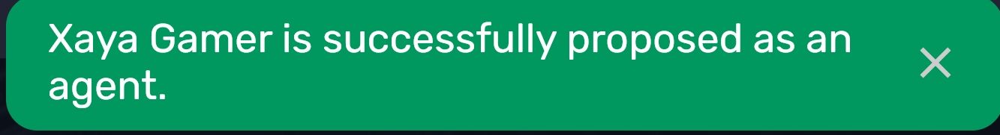{style="width: 334.00px; height: 45.33px; margin-left: 0.00px; margin-top: 0.00px; transform: rotate(0.00rad) translateZ(0px); -webkit-transform: rotate(0.00rad) translateZ(0px);"}]{style="overflow: hidden; display: inline-block; margin: 0.00px 0.00px; border: 0.00px solid #000000; transform: rotate(0.00rad) translateZ(0px); -webkit-transform: rotate(0.00rad) translateZ(0px); width: 334.00px; height: 45.33px;"}

[5. Check the Votes tab in the club or player's page. You may need to
wait a few seconds and/or refresh the page. ]{.c1}

[5. Check the Votes tab in the club or player's page. You may need to
wait a few seconds and/or refresh the page.]{.c1}

[{style="width: 258.50px; height: 167.95px; margin-left: 0.00px; margin-top: 0.00px; transform: rotate(0.00rad) translateZ(0px); -webkit-transform: rotate(0.00rad) translateZ(0px);"}]{style="overflow: hidden; display: inline-block; margin: 0.00px 0.00px; border: 0.00px solid #000000; transform: rotate(0.00rad) translateZ(0px); -webkit-transform: rotate(0.00rad) translateZ(0px); width: 258.50px; height: 167.95px;"}

[{style="width: 334.00px; height: 74.67px; margin-left: 0.00px; margin-top: 0.00px; transform: rotate(0.00rad) translateZ(0px); -webkit-transform: rotate(0.00rad) translateZ(0px);"}]{style="overflow: hidden; display: inline-block; margin: 0.00px 0.00px; border: 0.00px solid #000000; transform: rotate(0.00rad) translateZ(0px); -webkit-transform: rotate(0.00rad) translateZ(0px); width: 334.00px; height: 74.67px;"}

[{style="width: 143.13px; height: 181.70px; margin-left: 0.00px; margin-top: 0.00px; transform: rotate(0.00rad) translateZ(0px); -webkit-transform: rotate(0.00rad) translateZ(0px);"}]{style="overflow: hidden; display: inline-block; margin: 0.00px 0.00px; border: 0.00px solid #000000; transform: rotate(0.00rad) translateZ(0px); -webkit-transform: rotate(0.00rad) translateZ(0px); width: 143.13px; height: 181.70px;"}[ 
]{.c22
.c18}[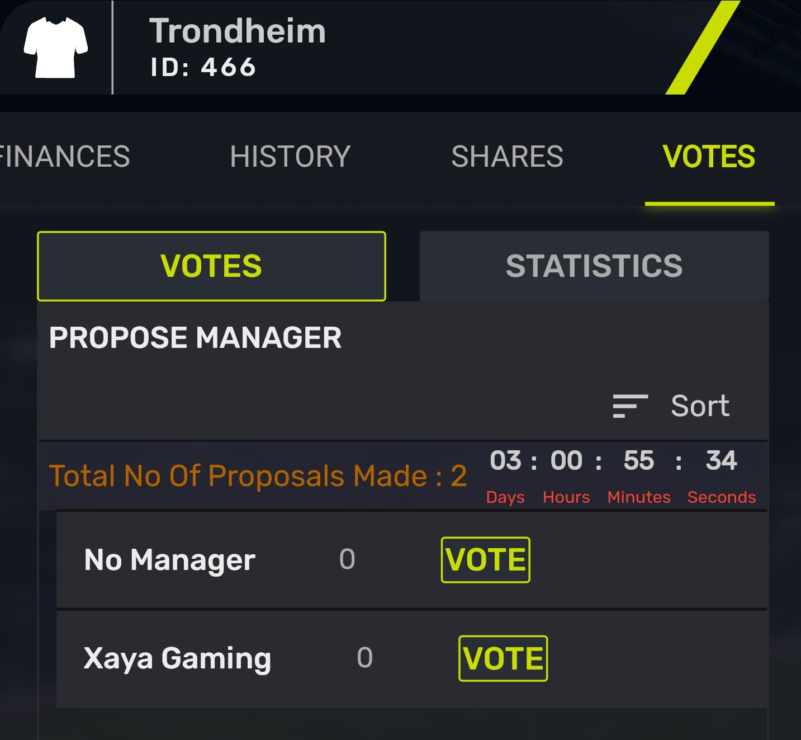{style="width: 139.56px; height: 128.70px; margin-left: 0.00px; margin-top: 0.00px; transform: rotate(0.00rad) translateZ(0px); -webkit-transform: rotate(0.00rad) translateZ(0px);"}]{style="overflow: hidden; display: inline-block; margin: 0.00px 0.00px; border: 0.00px solid #000000; transform: rotate(0.00rad) translateZ(0px); -webkit-transform: rotate(0.00rad) translateZ(0px); width: 139.56px; height: 128.70px;"}

## [Voting]{.c15} {#h.tg8sc7wmbebl .c20}

[All shareholders are eligible to vote; there is no minimum requirement
like there is for submitting proposals. ]{.c18}

[]{#t.e9bf59d8988ba07b1923e889aa900379d8d6c562}[]{#t.12}

[DESKTOP]{.c47 .c40}

[MOBILE]{.c47 .c40}

[1. Navigate to the Vote screen using the main menu VOTE item]{.c1}

[1. Navigate to the Vote screen using the main menu VOTE item]{.c1}

[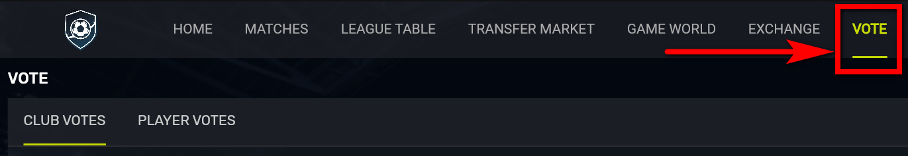{style="width: 334.00px; height: 57.33px; margin-left: 0.00px; margin-top: 0.00px; transform: rotate(0.00rad) translateZ(0px); -webkit-transform: rotate(0.00rad) translateZ(0px);"}]{style="overflow: hidden; display: inline-block; margin: 0.00px 0.00px; border: 0.00px solid #000000; transform: rotate(0.00rad) translateZ(0px); -webkit-transform: rotate(0.00rad) translateZ(0px); width: 334.00px; height: 57.33px;"}

[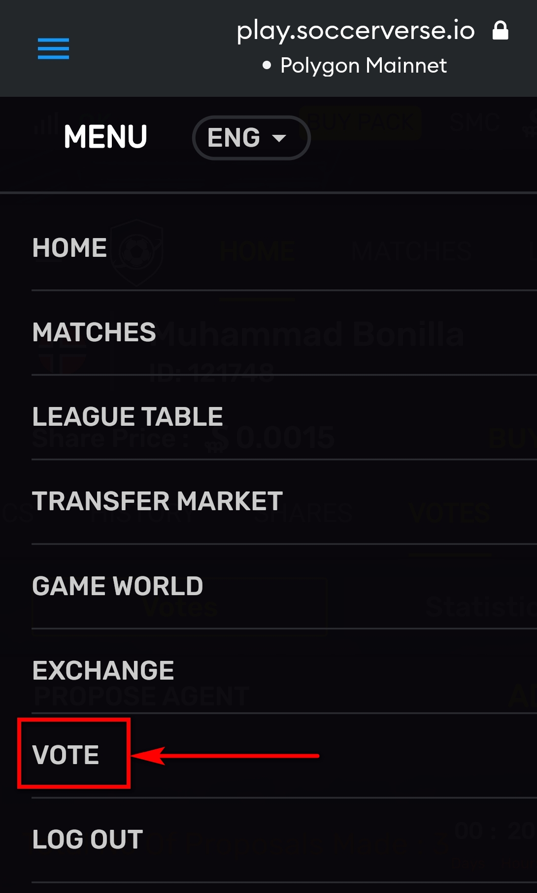{style="width: 142.45px; height: 236.70px; margin-left: 0.00px; margin-top: 0.00px; transform: rotate(0.00rad) translateZ(0px); -webkit-transform: rotate(0.00rad) translateZ(0px);"}]{style="overflow: hidden; display: inline-block; margin: 0.00px 0.00px; border: 0.00px solid #000000; transform: rotate(0.00rad) translateZ(0px); -webkit-transform: rotate(0.00rad) translateZ(0px); width: 142.45px; height: 236.70px;"}[ 
]{.c22
.c18}[{style="width: 162.51px; height: 155.70px; margin-left: 0.00px; margin-top: 0.00px; transform: rotate(0.00rad) translateZ(0px); -webkit-transform: rotate(0.00rad) translateZ(0px);"}]{style="overflow: hidden; display: inline-block; margin: 0.00px 0.00px; border: 0.00px solid #000000; transform: rotate(0.00rad) translateZ(0px); -webkit-transform: rotate(0.00rad) translateZ(0px); width: 162.51px; height: 155.70px;"}

[2. Click the CLUB VOTES or PLAYER VOTES tab]{.c1}

[2. Tap the CLUB VOTES or PLAYER VOTES tab]{.c1}

[{style="width: 188.50px; height: 99.89px; margin-left: 0.00px; margin-top: 0.00px; transform: rotate(0.00rad) translateZ(0px); -webkit-transform: rotate(0.00rad) translateZ(0px);"}]{style="overflow: hidden; display: inline-block; margin: 0.00px 0.00px; border: 0.00px solid #000000; transform: rotate(0.00rad) translateZ(0px); -webkit-transform: rotate(0.00rad) translateZ(0px); width: 188.50px; height: 99.89px;"}

[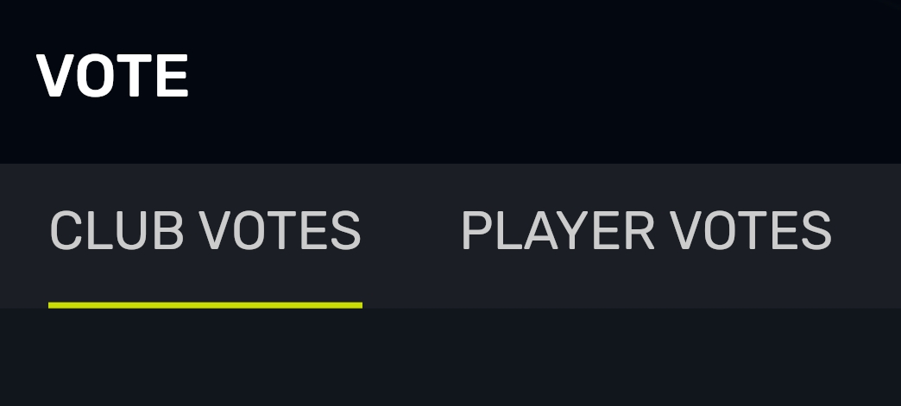{style="width: 208.50px; height: 94.26px; margin-left: 0.00px; margin-top: 0.00px; transform: rotate(0.00rad) translateZ(0px); -webkit-transform: rotate(0.00rad) translateZ(0px);"}]{style="overflow: hidden; display: inline-block; margin: 0.00px 0.00px; border: 0.00px solid #000000; transform: rotate(0.00rad) translateZ(0px); -webkit-transform: rotate(0.00rad) translateZ(0px); width: 208.50px; height: 94.26px;"}

[3. Scroll to find a club or player that you wish to make a proposal for
or to vote for a candidate]{.c1}

[3. Scroll to find a club or player that you wish to make a proposal for
or to vote for a candidate]{.c1}

[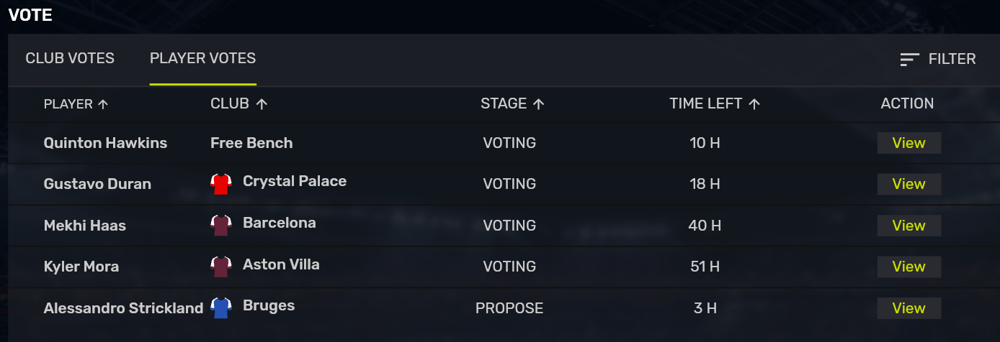{style="width: 334.00px; height: 114.67px; margin-left: 0.00px; margin-top: 0.00px; transform: rotate(0.00rad) translateZ(0px); -webkit-transform: rotate(0.00rad) translateZ(0px);"}]{style="overflow: hidden; display: inline-block; margin: 0.00px 0.00px; border: 0.00px solid #000000; transform: rotate(0.00rad) translateZ(0px); -webkit-transform: rotate(0.00rad) translateZ(0px); width: 334.00px; height: 114.67px;"}

[{style="width: 334.00px; height: 114.67px; margin-left: 0.00px; margin-top: 0.00px; transform: rotate(0.00rad) translateZ(0px); -webkit-transform: rotate(0.00rad) translateZ(0px);"}]{style="overflow: hidden; display: inline-block; margin: 0.00px 0.00px; border: 0.00px solid #000000; transform: rotate(0.00rad) translateZ(0px); -webkit-transform: rotate(0.00rad) translateZ(0px); width: 334.00px; height: 114.67px;"}

[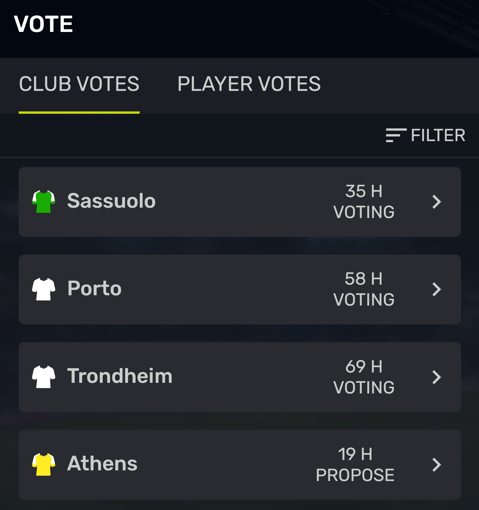{style="width: 157.34px; height: 167.70px; margin-left: 0.00px; margin-top: 0.00px; transform: rotate(0.00rad) translateZ(0px); -webkit-transform: rotate(0.00rad) translateZ(0px);"}]{style="overflow: hidden; display: inline-block; margin: 0.00px 0.00px; border: 0.00px solid #000000; transform: rotate(0.00rad) translateZ(0px); -webkit-transform: rotate(0.00rad) translateZ(0px); width: 157.34px; height: 167.70px;"}[ ]{.c22
.c18}[{style="width: 157.34px; height: 167.70px; margin-left: 0.00px; margin-top: 0.00px; transform: rotate(0.00rad) translateZ(0px); -webkit-transform: rotate(0.00rad) translateZ(0px);"}]{style="overflow: hidden; display: inline-block; margin: 0.00px 0.00px; border: 0.00px solid #000000; transform: rotate(0.00rad) translateZ(0px); -webkit-transform: rotate(0.00rad) translateZ(0px); width: 157.34px; height: 167.70px;"}

[4. Click the VIEW button to navigate to the club or player's voting
screen]{.c1}

[4. Tap the right chevron (\>) to navigate to the club or player's
voting screen]{.c1}

[{style="width: 158.00px; height: 83.00px; margin-left: 0.00px; margin-top: 0.00px; transform: rotate(0.00rad) translateZ(0px); -webkit-transform: rotate(0.00rad) translateZ(0px);"}]{style="overflow: hidden; display: inline-block; margin: 0.00px 0.00px; border: 0.00px solid #000000; transform: rotate(0.00rad) translateZ(0px); -webkit-transform: rotate(0.00rad) translateZ(0px); width: 158.00px; height: 83.00px;"}

[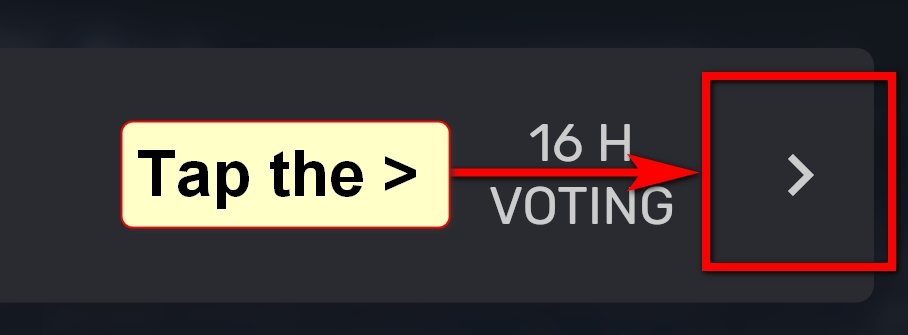{style="width: 215.50px; height: 79.36px; margin-left: 0.00px; margin-top: 0.00px; transform: rotate(0.00rad) translateZ(0px); -webkit-transform: rotate(0.00rad) translateZ(0px);"}]{style="overflow: hidden; display: inline-block; margin: 0.00px 0.00px; border: 0.00px solid #000000; transform: rotate(0.00rad) translateZ(0px); -webkit-transform: rotate(0.00rad) translateZ(0px); width: 215.50px; height: 79.36px;"}

[---]{.c1}

[4a. On the Player VOTES screen, scroll down the screen until you see
the voting section, or tap the up arrow button to collapse the basic
player information]{.c1}

[---]{.c1}

[{style="width: 186.50px; height: 212.75px; margin-left: 0.00px; margin-top: 0.00px; transform: rotate(0.00rad) translateZ(0px); -webkit-transform: rotate(0.00rad) translateZ(0px);"}]{style="overflow: hidden; display: inline-block; margin: 0.00px 0.00px; border: 0.00px solid #000000; transform: rotate(0.00rad) translateZ(0px); -webkit-transform: rotate(0.00rad) translateZ(0px); width: 186.50px; height: 212.75px;"}

[5. Make your decision then click the VOTE button, then sign the
transaction in MetaMask]{.c1}

[5. Make your decision then click the VOTE button, then sign the
transaction in MetaMask]{.c1}

[{style="width: 247.50px; height: 147.46px; margin-left: 0.00px; margin-top: 0.00px; transform: rotate(0.00rad) translateZ(0px); -webkit-transform: rotate(0.00rad) translateZ(0px);"}]{style="overflow: hidden; display: inline-block; margin: 0.00px 0.00px; border: 0.00px solid #000000; transform: rotate(0.00rad) translateZ(0px); -webkit-transform: rotate(0.00rad) translateZ(0px); width: 247.50px; height: 147.46px;"}

[{style="width: 192.21px; height: 241.70px; margin-left: 0.00px; margin-top: 0.00px; transform: rotate(0.00rad) translateZ(0px); -webkit-transform: rotate(0.00rad) translateZ(0px);"}]{style="overflow: hidden; display: inline-block; margin: 0.00px 0.00px; border: 0.00px solid #000000; transform: rotate(0.00rad) translateZ(0px); -webkit-transform: rotate(0.00rad) translateZ(0px); width: 192.21px; height: 241.70px;"}

[6. You can see the screen updated with each of your shares counting for
1 vote]{.c1}

[6. You can see the screen updated with each of your shares counting for
1 vote]{.c1}

[{style="width: 232.50px; height: 142.70px; margin-left: 0.00px; margin-top: 0.00px; transform: rotate(0.00rad) translateZ(0px); -webkit-transform: rotate(0.00rad) translateZ(0px);"}]{style="overflow: hidden; display: inline-block; margin: 0.00px 0.00px; border: 0.00px solid #000000; transform: rotate(0.00rad) translateZ(0px); -webkit-transform: rotate(0.00rad) translateZ(0px); width: 232.50px; height: 142.70px;"}

[{style="width: 166.50px; height: 128.12px; margin-left: 0.00px; margin-top: 0.00px; transform: rotate(0.00rad) translateZ(0px); -webkit-transform: rotate(0.00rad) translateZ(0px);"}]{style="overflow: hidden; display: inline-block; margin: 0.00px 0.00px; border: 0.00px solid #000000; transform: rotate(0.00rad) translateZ(0px); -webkit-transform: rotate(0.00rad) translateZ(0px); width: 166.50px; height: 128.12px;"}

[]{.c1}

# [TRADING PLAYERS IN THE TRANSFER MARKET]{.c58 .c40} {#h.eszjtkr0tal7 .c42}

[The transfer market is an ]{.c22 .c18}[auction]{.c59 .c18}[ where
players are traded between clubs. Agents determine if a player can be
traded while managers buy/sell players on behalf of their club. ]{.c1}

[]{.c1}

[There are 3 tabs in the Transfer Market: ]{.c1}

[]{.c1}

1.  [Transfer List: This is where players are listed for auction]{.c1}
2.  [Transfer History: Records of all past transfers]{.c1}
3.  [Free Bench: Bidding on a player here begins the 7-day auction in
    the Transfer List]{.c1}

## Minimums, Maximums & Fixed Numbers {#h.ugwb1yoxo14e .c20}

[There are limits for different facets of the transfer market. ]{.c1}

[]{.c1}

[]{#t.32bf025b27c8caaec2f16277e5411789a1d1268b}[]{#t.13}

  ---------------------------------------------------- ---------------------- ---------------------- --------------------
  [ITEM]{.c47 .c40}                                    [MINIMUM]{.c47 .c40}   [MAXIMUM]{.c47 .c40}   [FIXED]{.c47 .c40}
  [Club size]{.c1}                                     [21]{.c1}              [32]{.c1}              [---]{.c1}
  [Transfers in from another club (per season)]{.c1}   [0]{.c1}               [3]{.c1}               [---]{.c1}
  [Transfers out to another club (per season)]{.c1}    [0]{.c1}               [3]{.c1}               [---]{.c1}
  [Transfers in from the Free Bench]{.c1}              [0]{.c1}               [No limit]{.c1}        [---]{.c1}
  [Contract renewals]{.c1}                             [0]{.c1}               [32]{.c1}              [---]{.c1}
  [Transfer listing time]{.c1}                         [---]{.c1}             [---]{.c1}             [7 days]{.c1}
  [Player contract lengths (in seasons)]{.c1}          [1]{.c1}               [6]{.c1}               [---]{.c1}
  [Transfer buy bid increase]{.c1}                     [1%]{.c1}              [No limit]{.c1}        [---]{.c1}
  [Forced player sales]{.c1}                           [0]{.c1}               [32]{.c1}              [---]{.c1}
  [Forced free bench player buys]{.c1}                 [0]{.c1}               [21]{.c1}              [---]{.c1}
  ["FREE" Free Bench players]{.c1}                     [0]{.c1}               [21]{.c1}              [---]{.c1}
  ---------------------------------------------------- ---------------------- ---------------------- --------------------

[]{.c1}

[Clubs must maintain between 21 and 32 players. ]{.c1}

[]{.c1}

[Managers may only trade a maximum of 6 players with other clubs: 3 in
and 3 out. However, they may buy any number of players off of the Free
Bench up to the maximum club size of 32.]{.c1}

[]{.c1}

[Aside from trading players in the transfer market, the only way for a
manager to "fire" a player is to not renew their contract. It is
important for managers to ensure that they stay at or above the 21
player minimum, otherwise they will receive low-ranked players from the
Free Bench at the end of the season. ]{.c1}

[]{.c1}

[When a manager lists a player for auction in the transfer market, the
auction lasts for 7 days, after which it expires. ]{.c1}

[]{.c1}

[If a club is in debt at the end of a season, it may be forced to sell
valuable players and possibly acquire low rated  players from the Free
Bench if the squad size is below the minimum amount. See the section on
"]{.c22 .c18}[[Resolving End-of-Season Debt](#h.dwslbgbdtkq1){.c8}]{.c4
.c22}[" for more information.]{.c1}

## Free Bench {#h.c3iplctxje0j .c20}

[New players and players that don't have a contract with a club, i.e.
they are unemployed, are in the "Free Bench". These players enter the
regular Transfer List 7-day auction after a manager bids on them in the
Free Bench. ]{.c1}

## Agents Determine Transfer Availability {#h.78qjv5jjpzt7 .c20}

[Whether or not a player can be transferred depends on the player's
agent. By default, players are available for transfer. However, an agent
can change this so that the player cannot be transferred. For an agent
to change the transfer availability of a player, the agent must: ]{.c1}

[]{.c1}

1.  [Visit their player's screen]{.c1}
2.  [Click the CONTRACT tab]{.c1}
3.  [Beside Available for transfer, check either Yes or No]{.c1}
4.  [Click the Submit button\
    ]{.c22
    .c18}[{style="width: 292.19px; height: 146.70px; margin-left: 0.00px; margin-top: 0.00px; transform: rotate(0.00rad) translateZ(0px); -webkit-transform: rotate(0.00rad) translateZ(0px);"}]{style="overflow: hidden; display: inline-block; margin: 0.00px 0.00px; border: 0.00px solid #000000; transform: rotate(0.00rad) translateZ(0px); -webkit-transform: rotate(0.00rad) translateZ(0px); width: 292.19px; height: 146.70px;"}

[]{.c1}

[NOTE:]{.c59 .c18}[ If an agent's player is listed as available for
transfer, and a club manager then lists the player in the transfer
market, the agent can't reverse the listing by changing the player's
availability to No after the fact. At that point, it's too late. ]{.c1}

## Managers Buy/Sell In The Transfer Market {#h.4z7bd37agzn .c20}

[Club managers can buy and sell players between teams in the transfer
market, provided that the player's agent has made the player available
for transfer (the default is yes). If a player has no agent, then
consent is implied. Managers can also bid on players in the Free Bench,
which begins the 7-day auction of that player in the Transfer List where
other managers can also bid on that player. ]{.c1}

[]{.c1}

[To sell a player:]{.c1}

[]{.c1}

1.  [Go to your club Squad tab]{.c1}
2.  [Click a player]{.c1}
3.  [\[OPTIONAL\] Click the CONTRACT tab]{.c1}
4.  [\[OPTIONAL\] In the "As an agent" info panel, check whether or not
    the player's agent has allowed or disallowed transferring the
    player. If the Available for transfer No checkbox is checked, then
    you cannot list the player for transfer and must talk to the
    player's agent. If Yes is checked, you can list the player in the
    transfer market.]{.c1}
5.  [If Yes is checked for Available for transfer, then the Sell Player
    button will be visible on the left, bottom of the player screen.
    Click the Sell Player button\
    ]{.c22
    .c18}[{style="width: 145.08px; height: 270.70px; margin-left: 0.00px; margin-top: 0.00px; transform: rotate(0.00rad) translateZ(0px); -webkit-transform: rotate(0.00rad) translateZ(0px);"}]{style="overflow: hidden; display: inline-block; margin: 0.00px 0.00px; border: 0.00px solid #000000; transform: rotate(0.00rad) translateZ(0px); -webkit-transform: rotate(0.00rad) translateZ(0px); width: 145.08px; height: 270.70px;"}
6.  [Enter a minimum selling price\
    ]{.c22
    .c18}[{style="width: 242.50px; height: 127.91px; margin-left: 0.00px; margin-top: 0.00px; transform: rotate(0.00rad) translateZ(0px); -webkit-transform: rotate(0.00rad) translateZ(0px);"}]{style="overflow: hidden; display: inline-block; margin: 0.00px 0.00px; border: 0.00px solid #000000; transform: rotate(0.00rad) translateZ(0px); -webkit-transform: rotate(0.00rad) translateZ(0px); width: 242.50px; height: 127.91px;"}
7.  [Click the Sell Player button]{.c1}
8.  [If the minimum bid is met or surpassed, then at the end of the
    7-day auction period, the player is transferred from your club to
    the buying club]{.c1}

[]{.c1}

[To bid on a player:]{.c1}

[]{.c1}

1.  [Click Transfer Market in the top menu]{.c1}
2.  [This will show a list of players available for sale, however you
    can also click the "Free Bench" tab menu to view players available
    there too]{.c1}
3.  [Click a player's name]{.c1}
4.  [On the player's screen at the bottom of the basic info panel, click
    the Buy Player button]{.c1}

```{=html}
<!-- -->
```
1.  [If there is no Buy Player button, then ]{.c22 .c18}[[the player
    isn't available](#h.78qjv5jjpzt7){.c8}]{.c4 .c22}[ or you are not a
    manager of a club.]{.c22 .c18}[\
    ]{.c22
    .c18}[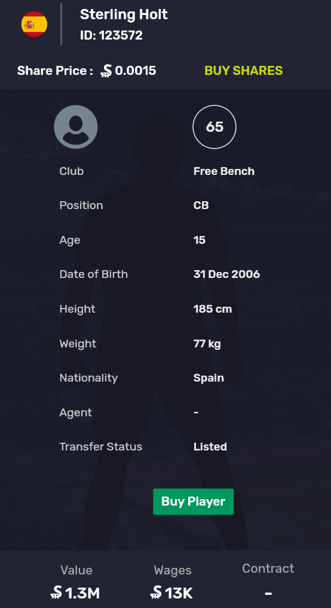{style="width: 132.92px; height: 242.70px; margin-left: 0.00px; margin-top: 0.00px; transform: rotate(0.00rad) translateZ(0px); -webkit-transform: rotate(0.00rad) translateZ(0px);"}]{style="overflow: hidden; display: inline-block; margin: 0.00px 0.00px; border: 0.00px solid #000000; transform: rotate(0.00rad) translateZ(0px); -webkit-transform: rotate(0.00rad) translateZ(0px); width: 132.92px; height: 242.70px;"}

```{=html}
<!-- -->
```
5.  [Enter a bid at or above the minimum bid]{.c1}
6.  [Click the Submit Transfer Bid button\
    ]{.c22
    .c18}[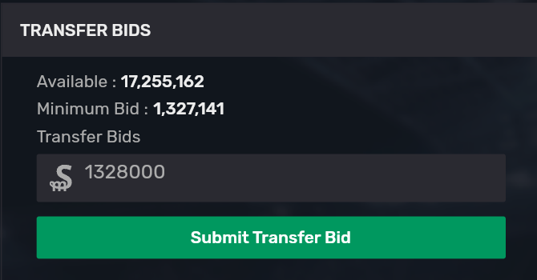{style="width: 240.50px; height: 125.23px; margin-left: 0.00px; margin-top: 0.00px; transform: rotate(0.00rad) translateZ(0px); -webkit-transform: rotate(0.00rad) translateZ(0px);"}]{style="overflow: hidden; display: inline-block; margin: 0.00px 0.00px; border: 0.00px solid #000000; transform: rotate(0.00rad) translateZ(0px); -webkit-transform: rotate(0.00rad) translateZ(0px); width: 240.50px; height: 125.23px;"}
7.  [At the end of the 7-day auction period, the highest bid wins and
    the player is transferred to the buying club]{.c1}

[]{.c1}

[Once a bid is placed, it cannot be cancelled. This prevents fake bids
from driving up the price. ]{.c1}

[]{.c1}

[The Buy Player button is visible to all club managers. Rather than go
through the Transfer Market top menu, you can simply check if a player
is currently listed for transfer by visiting the player's screen. ]{.c1}

[]{.c1}

[If you aren't a club manager, you can either check the Transfer Market,
or directly visit a player's screen and check whether or not the
Transfer Status in the basic player info panel is Listed or Not Listed.
You will not see any buy or sell buttons. ]{.c1}

[]{.c1}

[\-\-\-\-\-\-\-\-\-\-\-\-\-\-\-\-\-\-\-\-\-\-\-\-\-\-\-\-\-\-\-\-\-\-\-\-\-\-\-\-\-\-\-\-\-\-\-\-\-\-\-\-\-\-\-\-\-\-\-\-\-\-\-\-\-\-\-\-\-\-\-\-\-\-\-\-\-\-\-\-\-\-\-\-\-\-\-\-\-\-\-\-\-\-\-\-\-\-\-\-\-\-\-\-\-\-\-\-\-\-\-\-\-\-\-\-\-\-\-\-\-\-\-\-\-\-\-\-\-\-\-\-\-\-\-\-\-\--]{.c40}

[]{.c3}

------------------------------------------------------------------------

# []{.c58 .c40} {#h.ncc9awmc5dbo .c42 .c63}

# [END OF SEASON EVENTS]{.c58 .c40} {#h.r7edzioo14rd .c42}

[There are a few events at the end of every season:]{.c3}

[]{.c3}

1.  [League, cup and shield winners & prizes announced]{.c3}
2.  [Player contract renewal or non-renewal]{.c3}
3.  [Club debt payments]{.c3}
4.  [Prize money awarded]{.c3}
5.  [Old players retire & new players join]{.c3}
6.  [Player ratings changes]{.c3}
7.  [Clubs promoted/relegated to higher/lower divisions]{.c3}
8.  [Club Debt]{.c3}

## [Prizes]{.c15} {#h.l3i367aily3p .c20}

[Prizes for winning in the leagues, cup and shield are awarded. They
include trophies and cash prizes. ]{.c3}

## [Player Contract Renewal]{.c15} {#h.xe5a8zs6kpn2 .c20}

[Player contracts are either renewed or not. Players whose contracts
aren't renewed move to the Free Bench at the end of the season if their
contracts expire.]{.c18}

## [Club Debt Payments]{.c15} {#h.9i4ogyf4o9uf .c20}

[All club debts are paid off. See "]{.c18}[[Resolving End-of-Season
Debt](#h.dwslbgbdtkq1){.c8}]{.c4}[" for more information. ]{.c3}

## [Prize Money Awarded]{.c15} {#h.8bhmarvsv1co .c20}

[Provided that the prize money wasn't used to pay off club debt, the
club, its shareholders, and its player shareholders split the prize
money 89.8% / 10% / 0.2%, respectively. ]{.c3}

## [Old Players Retire & New Players Join]{.c15} {#h.obhfa43ouxpc .c20}

[At the end of each season, some old players retire while new players
join. New players start in the Free Bench. ]{.c3}

## [Player Ratings Changes]{.c15} {#h.kdx4z9dwlh6f .c20}

[At the end of each season, player ratings may change up or down,
depending on their real world performance. ]{.c3}

## Clubs Promoted/Relegated to Higher/Lower Divisions {#h.7acugysofqog .c20}

[Depending upon a club's performance, it can advance to a higher
division, or be relegated to a lower division. Higher divisions are more
profitable for shareholders and managers. ]{.c1}

[]{.c1}

## [Club Debt]{.c15} {#h.oqqmt5frlo36 .c20}

[At the end of the season it is possible that some clubs are in debt if
the manager did not properly take care of the club's finances.]{.c3}

[]{.c3}

[The autonomous debt resolution process minimises damage to the club.
The steps proceed in order until all debt is paid off.]{.c3}

[]{.c3}

1.  [League, cup, and shield prize money goes to the club's debt first
    and then to the club and shareholders if any prize money
    remains.]{.c3}
2.  [The club's top player is sold on the transfer market to pay off
    debt and reduce the outgoing expenses (player's wage).]{.c3}
3.  [If the club falls below the minimum of 21 players, it receives free
    low-ranked players from the Free Bench. ]{.c3}

### [Prize Money for Paying Debts]{.c15} {#h.8cicqlc8u85v .c27}

[If a club wins any prize money from its league or a cup or shield,
debtors are first in line for that money.]{.c3}

[]{.c3}

[If there is any prize money left after paying off all debts, then the
remainder goes to the club, its shareholders, and its player
shareholders split the prize money 89.8% / 10% / 0.2%, respectively.
]{.c3}

[]{.c3}

[Since this represents a financial loss for shareholders, they may wish
to find someone better to replace their club's manager. See the section
on ]{.c18}[[voting](#h.lrilimrzzjrk){.c8}]{.c4}[ for more information.
]{.c3}

[]{.c3}

[]{.c3}

[]{.c1}

[\-\-\-\-\-\-\-\-\-\-\-\-\-\-\-\-\-\-\-\-\-\-\-\-\-\-\-\-\-\-\-\-\-\-\-\-\-\-\-\-\-\-\-\-\-\-\-\-\-\-\-\-\-\-\-\-\-\-\-\-\-\-\-\-\-\-\-\-\-\-\-\-\-\-\-\-\-\-\-\-\-\-\-\-\-\-\-\-\-\-\-\-\-\-\-\-\-\-\-\-\-\-\-\-\-\-\-\-\-\-\-\-\-\-\-\-\-\-\-\-\-\-\-\-\-\-\-\-\-\-\-\-\-\-\-\-\-\--]{.c40}

------------------------------------------------------------------------

# []{.c58 .c40} {#h.79rmwqn3vg8f .c42 .c63}

# [USER ROLES]{.c58 .c40} {#h.7n4f6qylfy7j .c42}

[There are 3 primary roles that users can play in Soccerverse:]{.c3}

[]{.c3}

1.  [Manager]{.c3}
2.  [Agent]{.c3}
3.  [Shareholder]{.c3}

[]{.c3}

[Users may play more than 1 role and may even play all 3 roles. ]{.c3}

[]{.c3}

[The following describes the core of each role. ]{.c3}

## [Manager]{.c15} {#h.z1gjtvfhyp5 .c20}

[Club managers have the most difficult role. They manage and control
their clubs completely. ]{.c3}

[]{.c3}

[However, there are only 300 clubs, so there can only be 300 managers.
Users must convince club shareholders to propose and vote for them to
become a club's manager. This is THE ELITE position in the game. ]{.c3}

[]{.c3}

[Once a user becomes a manager, their Home screen changes from their
personal profile to their club's main screen. They also gain full access
to all club management functions, including access to the club's
tactics, which is arguably the most important part of the game. ]{.c3}

### [Tactics]{.c15} {#h.p95qxz9wx7d6 .c27}

[Tactics is where managers set their strategies for matches. After
making any changes (including situations), you must click/tap the Submit
Team Sheet button or your changes will be lost. ]{.c3}

[]{.c3}

[{style="width: 172.00px; height: 54.00px; margin-left: 0.00px; margin-top: 0.00px; transform: rotate(0.00rad) translateZ(0px); -webkit-transform: rotate(0.00rad) translateZ(0px);"}]{style="overflow: hidden; display: inline-block; margin: 0.00px 0.00px; border: 0.00px solid #000000; transform: rotate(0.00rad) translateZ(0px); -webkit-transform: rotate(0.00rad) translateZ(0px); width: 172.00px; height: 54.00px;"}

[]{.c3}

[]{#t.4cfa39184a0d42029738498067bc604a51a92e73}[]{#t.14}

  ---------------------------------------------------------------------------------------------------------------------------------------------------------------------------------------------------------------------------------------------------------------------------------------------------------------------------------------------------------------------------------------------------------------------------------------------------------------------------------- ------------------------------------------------------------------------------------------------------------------------------------------------------------------------------------------------------------------
  [{style="width: 77.40px; height: 77.40px; margin-left: 0.00px; margin-top: 0.00px; transform: rotate(0.00rad) translateZ(0px); -webkit-transform: rotate(0.00rad) translateZ(0px);"}]{style="overflow: hidden; display: inline-block; margin: 0.00px 0.00px; border: 0.00px solid #000000; transform: rotate(0.00rad) translateZ(0px); -webkit-transform: rotate(0.00rad) translateZ(0px); width: 77.40px; height: 77.40px;"}   [Tactics MUST be submitted at least 12 hours BEFORE the next match. If there are less than 12 hours before the next match, you cannot change your ]{.c18 .c75 .c82}[tactics]{.c18 .c75 .c82}[. ]{.c18 .c75 .c80}
  ---------------------------------------------------------------------------------------------------------------------------------------------------------------------------------------------------------------------------------------------------------------------------------------------------------------------------------------------------------------------------------------------------------------------------------------------------------------------------------- ------------------------------------------------------------------------------------------------------------------------------------------------------------------------------------------------------------------

[NOTE ON DATE & TIME:]{.c59 .c18}[ The date format is \<day of the
week\> \<day number\> \<month\> \<2-digit year\>, e.g. Tues 6 Jun 06 in
simple ISO date format is 2006-06-06. Time is given in UTC+0 time, so
you must adjust for your timezone. Club managers should consult their
Tactics page to see the counter for  when they must submit their team
sheets by. ]{.c3}

[]{.c3}

[{style="width: 461.00px; height: 54.00px; margin-left: 0.00px; margin-top: 0.00px; transform: rotate(0.00rad) translateZ(0px); -webkit-transform: rotate(0.00rad) translateZ(0px);"}]{style="overflow: hidden; display: inline-block; margin: 0.00px 0.00px; border: 0.00px solid #000000; transform: rotate(0.00rad) translateZ(0px); -webkit-transform: rotate(0.00rad) translateZ(0px); width: 461.00px; height: 54.00px;"}

[Counter for team sheet submission deadline]{.c3}

[]{.c3}

[There are 4 sections in Tactics:]{.c3}

[]{.c3}

1.  [Line Up]{.c3}
2.  [Instructions]{.c3}
3.  [Formation]{.c3}
4.  [Situations]{.c3}

#### [Line Up]{.c15} {#h.dcxhwhnelcnk .c70 .c49}

[Line Up is where managers decide who is on the pitch to start, who the
substitutes are, and who the extra players that won't be participating
in the match are. It shows:]{.c3}

[]{.c3}

-   [Which players are on the pitch and their positions (11)]{.c3}
-   [Which players are available for substitutions (7)]{.c3}
-   [Which players aren't participating in the match (the rest of the
    club's players, between 3 and 14)]{.c3}

[]{.c3}

[To change the line up, drag and drop a player onto another player.
They'll swap positions. You can submit the line up by clicking the
Submit Team Sheet button. ]{.c3}

[]{.c3}

[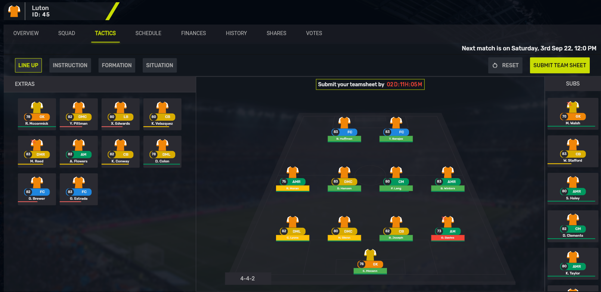{style="width: 480.00px; height: 233.02px; margin-left: 0.00px; margin-top: 0.00px; transform: rotate(0.00rad) translateZ(0px); -webkit-transform: rotate(0.00rad) translateZ(0px);"}]{style="overflow: hidden; display: inline-block; margin: 0.00px 0.00px; border: 0.00px solid #000000; transform: rotate(0.00rad) translateZ(0px); -webkit-transform: rotate(0.00rad) translateZ(0px); width: 480.00px; height: 233.02px;"}

[Line Up]{.c3}

#### [Instructions]{.c15} {#h.rlrpv0ul1baw .c49 .c70}

[This is where the particulars of the team's strategy is determined. If
you need to have it explained to you, then you're not qualified to be a
manager. ]{.c3}

[]{.c3}

[{style="width: 480.00px; height: 235.64px; margin-left: 0.00px; margin-top: 0.00px; transform: rotate(0.00rad) translateZ(0px); -webkit-transform: rotate(0.00rad) translateZ(0px);"}]{style="overflow: hidden; display: inline-block; margin: 0.00px 0.00px; border: 0.00px solid #000000; transform: rotate(0.00rad) translateZ(0px); -webkit-transform: rotate(0.00rad) translateZ(0px); width: 480.00px; height: 235.64px;"}

[Instructions]{.c3}

#### [Formation]{.c15} {#h.75vq035snkwf .c70 .c49}

[Formations are foundational for setting strategies. There are many to
choose from. ]{.c3}

[]{.c3}

[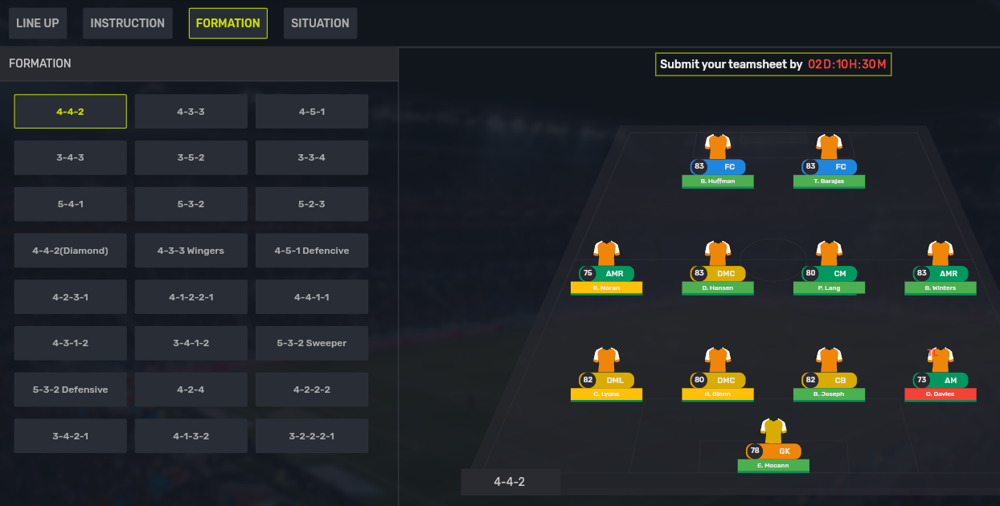{style="width: 480.00px; height: 242.62px; margin-left: 0.00px; margin-top: 0.00px; transform: rotate(0.00rad) translateZ(0px); -webkit-transform: rotate(0.00rad) translateZ(0px);"}]{style="overflow: hidden; display: inline-block; margin: 0.00px 0.00px; border: 0.00px solid #000000; transform: rotate(0.00rad) translateZ(0px); -webkit-transform: rotate(0.00rad) translateZ(0px); width: 480.00px; height: 242.62px;"}

[Choose a formation for your team]{.c3}

#### [Situations]{.c15} {#h.h1fw3g74rogb .c70 .c49}

[Situations let you change strategies and substitute players depending
on various conditions at the 45, 60, and 75 minute marks of the match.
]{.c3}

[]{.c3}

[{style="width: 480.00px; height: 127.42px; margin-left: 0.00px; margin-top: 0.00px; transform: rotate(0.00rad) translateZ(0px); -webkit-transform: rotate(0.00rad) translateZ(0px);"}]{style="overflow: hidden; display: inline-block; margin: 0.00px 0.00px; border: 0.00px solid #000000; transform: rotate(0.00rad) translateZ(0px); -webkit-transform: rotate(0.00rad) translateZ(0px); width: 480.00px; height: 127.42px;"}

[Create situations]{.c3}

[]{.c3}

[You can create situations based on various conditions. ]{.c3}

[]{.c3}

[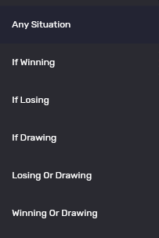{style="width: 144.00px; height: 216.00px; margin-left: 0.00px; margin-top: 0.00px; transform: rotate(0.00rad) translateZ(0px); -webkit-transform: rotate(0.00rad) translateZ(0px);"}]{style="overflow: hidden; display: inline-block; margin: 0.00px 0.00px; border: 0.00px solid #000000; transform: rotate(0.00rad) translateZ(0px); -webkit-transform: rotate(0.00rad) translateZ(0px); width: 144.00px; height: 216.00px;"}[{style="width: 144.00px; height: 148.32px; margin-left: 0.00px; margin-top: 0.00px; transform: rotate(0.00rad) translateZ(0px); -webkit-transform: rotate(0.00rad) translateZ(0px);"}]{style="overflow: hidden; display: inline-block; margin: 0.00px 0.00px; border: 0.00px solid #000000; transform: rotate(0.00rad) translateZ(0px); -webkit-transform: rotate(0.00rad) translateZ(0px); width: 144.00px; height: 148.32px;"}

[Situations based on conditions]{.c3}

## [Agent]{.c15} {#h.eb9a5dn6xs7x .c20}

[It's the agent's job to negotiate with the club manager for the benefit
of the shareholders. For example, if a manager is not fielding the
player in the starting line-up then the players shareholders will
receive less dividends. Likewise, if the players rating has increased
then the player may want the manager to renew his contract with a
recalculated salary. ]{.c3}

[]{.c3}

[However, if an agent doesn't get his way, he can change the player's
morale to "unhappy". This reduces the player's rating by 20 points and
thus the manager will have less options and degraded performance when he
wishes to use the player. ]{.c3}

### [Change Morale]{.c15} {#h.soxm7j6zxcds .c27}

[To change the morale for a player:]{.c3}

[]{.c3}

1.  [Visit the player's screen]{.c3}
2.  [Make certain that you are on the Selection tab]{.c3}
3.  [Click the smiley/neutral/unhappy face morale button\
    ]{.c18}[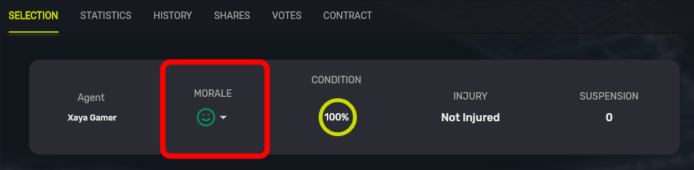{style="width: 341.50px; height: 84.15px; margin-left: 0.00px; margin-top: 0.00px; transform: rotate(0.00rad) translateZ(0px); -webkit-transform: rotate(0.00rad) translateZ(0px);"}]{style="overflow: hidden; display: inline-block; margin: 0.00px 0.00px; border: 0.00px solid #000000; transform: rotate(0.00rad) translateZ(0px); -webkit-transform: rotate(0.00rad) translateZ(0px); width: 341.50px; height: 84.15px;"}
4.  [In the Change Morale popup, click happy, neutral, or unhappy\
    ]{.c18}[{style="width: 313.50px; height: 109.84px; margin-left: 0.00px; margin-top: 0.00px; transform: rotate(0.00rad) translateZ(0px); -webkit-transform: rotate(0.00rad) translateZ(0px);"}]{style="overflow: hidden; display: inline-block; margin: 0.00px 0.00px; border: 0.00px solid #000000; transform: rotate(0.00rad) translateZ(0px); -webkit-transform: rotate(0.00rad) translateZ(0px); width: 313.50px; height: 109.84px;"}
5.  [The player's morale changes\
    ]{.c18}[{style="width: 83.50px; height: 72.11px; margin-left: 0.00px; margin-top: 0.00px; transform: rotate(0.00rad) translateZ(0px); -webkit-transform: rotate(0.00rad) translateZ(0px);"}]{style="overflow: hidden; display: inline-block; margin: 0.00px 0.00px; border: 0.00px solid #000000; transform: rotate(0.00rad) translateZ(0px); -webkit-transform: rotate(0.00rad) translateZ(0px); width: 83.50px; height: 72.11px;"}

[]{.c3}

### [Change Contract Demands]{.c15} {#h.3hvttccbxzq2 .c27}

[Agents set the terms for their players' contracts. This is done on the
player's Contract screen. ]{.c3}

[]{.c3}

[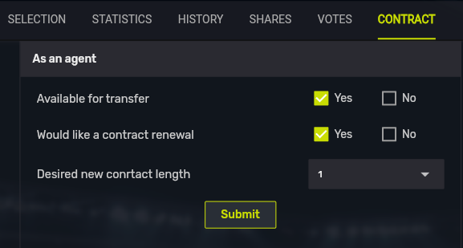{style="width: 341.16px; height: 182.70px; margin-left: 0.00px; margin-top: 0.00px; transform: rotate(0.00rad) translateZ(0px); -webkit-transform: rotate(0.00rad) translateZ(0px);"}]{style="overflow: hidden; display: inline-block; margin: 0.00px 0.00px; border: 0.00px solid #000000; transform: rotate(0.00rad) translateZ(0px); -webkit-transform: rotate(0.00rad) translateZ(0px); width: 341.16px; height: 182.70px;"}

[Player contract options]{.c3}

[]{.c3}

[Agents can decide whether or not their player can be listed by the
club's manager in the transfer market or not. ]{.c3}

[]{.c3}

[Agents can also decide whether or not the player is willing to renew
their contract with the club. Contract lengths are between 1 and 6
seasons. ]{.c3}

[]{.c3}

[Simply make any changes in the Contract panel then click the Submit
button. ]{.c3}

## [Shareholder]{.c15} {#h.h6fdapjh2ux7 .c20}

[Shareholders buy and sell shares in clubs and players and earn
dividends based on club/player performance. See the section on
]{.c18}[[buying and selling shares](#h.po03fx23ajwx){.c8}]{.c4}[ for
more information about that.]{.c3}

[]{.c3}

[If they hold enough shares, i.e. 100+ for clubs and 1,000,000+ for
players, they can propose a new club manager or player agent. If they
hold 50% + 1 shares, they can propose and vote as they wish with nobody
to stop them. ]{.c3}

[]{.c3}

[While agents and managers are "hands on" to ensure the success of
players and clubs, it's the responsibility of shareholders to hire a
competent agent or manager. ]{.c3}

[]{.c3}

[Exactly how shareholders organise themselves is outside of the game,
per se, although they can use the in-game chat.]{.c3}

[]{.c3}

[Each club has its own chat channel which can be accessed in the club
Overview screen.]{.c3}

[]{.c3}

[]{.c3}

[]{.c3}

[]{.c3}

[]{.c3}

[###END###]{.c40 .c75 .c86}

<div>

[{style="width: 320.00px; height: 80.00px; margin-left: 0.00px; margin-top: 0.00px; transform: rotate(0.00rad) translateZ(0px); -webkit-transform: rotate(0.00rad) translateZ(0px);"}]{style="overflow: hidden; display: inline-block; margin: 0.00px 0.00px; border: 0.00px solid #000000; transform: rotate(0.00rad) translateZ(0px); -webkit-transform: rotate(0.00rad) translateZ(0px); width: 320.00px; height: 80.00px;"}

</div>
